# BNI 名簿システム ご利用マニュアル

このマニュアルは、BNIチャプターの定例会準備システム（名簿システム）の使い方を、はじめての方にもわかるようにまとめたものです。
もとは Activeチャプター用に作ったもので、例の多くは Activeチャプターのものです。
チャプター名・期の番号・定例会の曜日と回数・プレゼンの秒数は、`⚙️ 設定` > `チャプター（名前・期・定例会の回数・プレゼンの秒数）` で変えられます
（「初期設定」の章の「チャプターの設定」）。

このシステムでできることは、大きく分けて次のとおりです。

**毎週の作業**

1. **ビジターリストの作成** ... Spreadingからダウンロードしたデータを、きれいな名簿PDF にする
2. **ルーム割り振り表の作成** ... ブレイクアウトルームの担当をドラッグ＆ドロップ（またはAI）で決める
3. **案内メールの一括送信** ... ビジターへの案内メールをまとめて送る
4. **ビジター情報の投稿文** ... 入金済み／未入金つきの参加者一覧を、グループに貼れる文章にする
5. **役職ごとの入力（定例会の準備）** ... 各役職の方が次回の定例会について入力し、ルーティンチェックシートに保存する。
   どの役職の必須項目が足りないかは一覧で一目で分かる

**スライド・冊子**

6. **ビジター・代理スライド** ... 参加者シートから紹介スライドとビジタープレゼンを作る
7. **定例会スライド（前半）** ... ルーティンチェックシートと名簿から、その週の内容を差し込む。
   ウィークリープレゼン（メンバーのページ）もここで一緒に作る
8. **定例会スライド（後半）** ... リファーラル発表・推薦のことば・抽選コーナー・音楽を差し込む
9. **メンバーブック・Zoom入室案内** ... 名簿から配布用の冊子と案内を作る

すべての操作は、Googleスプレッドシートの上のメニューバーにある **「名簿システム」** から行います。

---

> 💡 **このマニュアルはスプレッドシートからいつでも開けます**
> メニュー `名簿システム` > `❓ 使い方（ヘルプ）` をクリックしてください。
> 全機能の一覧は `名簿システム` > `🏠 メニュー画面をひらく` から開けます。

---

## 準備：メニューが出ていないところから

初めて使うときや、別のパソコン・別のアカウントで開いたときは、まず
**メニューバーに「名簿システム」を表示させる**ところから始めます。

### ステップ 0：スプレッドシートを開く

共有されたスプレッドシートのURLを開きます。
**ふだんお使いのGoogleアカウントでログインした状態**で開いてください。

> 複数のGoogleアカウントをお使いの場合、別のアカウントで開いていると
> メニューが出ないことがあります。画面右上のアイコンで、今どのアカウントで
> 開いているかを確認できます。

### ステップ 1：メニューバーに「名簿システム」が出るまで待つ

スプレッドシートを開いた直後は、上部のメニューバーに
`ファイル` `編集` `表示` … と並んでいるだけです。

数秒待つと、いちばん右あたりに **「名簿システム」** が追加されます。

```
ファイル  編集  表示  挿入  表示形式  データ  ツール  拡張機能  ヘルプ   名簿システム
                                                                      ↑ここに出ます
```

**出てこないときは、ブラウザの再読み込み（F5 または Ctrl+R）をしてください。**
読み込みのたびにメニューが作られるしくみのため、再読み込みで解決することがほとんどです。

### ステップ 2：それでも「名簿システム」が出ないとき

以下を順に確認してください。

| 確認すること | 対処 |
|---|---|
| ログインしているアカウントは合っていますか | 画面右上のアイコンで確認し、正しいアカウントに切り替える |
| このスプレッドシートの閲覧権限しかありませんか | 編集権限がないとメニューは動きません。管理者に編集権限を依頼してください |
| ブラウザは Google Chrome ですか | Chrome を推奨します。他のブラウザでは正しく動かないことがあります |
| シークレットウィンドウで開いていませんか | 通常のウィンドウで開き直してください |
| 拡張機能でブロックされていませんか | 広告ブロッカー等を一時的に無効にして再読み込み |

それでも出ない場合は、`拡張機能` > `Apps Script` を開いてみてください。
スクリプトの画面が開けば、ファイルは正しく入っています。開けない場合は権限の問題です。

### ステップ 3：最初の1回だけ、Googleの許可が必要です

メニューが出たら、何か機能をクリックしてみてください。
**初回だけ**「承認が必要です」という画面が出ます。次の章の手順どおりに進めてください。

---

## はじめに：初回だけ必要な「Google認証」の手順

システムを初めて使うとき、Googleから「このスクリプトを動かしてもいいですか？」という確認が出ます。

これは**セキュリティのための正常な動作**です。システムがあなたの代わりにPDFを作ったりメールを送ったりするために、あなたの許可が必要なのです。

ちょっとビックリする画面が出ますが、以下の手順どおりに進めれば大丈夫です。

---

### 手順（スクリーンショット付き解説）

画面の写真は実際のものです（メールアドレスと顔写真だけ、見本に置き換えています）。
**赤い丸のところを順に押していけば**進めます。

**ステップ 1**

ウェブアプリのURL（`…/exec` で終わるもの）を初めて開くと、こんな画面が出ます。

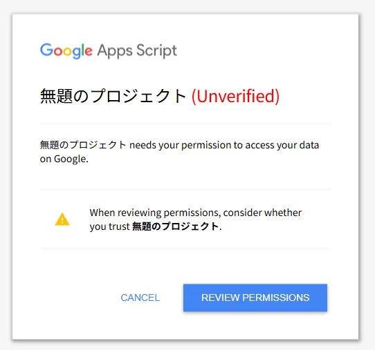

→ **「REVIEW PERMISSIONS」をクリック** してください。

スプレッドシートのメニューから機能を使ったときは、「承認が必要です」という小さな画面が出ます。
そのときは **「続行」**（「権限を確認」と出ることもあります）をクリックしてください。
このあとの画面は、どちらから始めても同じです。

---

**ステップ 2**

Googleアカウントの選択画面が出たら、**ふだん使っているGoogleアカウントをクリック** してください。
（ログインしているアカウントが1つだけのときは、この画面は出ないこともあります）

---

**ステップ 3**

ここが一番ドキッとするところです。こんな警告が出ます。

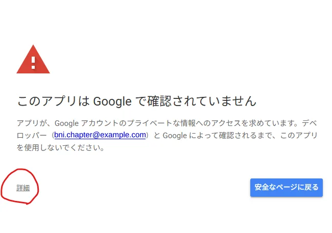

→ 怖く見えますが大丈夫です。左下の **「詳細」** をクリックしてください。

（この警告は、Googleの公式審査を通していない自作スクリプトすべてに出るもので、危険だから出ているわけではありません。
「デベロッパー」のところには、このスプレッドシートの持ち主（チャプターのアカウント）のメールアドレスが出ます）

---

**ステップ 4**

「詳細」を押すと、下に小さな文字のリンクが現れます。

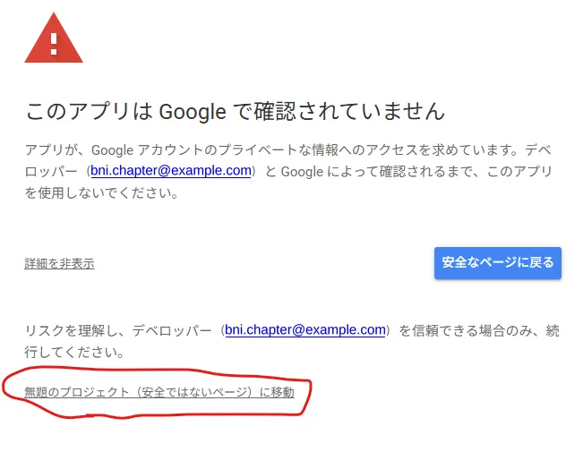

→ **「無題のプロジェクト（安全ではないページ）に移動」をクリック** してください。

（「安全ではない」と書いてありますが、これも自作スクリプトには必ず出る表現です。
「無題のプロジェクト」はこのシステムのプロジェクト名です。名前を付け直してあれば、その名前で出ます）

---

**ステップ 5**

「無題のプロジェクト にログイン」という画面が出ます。

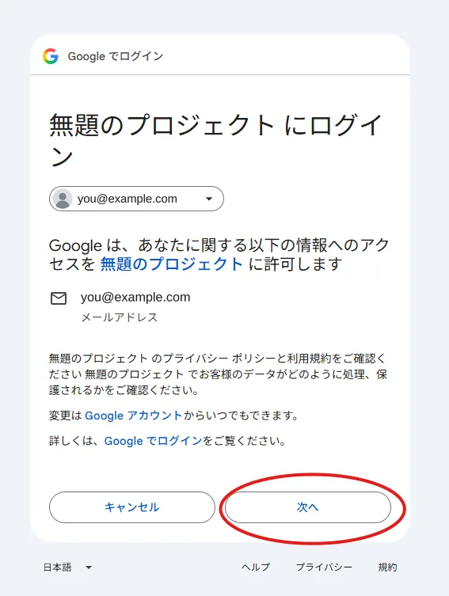

→ 上に出ているアカウントがふだん使っているものか確かめて、**「次へ」をクリック** してください。

---

**ステップ 6**

最後に「無題のプロジェクト が Google アカウントへのアクセスを求めています」という画面が出ます。
縦に長い画面なので、**いちばん下までスクロール** してください。

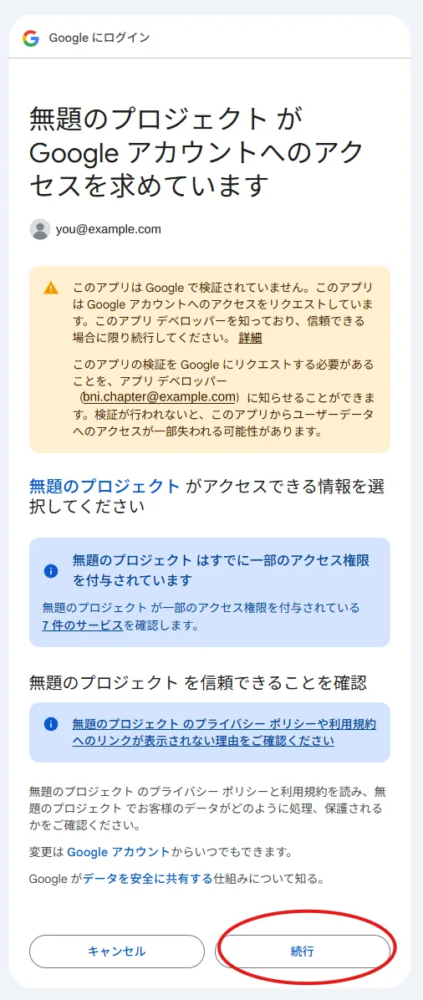

→ **「続行」をクリック** してください。

> **権限にチェックを付ける欄が出たとき**
>
> 初めてのときは「…がアクセスできる情報を選択してください」の下に、権限の一覧とチェック欄が出ます。
> **「すべて選択」にチェック**を入れてから「続行」を押してください。
> チェックが外れた権限があると、その権限を使う機能（メール送信・PDF作成など）が動きません。

---

### これで完了です

この認証は **最初の1回だけ** です。次回からはこの画面は出ません。
ウェブアプリから始めたときは、このあとメニュー（トップページ）が出ます。

### 認証のあと、最初にやること

メニュー `名簿システム` > **`🏠 メニュー画面をひらく`** をクリックしてください。
すべての機能が一覧で表示され、右側の **「準備の状況」** に、何が設定済みで何が未設定かが
✓ と ! で表示されます。! が付いている項目は、その場のリンクから設定画面を開けます。

> **追加の許可を求められることがあります**
>
> スライド作成や大きなファイルを扱う機能は、最初に使うときにさらに許可が必要な場合があります。
> 画面に許可を求めるダイアログが出たら「許可」を選んでください。
>
> なお、設定画面の中で「サーバーエラー」と表示された場合は、許可がまだ取れていない可能性があります。
> その場合はメニュー `名簿システム` > `🔧 動作確認` から
> **`Googleの権限を確認・許可する`** または **`Gemini接続テスト`** を1回実行してください。
> （ダイアログの中からは許可を求める画面を出せないため、メニューから直接実行する必要があります）

**それぞれの権限が何に使われるか**

| 権限 | 使う場面 |
|------|----------|
| スプレッドシートの読み書き | 名簿データの保存や読み込み |
| Google ドライブへのアクセス | PDFファイルの作成と共有 |
| Gmail でのメール送信 | ビジターへの案内メール送信 |
| 外部サービスへの接続 | AI自動割り振り（Gemini API）の呼び出し |
| Google ドキュメントへのアクセス | メンバーリストPDFの文字読み取り（OCR） |

---

## ウェブアプリとして開く（ダイアログが出ない環境向け）

スプレッドシートのダイアログが真っ白になる環境でも、**すべての機能を普通のタブで**
使えるようにする方法です。スプレッドシートのメニューはこれまでどおり使えます。
どちらから操作しても、保存先は同じスプレッドシートです。

### 最初に1回だけ：デプロイ

1. `拡張機能` ＞ `Apps Script` を開く
2. 右上の **`デプロイ`** ＞ **`新しいデプロイ`**
3. 左上の歯車アイコン ＞ **`ウェブアプリ`** を選ぶ
4. 設定
   - **次のユーザーとして実行** … `ウェブアプリにアクセスしているユーザー`
   - **アクセスできるユーザー** … `Google アカウントを持つ全員`
     （URLを開いた人の権限で動くので、スプレッドシートを見られない人には何も見えません。
     `appsscript.json` の設定と同じにしてあります。詳しくはREADME）
5. **`デプロイ`** を押す
6. 表示されたURL（`…/exec` で終わるもの）を開く。**ブックマークしておくと便利です**

URLを忘れたときは、`デプロイ` ＞ **`デプロイを管理`** を開くと、ウェブアプリの行に出ています。
（以前あったメニューの「ウェブアプリで開く（URLを表示）」は、正しいURLを出せないことがあったため外しました）

### 使えること

トップページに、スプレッドシートのメニューと同じ機能が一覧で並びます。
CSV取り込み・割り振り表・スライド作成・メンバーブック・各種設定まで、
**すべてダイアログと同じものが使えます。**

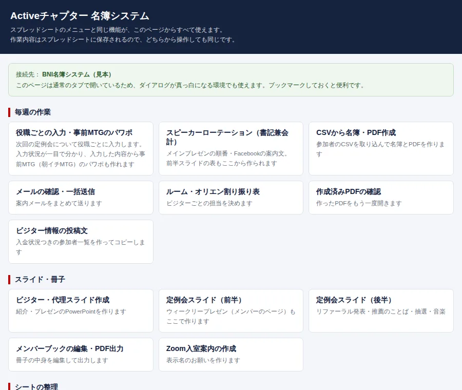

### 機能を追加・変更したあと

コードを更新しただけではウェブアプリには反映されません。

**画面から行う場合**
`デプロイ` ＞ `デプロイを管理` ＞ 鉛筆アイコン ＞ バージョンを `新バージョン` にして
`デプロイ` を押すと、URLはそのままで中身が新しくなります。

**コマンドで行う場合**
```
git pull
clasp push
clasp version "更新のメモ"          （→「Created version 34」のように番号が出ます）
clasp deploy -i <デプロイID> -V 34   （-V には、いま出た番号を書きます）
```
**この順番で行ってください。** `clasp version` は、最後に `clasp push` した中身を保存します。
（`appsscript.json` に `webapp` の宣言が必要です。無いとライブラリとして
デプロイされ、URLで開けなくなります。詳しくはREADMEをご覧ください）
`-i` を付けると既存のデプロイを上書きするので**URLは変わりません**。
付け忘れると別のURLが新しく作られてしまいます。
デプロイIDは `clasp deployments` で調べられるほか、
ウェブアプリURLの `/s/` と `/exec` の間の文字列がそのままIDです。

**反映されたかは「版」で確かめられます。** ウェブアプリのトップページのいちばん下と、
「定例会スライド（前半）」「定例会スライド（後半）」の画面の右上に `版 2026-09-27a` のように出ます。
更新をお願いしたときにお伝えする版と同じになっていれば、新しい中身で動いています。

---

## メニューの構成

メニューは、よく使うものほど手前に来るように整理しています。


```
名簿システム
├─ 🏠 メニュー画面をひらく      ← 全機能の一覧と、準備状況の確認
├─────────────────
├─ 1. CSVから名簿・PDF作成        ┐
├─ 2. メールの確認・一括送信      │ 毎週の作業
├─ 3. ルーム・オリエン割り振り表  │
├─ 4. 作成済みPDFの確認           │
├─ 5. ビジター情報の投稿文         ┘
├─ 📝 役職ごとの入力（定例会の準備） ▸  入力状況の一覧・事前MTGのパワポ、スピーカーローテーション、13の役職の入力画面
├─────────────────
├─ 📊 スライド・冊子をつくる ▸    ビジター・代理スライド、定例会スライド（前半・後半）、トークスクリプト、メンバーブック、Zoom案内
├─ 🎯 抽選ルーレット ▸            ビジター招待数の記入
├─ 🗂 シートの整理 ▸              タブが増えたときの整理と復元
├─ ⚙️ 設定 ▸                      初回や内容が変わったときだけ触ります
├─ 🔧 動作確認 ▸                  うまく動かないときの点検（メール送信のテスト・Gemini・Googleの権限など）
├─────────────────
└─ ❓ 使い方（ヘルプ）            このマニュアル
```

▸ が付いている項目にマウスを合わせると、中身が開きます。

**どこにあるか分からなくなったら、`🏠 メニュー画面をひらく` を使ってください。**
全機能がボタンで並び、右側に「準備の状況」（何が設定済みか）も表示されます。

---

## 毎週の作業の全体の流れ

定例会の準備は、毎週この順番で進めます。

```
① Spreadingで「CSVダウンロード」
        ↓
② 名簿システムで「CSVから名簿・PDF作成」
        ↓
③ 名簿システムで「ルーム・オリエン割り振り表」
        ↓
④ 名簿システムで「メールの確認・一括送信」
        ↓
    準備完了！
```

定例会の前には、各役職の方が **「📝 役職ごとの入力（定例会の準備）」** で次回の定例会について入力します
（ルーティンチェックシートに保存されます。どの役職が入力済みかは「入力状況の一覧」で分かります）。
入力がそろったら、同じ **「入力状況の一覧・事前MTGのパワポ」** の画面で、事前MTGのパワポも作れます。

参加者が確定したら、**「5. ビジター情報の投稿文」**でグループに投稿する文章
（`第535回(9/30)定例会ビジター情報　確定` で始まる、入金済み／未入金つきの一覧）を作れます。

新しい開催日の名簿を作ると、**前の開催日のシートは自動で非表示（アーカイブ）**されるため、
タブが増え続けることはありません。詳しくは「シートの整理（アーカイブ）」をご覧ください。

以下、それぞれの手順をくわしく説明します。

---

## ステップ①　Spreadingからデータをダウンロードする

1. **Spreading** にログインします。
2. 対象の定例会を選択します。
3. **「CSVダウンロード」** をクリックして、パソコンに保存します。

> **ポイント**: ダウンロードしたCSVファイルは、そのまま触らずに使ってください。Excelで開いて保存し直すと文字化けすることがあります。

> **AI連携（MCP）ではこの手順を置き換えられません。**
> SpreadingのAI連携でも参加者は取得できますが、
> **メモ（ビジターリストに表示）・オリエンテーション希望・決裁権・決裁スピード・入会見込み・役職・ウェブサイト**
> が含まれておらず、CSVより項目が少なくなります。
> 毎週の参加者はこれまでどおりCSVを使ってください。
> AI連携が役に立つのは、**メンバー名簿の更新**（「Spreadingから名簿を更新」）のほうです。

### 「つなげたいメンバー」のメモ

Spreadingの仕様上、**「紹介したい（つなげたい）メンバー」の情報はCSVに含まれません。**

そのため、Spreadingの画面で各ビジターの詳細を開き、つなげたいメンバーの名前をメモしておいてください。後の「割り振り表」のステップで使います。

---

## ステップ②　ビジター名簿とPDFを作成する

**メニュー**: `名簿システム` > `1. CSVから名簿・PDF作成`

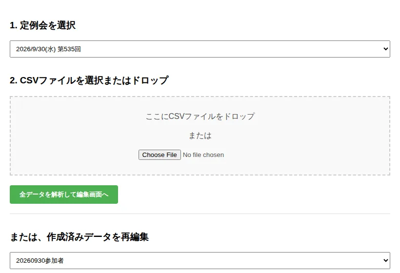

### 手順

1. メニューから **「1. CSVから名簿・PDF作成」** をクリックします。
2. **定例会を選ぶ**: 上のプルダウンで、対象の定例会（日付と回数）を選びます。
3. **CSVを読み込む**: ダウンロードしたCSVファイルを点線の枠にドラッグ＆ドロップして、 **「全データを解析して編集画面へ」** を押します。
4. **データを確認・修正する**: 編集画面が開きます。

### 編集画面の見方

| 色 | 意味 |
|----|------|
| **赤いセル** | 名前にスペースが入っていなかったため、システムが自動で推測して入れています。正しいか確認してください |
| **黄色いセル** | 招待者の名前がメンバーリストと完全一致しなかったため、推測しています（姓だけで、同じ姓の方が2人以上いるときも黄色になります）。確認してください |
| 色なし | 自動処理で問題なかったセルです |

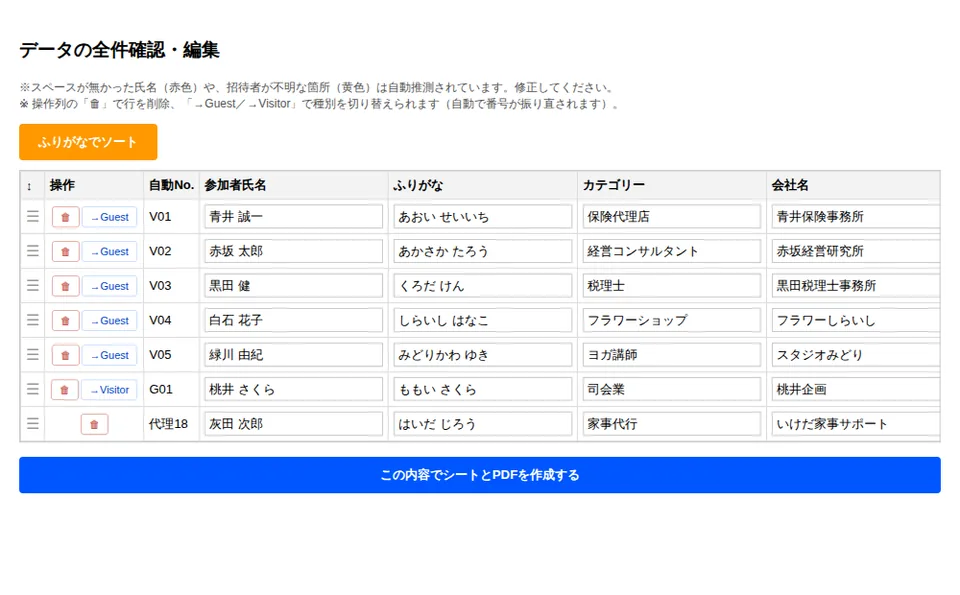

どのセルも、直接クリックして文字を書き換えることができます。

### 並べ替えと番号の振り直し

- **「ふりがなでソート」ボタン**: ふりがなの修正後に押すと、正しいふりがな順に並べ替えてV01、V02...の番号も振り直されます。
- **行のドラッグ移動**: 左端の ☰ マークをドラッグすると、行の順番を自由に入れ替えられます。入れ替え後、V01、V02...が自動で振り直されます。

### 確認が終わったら

**「この内容でシートとPDFを作成する」** をクリックします。

→ スプレッドシートにデータが書き込まれ、同時に **誰でも閲覧できるPDF（ビジター様リスト）** が自動作成されます。完了すると、PDFへのリンクが表示されます。

Spreadingで **キャンセルになっている方の行は灰色**になり、上に赤字で名前が出ます。ビジターリストに載せない場合は「🗑」で削除してください
（削除しなかった場合も、案内メールの画面では、はじめからチェックが外れています）。

代理の方の番号（「代理12」など）は、作成するときに **招待者の欄から付け直します**。編集画面で招待者を直したときも、その方の番号になります。

前に作ったPDF（同じ開催日）がドライブにあれば、その中身を差し替えます（URLはそのまま。ゴミ箱に入れていたときは戻してから差し替えます）。
新しく作るときは、スプレッドシートと同じフォルダに作ります（書き込めない方のときは、素材フォルダの 03_生成物 か、その方のマイドライブ）。
作った直後は、Google側で「リンクを知っている全員が閲覧可」にするのを断られることがあるので、少し待って3回まで試します。
それでもできないとき（組織の設定でリンクの共有が禁止されているアカウントなど）は、ビジターの方が開けないので、PDFは登録せずに止めて、
**動かしたGoogleアカウント** と考えられることを知らせます（よくある質問の「リンクを知っている全員が閲覧可にできませんでした」をご覧ください）。
名簿のシートはできているので、「作成済みデータを再編集」の一覧で選ばれているその開催日のシートの **「PDFのみ再作成」** で、PDFだけを作り直せます。
消してしまった・権限が無いなどで差し替えられないときは新しいPDFを作り、完了の画面に赤字で **「URLが変わっています」** と出ます。
すでにリンクを送った方には、新しいリンクを送り直してください。

### やり直したいときは

一度作成した名簿を修正したくなった場合、CSVを読み込み直す必要はありません。

画面下部の **「作成済みデータを再編集」** のプルダウンから対象のシート（例: `20260930参加者`）を選んで **「このシートを読み込んで再編集」** を押せば、前回のデータがそのまま編集画面に読み込まれます。修正して再度「作成する」を押せば、同じPDFファイルが上書き更新されます（URLは変わりません）。

再編集で「作成する」を押すと、**読み込んだシートの開催日に書き戻します**（上の「定例会を選択」の日ではありません。開催日が過ぎて候補に出ない回でも、その回に書き戻します）。
編集画面の上に **「書き込み先：2026/9/30(水) 第535回（読み込んだ「20260930参加者」に書き戻します）」** のように出るので、確かめてから押してください。

> **補足**: CSVの列名が日本語でも英語でも、どちらでも自動的に読み込めます。

---

## ステップ③　ルーム・オリエン割り振り表を作成する

**メニュー**: `名簿システム` > `3. ルーム・オリエン割り振り表`

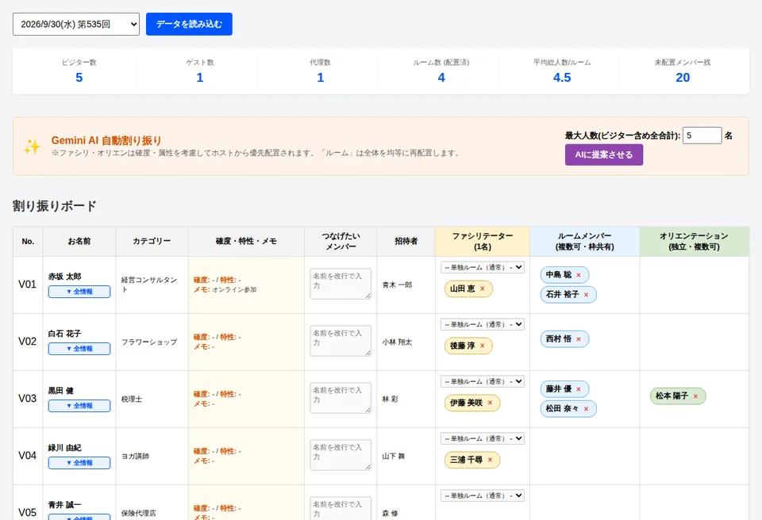

### 手順

1. メニューから **「3. ルーム・オリエン割り振り表」** をクリックします。
2. 対象の定例会を選択して **「データを読み込む」** を押します。

### 画面の説明

#### 上部：ダッシュボード

ビジター・ゲスト・代理の人数、ルーム数、1ルームの平均人数、未配置メンバー数がひと目でわかります。

#### ビジターのカード

ビジターごとに1枚のカードが表示されます。各カードには以下があります。

- **▼ ボタン（全情報）**: ビジターの確度・性格・メモなど、CSVの全情報をその場で確認できます
- **つなげたいメンバー欄**: Spreadingで確認した「つなげたい人」をここに入力します。改行で区切って複数名入れられます。枠の外をクリックすると、自動でその人がルームメンバーに追加されます
- **ファシリテーター枠**: このルームの進行役を配置する場所
- **ルームメンバー枠**: ルームに入るメンバーを配置する場所
- **オリエンテーション枠**: オリエン担当を配置する場所

#### 下部：メンバーの待機リスト（プール）

まだどのルームにも配置されていないメンバーが並んでいます。

#### ドラッグ＆ドロップで配置

- プールからメンバーのチップ（名前の書かれた小さな札）をドラッグして、各枠にドロップします
- 配置済みのチップも、別のルームの枠にドラッグして移動できます
- 使用済みのメンバーはプール上でグレーになります

#### 合同ルーム

ビジター同士を同じ部屋にする場合、ファシリ枠の上のプルダウンから「合同先」を選びます。

### AI自動割り振り（Gemini AI）

手作業が面倒な場合は、AIにお任せすることもできます。

1. **最大人数**（1ルームあたり、デフォルト5名）を指定します。
2. **「AIに提案させる」** ボタンを押します。
3. 数分待つと、AIが全ルームの配置を自動で提案します。

AIは以下の情報を使って最適な配置を考えます。
- **メンバー名簿の内容**（誰がどんなビジネスをしているか）… 業種区分・カテゴリー・会社名・会社での役職・BNIの役職・
  一言コメント・紹介してほしい人・協業したい人。待機メンバー（そのルームに入れられる方）の分だけを、文字のまま渡します
- ビジターのカテゴリー・メモ（確度は、ファシリテーターを付ける順番に使います）
- つなげたいメンバーの情報
- AI参考資料（登録してあるとき）

メンバーブックの中身は名簿で持っているので、**メンバーブックのPDFを読ませる必要はありません**
（名簿の文字をそのまま渡すので、読み違いが無く、いつも最新の内容で、待ち時間も短くなります）。
名簿を直せば、次の「AIに提案させる」からその内容が使われます。
名簿に一言・紹介してほしい人・協業したい人が**まったく入っていないとき**だけ、これまでどおり
「メンバーブック(PDF)の更新」で登録したPDFも読ませます。

> AIに渡すのは、上の項目だけです。ふりがな・メモ・日付・写真は渡しません。

> AI提案後も、気に入らない部分があればドラッグ＆ドロップで自由に調整できます。

### 作成

**「この内容でシートとPDFを作成する」** を押すと、次の3枚のシートとPDFが一度に作られます。

| シート | 内容 |
|---|---|
| `20260930割り振り表` | 割り振り表の本体。PDFもこのシートから作られます |
| `20260930オリエン` | ブレイクアウトルーム表（オリエンテーション） |
| `20260930オープンネット` | ブレイクアウトルーム表（オープンネットワーキング） |

（シート名の頭は開催日の年月日です）

#### ブレイクアウトルームの表について

Zoomのブレイクアウトルームを作るための表です。定例会ごとに2枚できます。
**ルーム名は `V01山田 太郎(カテゴリー)様ルーム` の形**で、割り振り表と同じ割り当てを
ルーム単位で並べ直したものです。

| シート | 列 |
|---|---|
| オリエン | ルーム名 ／ オリエンテーション担当 |
| オープンネット | ルーム名 ／ 招待者 ／ ファシリテーター ／ ルームメンバー |

貼り付け先の列の位置が変わらないよう、**A列は空けたまま、B列をルーム名にしてあります。**

> **合同ルームにしたビジターについて**: 「【合同】〇〇様と同室」としたビジターも、
> BOR表には1行として出ます（ファシリテーター欄に「【合同】…と同室」と表示されます）。
> Zoom側では1つのルームにまとめてください。

割り振りをやり直して作り直すと、この2枚も毎回作り直されます。

---

## ステップ④　案内メールを一括送信する

**メニュー**: `名簿システム` > `2. メールの確認・一括送信`

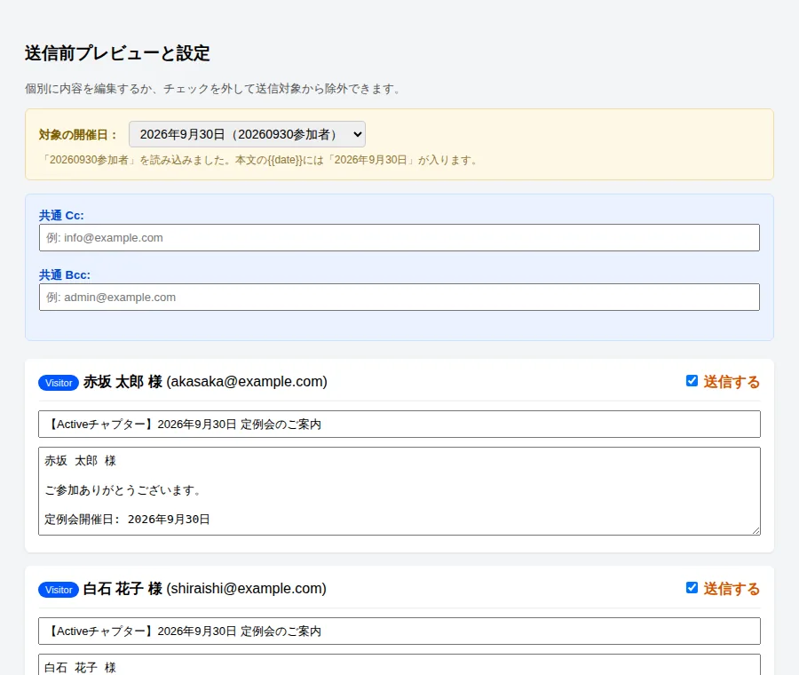

### 対象の開催日

画面の上に **「対象の開催日」** の選択欄があります。
**次回の定例会**が最初から選ばれているので、ふつうはそのままで構いません。

**次回のシートがまだ作られていない場合は、直近の最新の回**が選ばれます。
そのときは画面に赤字で **「選ばれているのは過ぎた回です」** と出ます（送った回の方々に、もう一度送ってしまわないように）。
メールアドレスが無いため送れない方も、画面の上に名前が出ます（全角で入力された「＠」「．」は、半角に直して送ります）。

過去の回に送り直したいときは、ここで開催日を選び直してください。
選んだ開催日の「〇〇参加者」シートが読み込まれ、**本文の `{{date}}` にも
その開催日**が入ります。**`{{visitorlist}}` にも、その開催日のビジターリストPDFのリンク**が入ります
（翌週の名簿を先に作った・前の回のPDFを作り直したあとでも、別の回のリンクにはなりません）。

その開催日のビジターリストのPDF（またはメンバーブックのPDF）がまだ無いときは、
画面の上に赤字で知らせ、本文のリンクは「【未生成】」になります。送る前の確認にも同じ知らせが出るので、
先に「1. CSVから名簿・PDF作成」でPDFを作ってから送ってください。

> 以前は「開いているシート」を対象にしていましたが、
> ウェブアプリには「開いているシート」が無いため、選ぶ方式に変えました。
> どちらから使っても同じように動きます。

### 手順

1. メニューから **「2. メールの確認・一括送信」** をクリックします。
2. 開催日を確認します（既定は次回の定例会）。
   その下に **送信元**（どこから送るか）が出ます。代理送信の Web App を使っているときは、開いたときに送らずに確かめて、
   「✓ 送信元：代理送信の Web App。…送れます（送信元：…）」と出ます。**動いていなければ赤で知らせ、
   「代理送信を使わず、自分のGmail（…）から送る」にチェックを入れておきます**（そのまま送れば、自分のGmailから送ります）
3. 全員分のメールプレビューが表示されます。
   - 宛先、件名、本文がすでに入っています
   - 種別（Visitor / Guest / Substitute）がバッジで表示されます
4. **修正したい場合**: 本文のテキストエリアを直接書き換えられます。
5. **送信しない人がいる場合**: その人の **「送信する」チェックを外す** だけです。
   - **すでに送った方**（この画面から送った記録がある方）と、**Spreadingでキャンセルになっている方**は、
     はじめからチェックが外れていて、「送信済み 9/29 10:15」「キャンセル（Spreading）」の印が出ます。
     画面を開き直しても二重に送らないためです。わざとチェックを入れ直して送るときは、送る前の確認で知らせます
6. **「上記の内容で順番に送信する」** をクリックすると、プログレスバーが進みながら1件ずつ送信されます。

> **安心ポイント**: 途中で1件エラーが出ても、残りのメールは止まらず送信されます。エラーは画面に赤字で表示されるので後から確認できます。
> 送れなかった方がいるときは、最後に「送れなかった方がいます（○名）」と出ます（「完了🎉」とは出ません）。
> 送れた方には「送信済み」の印が付くので、開き直すと、送れなかった方にだけチェックが入ります。

#### 「メールは送られていません…代理送信の Web App が動いていない」と出たとき

`⚙️ 設定` > `メールテンプレート` に **「代理送信 Web App URL」** が入っていると、メールはその Web App（管理者のGmail）から送ります。
その Web App が動いていない（Googleのログインの画面・「見つかりません」のページが返ってくる、合言葉が違う、など）ときは、
**その時点で送信を止めて、理由を出します**（ほかの方にも同じく送れないため。以前は全員に
`SyntaxError: Unexpected token '<'…` と出て、最後に「完了🎉」と出ていました）。**「送られていません（○名）」の方には、メールは送られていません。**

- **今すぐ送るには**、その画面の **「自分のGmail（…）から、○名に送る」** を押します。
  この画面を開いている方のGmailから送ります（送り主の名前は、これまでどおりチャプター名です）
- **代理送信を直すには**、代理送信用の Apps Script で `デプロイ` > `デプロイを管理` を開き、
  「次のユーザーとして実行：**自分**」「アクセスできるユーザー：**全員**」にしてデプロイし直します。
  URLは「/exec」で終わるものを使います（「/dev」で終わるURL、名簿システムのウェブアプリ＝メンバーが開く画面のURLは使えません）。
  代理送信を使わないなら、「代理送信 Web App URL」を空欄にして保存します
- 直したら、メールテンプレート設定の **「① 代理送信を確かめる」「② テストメールを送る」**、または
  `名簿システム` > `🔧 動作確認` > `メール送信のテスト（代理送信の Web App）` で確かめられます（下の「メール送信のテスト」）

#### 代理送信の「送れました」の返事を受け取れなかったとき

代理送信の Web App は、メールを送ったあと、「送れました」の返事を **Googleの別のページに置いて** 返します（Googleの仕組みです）。
このページを読みに行くところが、まれにGoogle側で失敗することがあります。このときメールはもう送られています。

- システムは、**メールは送り直さずに、返事だけを3回まで読み直します**
- それでも読めないときは、**送れているものとして「送信済み」の印を付け、止めずに次の方へ進みます**。
  終わりに「次の方は送れているはずですが…」とお名前が出るので、念のため **代理送信の Web App の持ち主（管理者）のGmailの「送信済み」** で確かめてください
- 返事がまったく別のページ（Googleのエラーのページなど）で、**送れたかどうか分からない** ときは、そこで止めて
  「○○様には、送れたかどうか分かりません」と出します。**その方は「自分のGmailから送る」に入れません**（送れていたら2通届くため）。
  管理者のGmailの「送信済み」で確かめて、送れていなかったときだけ、画面を開き直してその方にチェックを入れて送ってください
  （開き直すと、その方は「送れたか不明」と出て、チェックが外れています）

> 版 `2026-10-06b` より前は、返事を受け取れなかっただけなのに「メールは送られていません…（doPost）がありません」と出て止まり、
> その方も「自分のGmailから、○名に送る」の人数に入っていました。そのとき「自分のGmailから送る」を押していたら、
> 止まったときの1人目の方には **2通** 届いています。

---

## 作成済みPDFをもう一度見たいとき

**メニュー**: `名簿システム` > `4. 作成済みPDFの確認`

**次回の定例会**（まだ作っていなければ直近の回）の、以下のPDFリンクをワンクリックで開けます。
どの開催日のものかは、画面の上に出ます。

- ビジター様リスト PDF（その開催日のもの）
- ルーム割り振り表 PDF（その開催日のもの）
- メンバーブック PDF

---

## ビジター情報の投稿文をつくる

**メニュー**: `名簿システム` > `5. ビジター情報の投稿文`

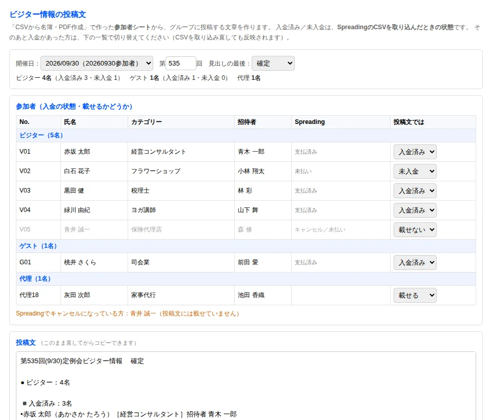

グループに投稿している、次のような文章を作ります。材料は **「1. CSVから名簿・PDF作成」で作った
参加者シート**なので、取り込むものはありません。

```
第535回(9/30)定例会ビジター情報 　確定

● ビジター：7名

◾️入金済み：4名
•見本 一郎（みほん いちろう）［税理士］招待者 名簿 太郎
（…）

◾️未入金：3名
（…）

● ゲスト：0名

◽️入金済み：0名

◽️未入金：0名

● 代理：0名


※招待者の方は[spreading]にご入力ください。

■メンバーの皆様はSpreadingにてビジター様の詳細情報を事前に確認してください。
```

### 手順

1. メニューから **「5. ビジター情報の投稿文」** を開きます。
2. **開催日**を確かめます（次回の定例会が選ばれています）。**第○回**はルーティンチェックシートの
   「定例会回数」から入ります（書いていなければ休会日を除いて数えます）。
3. 一覧で **入金済み／未入金** を確かめます。変わっていれば、その方の欄を切り替えます。
4. **「📋 コピーする」** を押して、LINEなどに貼り付けます。

### 入金済み・未入金の見分け方

SpreadingのCSVの **「支払いステータス」**（`支払済み` / `未払い`）をそのまま使います。
**CSVを取り込んだときの状態**なので、そのあとに入金があった方は、

- 一覧でその方を **「入金済み」** に切り替える、または
- SpreadingからCSVをダウンロードし直して、**「1. CSVから名簿・PDF作成」で作り直す**

のどちらかで反映してください。

- 入金の状態が読めなかった方は **「未入金」** にして、黄色で知らせます
- Spreadingで **キャンセル** になっている方は、投稿文に載せません（一覧には灰色で出ます）
- 載せたくない方は **「載せない」** を選べます

### 見出し・末尾の文面

- **見出しの最後** は `確定` / `速報` / なし から選べます
- **最後に付ける決まり文句**（`※招待者の方は…` の部分）は書き換えられます。
  **「この文面を保存」** を押すと次回からその文面が入ります（空にして保存すると初期の文面に戻ります）
- 投稿文の欄は、**そのまま手で直してからコピー**できます。手で直したあとは、一覧を切り替えても
  自動では作り直しません（**「作り直す」** を押すと反映されます）

> コピーが効かないときは、文章が選ばれた状態になるので **Ctrl+C（Macは ⌘+C）** でコピーしてください。

---

## 役職ごとの入力（定例会の準備）

**メニュー**: `名簿システム` > `📝 役職ごとの入力（定例会の準備）` > `入力状況の一覧・事前MTGのパワポ`
（役職の名前を選ぶと、その役職の入力画面が直接開きます）

ウェブアプリでは、トップページの「毎週の作業」にある **役職ごとの入力・事前MTGのパワポ** から開けます。
ホーム画面（🏠 メニュー画面）では「定例会の準備」の **役職ごとの入力・事前MTGのパワポ** です。

ルーティンチェックシートに直接書き込む代わりに、**役職ごとの画面**から、次回の定例会について
必要なことを入力します。入力した内容は **ルーティンチェックシートの、その開催日の列** に保存されるので、
定例会スライドなど、ルーティンチェックシートを読む機能にそのまま使われます。
事前MTGの「週次情報共有フォーム」で集めていた内容（今週の共有事項・お願い事項・人数など）も、ここで入力できます。
その内容から、**事前MTG（朝イチMTG）のパワポ**も作れます（下の「事前MTG（朝イチMTG）のパワポ」）。

### 入力状況の一覧

開くと、まず **13の役職のカード** が並びます。

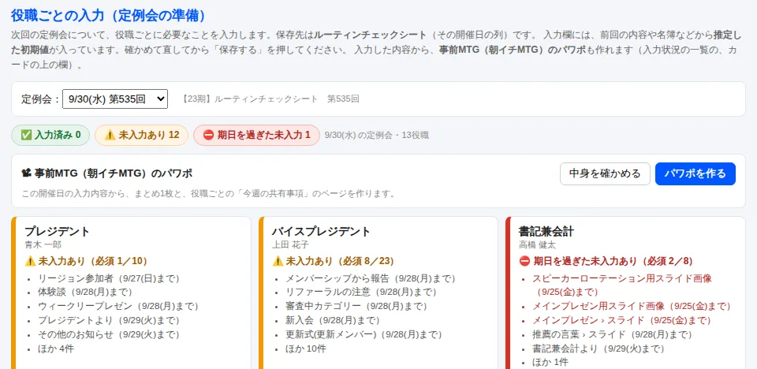

| カード | 意味 |
|---|---|
| 緑 ✅ 入力済み | 必須の項目が、すべてルーティンチェックシートに入っている |
| 黄 ⚠️ 未入力あり | 必須の項目に空欄がある（足りない項目と期日がカードに出ます） |
| 赤 ⛔ 期日を過ぎた未入力あり | 期日を過ぎても空欄の必須項目がある |

- 上の **「定例会」** で開催日を選べます（最初は次回の定例会）
- カードの上の **「📽 事前MTG（朝イチMTG）のパワポ」** で、この開催日の事前MTGのパワポを作れます
- カードの **「入力する →」** で、その役職の入力画面に移ります
- いちばん下の **役職・チーム（半期ごと）** で、役職の担当者（チームのリーダー）と、チームのサポートメンバーを期ごとに登録できます（下の「役職・チーム（半期ごと）」）

#### 役職・チーム（半期ごと）

役職の担当者（チームのリーダー）と、サポートメンバー（ビジターホスト・メンバーシップ委員会など）は、
**半期（4月〜9月・10月〜3月）ごと**に替わります
（Activeチャプターは 2026年9月までが23期、2026年10月〜2027年3月が24期、2027年4月〜9月が25期。
期の番号は `⚙️ 設定` > `チャプター（名前・期・定例会の回数・プレゼンの秒数）` で変えられます）。期ごとに登録します。

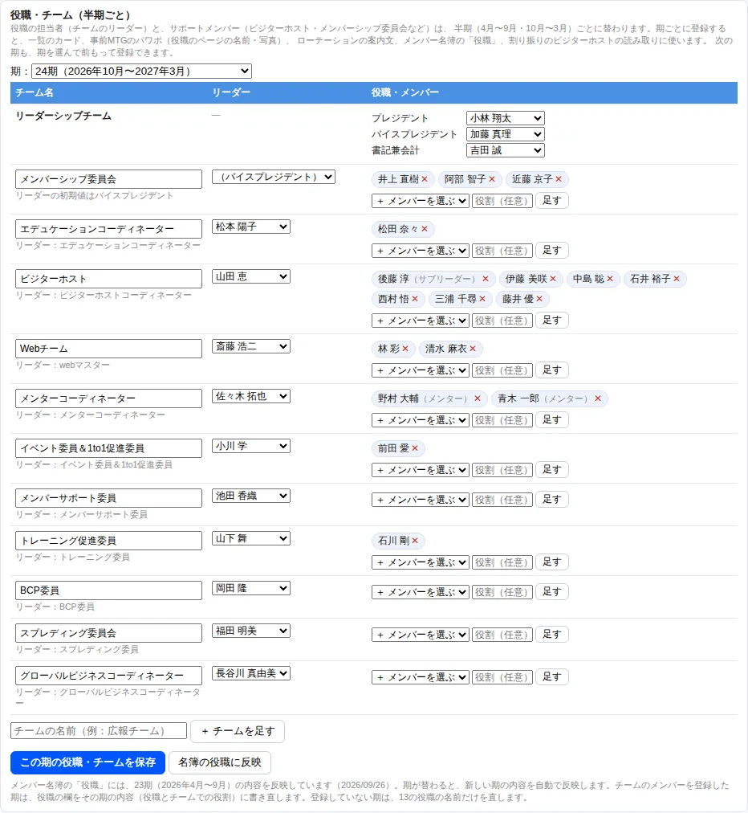

入力状況の一覧のいちばん下に、**チーム名・リーダー・役職・メンバー** の表があります。

| チーム | リーダー | 役職・メンバー |
|---|---|---|
| リーダーシップチーム | — | プレジデント・バイスプレジデント・書記兼会計を選びます |
| メンバーシップ委員会 | 選びます（空欄ならバイスプレジデント） | サポートメンバーを足します |
| 役職ごとのチーム（エデュケーションコーディネーター、ビジターホスト、Webチーム、メンターコーディネーター、イベント委員＆1to1促進委員、メンバーサポート委員、トレーニング委員、BCP委員、スプレディング委員会、グローバルビジネスコーディネーター） | その役職の担当者を選びます（ビジターホストのリーダーはビジターホストコーディネーター） | サポートメンバーを足します。コーディネーター以外のチームにも足せます |
| 足したチーム | 選びます | サポートメンバーを足します |

1. **期**を選びます。最初は、上の「定例会」の開催日の期が選ばれています（「・この開催日」の印）。
2. **リーダー**を選びます（リーダーシップチームは、3つの役職の担当者）。
3. **サポートメンバー**は、「＋ メンバーを選ぶ」で方を選び、必要なら **役割**（`サブリーダー`、`メンター` など）を入れて **「足す」** を押します。
   外すときは名前の横の **✕** を押します。
4. チームの名前は直せます（例：`トレーニング委員` → `トレーニング促進委員`）。ほかのチームは、下の欄に名前を入れて
   **「＋ チームを足す」** で足せます（足したチームは「✕ このチームを外す」で外せます）。
5. **「この期の役職・チームを保存」** を押します。

- **次の期も選べる**ので、新しい期の顔ぶれを前もって登録しておけます（今の期のカードは変わりません）
- まだ登録していない期（「・未登録」の印）は、
  - **チームのメンバー・リーダーは空のまま**です。期が替わると顔ぶれが替わるので、**前の期のメンバーは引き継ぎません**
    （チームの名前と、足したチームだけは、前の期のものを使います）
  - 役職の担当者は、いちばん近い前の期（無ければ次の期）の方を出します
  - 選んで保存すると、その期のものになります
- 期が替わったのに新しい期の役職・チームがまだ無いと、一覧の上にお知らせが出ます
- 担当者は、一覧のカード・役職の入力画面、**事前MTGのパワポ**（役職のページのお名前・写真）、
  **スピーカーローテーションの案内文**（「書記兼会計の○○まで」）、**定例会スライド（前半）の役職のメンバー紹介**
  （リーダーシップチーム・コーディネーター・チームのページのお名前・写真）に使います。どれも**その開催日の期の担当者**です
- 役職とチームでの役割は、**メンバー名簿の「役職」**にも入ります（下の「メンバー名簿の「役職」への反映」）
- ビジターホストのチームは、**割り振りのビジターホストの設定**で読み取れます（「⚙️ 設定」の「ビジターホストの設定」）
- 期ごとにする前に画面で保存していた担当者は、**24期の担当者**として引き継いでいます。
  一度も登録していない期の担当者は空欄です（メンバーの氏名はシステムのコードには持たず、ここで登録したものだけを使います）

#### メンバー名簿の「役職」への反映

期が替わると、新しい期の役職・チームを **メンバー名簿の「役職」** に自動で書き込みます
（メンバーブックのお名前の上に赤い帯で出る **BNIの役職** も変わります。会社での役職（肩書き）は別の列なので変わりません）。
期が替わったあと、役職ごとの入力・メンバー名簿・メンバーブックなどを最初に開いたときに行います。

**その期のチームのメンバーを登録してあるとき**は、期が替わると顔ぶれが全部替わるので、役職の欄を**全部その期の内容**にします。

| 名簿の行 | 「役職」 |
|---|---|
| 役職の担当者 | 役職の名前（例：`プレジデント`、`ビジターホストコーディネーター`） |
| チームのサポートメンバー | チームの名前（例：`ビジターホスト`、`Webチーム`、`ビジターホスト（サブリーダー）`）。チームの名前が役職の名前と同じチームは、`エデュケーションコーディネーター（サポート）` `メンターコーディネーター（メンター）` のように（）で役割を付けます |
| 足したチーム・メンバーシップ委員会のリーダー（役職の無い方） | `広報チーム（リーダー）` のように付けます |
| いくつも当てはまる方 | 「・」でつなぎます（例：`書記兼会計・Webチーム`） |
| どれにも入っていない方 | 空欄 |

**チームのメンバーがまだ無い期**は、13の役職だけを直します。

| 名簿の行 | 「役職」の直し方 |
|---|---|
| その期の担当者 | 担当する役職の名前にします |
| 担当者でない方で、「役職」が13の役職の名前だけ（前の期の担当者など） | 空欄にします |
| 「ビジターホスト」「WEB」など、13の役職の名前以外が入っている | そのまま残します |

- 新しい期の役職・チームがまだ登録されていないときは反映しません。期が替わってから登録して保存すると、そのとき反映します
- 反映してある期の役職・チームを直して保存すると、名簿も直します
- すぐに反映したいとき（次の期を前もって反映したいときも）は、「役職・チーム（半期ごと）」で期を選んで
  **「名簿の役職に反映」** を押します。直すところの一覧が出るので、確かめてから反映します
- 反映してあるときに **Spreading・メンバーリスト(OCR)から取り込む**と、取り込んだあと、役職を登録した内容に合わせ直します
  （取り込んだ役職が前の期のままでも、登録した内容に戻ります）
- どの期の内容を反映してあるかは、「役職・チーム（半期ごと）」の下に出ます

### 役職ごとの入力

1. 自分の役職のカードの **「入力する →」** を押します（メニューで役職名を選んだときは、この画面から始まります）
2. 項目ごとに、入力欄を確かめて直します
   - 入力欄には、**前回の内容や名簿などから推定した初期値**が入っています。出どころは欄の下に出ます
   - **前回（9/23）：…** の行に、前回の内容が出ます。**「前回と同じ」** を押すと前回の内容が入ります
   - **「なし」「済」** のボタンで、その文字を入れられます。**「元に戻す」** で開いたときの内容に戻ります
3. いちばん下の **「保存する」** を押すと、ルーティンチェックシートに書き込まれます

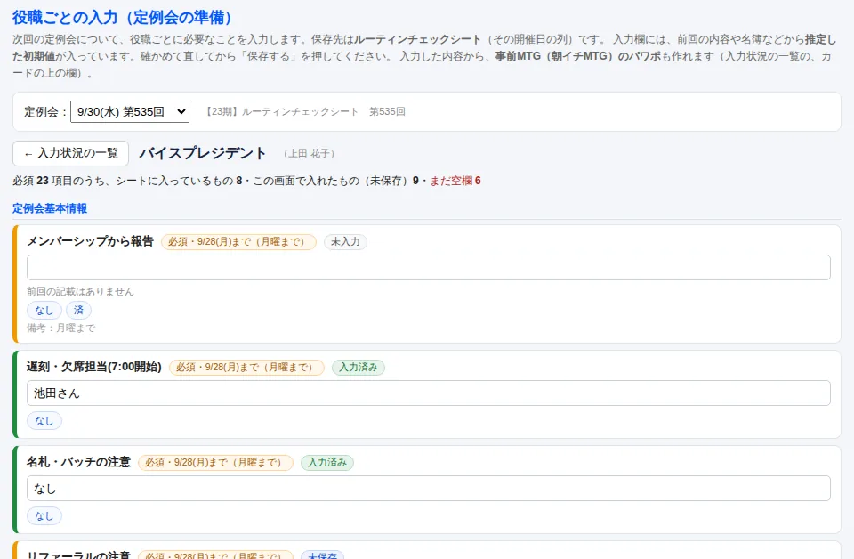

| 表示 | 意味 |
|---|---|
| **必須・9/28(月)まで** | 必須の項目と、その期日（ルーティンチェックシートの「期日」から計算） |
| **入力済み** | ルーティンチェックシートに入っている |
| **未保存** | この画面で入れた・直したが、まだ保存していない（推定で入った初期値も、保存するまでは未保存です） |
| **自動** | 数式などで自動で入る欄（トークスクリプトなど。入力できません） |

「代理・欠席」の欄には、お名前の数（◯名）も出ます（フォームの「欠席人数」などの代わり。
数え方は下の「事前MTG（朝イチMTG）のパワポ」の「人数の数え方」）。
保存していない入力があるまま一覧に戻ったり開催日を変えたりすると、確認が出ます。

### 推定した初期値

| 項目 | 初期値の決め方 |
|---|---|
| 一般規定 | 前回の番号の次（12番の次は1番。休会日は数えません） |
| ウィークリープレゼン | 前回の記載から、業種区分を開催した回数ぶん進めたもの（誰もいない区分は飛ばす）と、その区分のNo.がいちばん若い方 |
| 更新対象者（30日前・60日前・90日前） | メンバー名簿の更新期限日から |
| 新入会・更新式 | メンバー名簿の入会日・更新日が、前回の開催日より後の方 |
| 代理・欠席 › 代理、人数（ビジター・ゲスト） | その開催日の参加者シート（「1. CSVから名簿・PDF作成」で作ったもの）から。キャンセルの方は数えません |
| 本日の招待者（webマスター） | その開催日の参加者シートの、**ビジター・ゲストを招待したメンバー**（同じ方は1回。「見本さん、試験さん」の形）。代理の方・キャンセルの方は入れません。参加者シートがまだ無い回は空のまま、ビジター・ゲストがいなければ「なし」 |
| 人数（リージョン参加者） | 「リージョン参加者」の欄のお名前の数 |
| 各担当者とポジティブな挨拶 | その日のメインプレゼンのお2人 |
| エデュケーション・BNI目的と概要 | ECの前回の共有事項に書いた「次週のエデュケーション：○○さん（コアバリュー）」から |
| 遅刻・欠席担当、名札・バッチの注意、リファーラルの注意、審査中・募集・開放カテゴリー、リマインダー、バイスプレジデントによる報告、今週の共有事項、お願い事項 など | 前回と同じ |
| そのほか | 前回と前々回が同じならその内容、前回が「なし」なら「なし」 |

- 「済」を書く欄（スライド画像・スライドなど）は、前回の「済」を引き継ぎません
- 退会者は、更新状況で「更新しない」にした方を、欄の下に推定として出します（「これにする」で入ります）
- すでにシートに入っている項目は、その内容が入力欄に出ます。名簿などからの推定と違うときは、欄の下に推定も出ます

### 項目と必須の決まり方

**項目も必須も、ルーティンチェックシートで決まります。**

- 役職の画面には、ルーティンチェックシートの **「担当」の欄** がその役職になっている行が並びます
  （プレジ・バイス・書記兼会計・VH・EC・WEB など。担当を書き換えれば、画面もそのとおりに変わります）
- **「期日」の欄**（5日前・2日前・当日 など）が入っている項目が **必須** です。期日を消せば必須でなくなります
- 担当の書き方がどの役職か分からない項目は、一覧の下にお知らせが出ます

事前MTGのフォームにあって、ルーティンチェックシートに無かった項目は、
**初めて保存したときに、シートの項目のいちばん下（1行あけた下）へ「事前MTG 共有事項」として行を足します**
（期ごとのシートに1回だけ。書くのは項目名・担当・期日・曜日目安の列だけです）。

| 役職 | 足す項目 |
|---|---|
| 全役職 | 今週の共有事項（必須・2日前） |
| プレジデント・バイスプレジデント・書記兼会計 | お願い事項 |
| 書記兼会計 | 直近のイベント、卒業コメント |
| バイスプレジデント | 人数：ビジター・ゲスト・見学・リージョン参加者（必須・2日前） |

フォームの「ウィークリープレゼン担当者」「スタートアッププレゼン担当者」「メインプレゼン担当者」
「新入会・更新・退会」「リージョン参加者(お名前)」は、ルーティンチェックシートにある同じ項目に入ります。

ルーティンチェックシートに、その役職の **「（役職）より」の行**（`書記兼会計より` `プレジデントより` など。
朝一MTGでその役職が話すこと）があるときは、**そちらに書いてあれば「今週の共有事項」は空でも入力済み**に数えます
（画面には「「書記兼会計より」に記載」と出ます）。どちらも事前MTGのパワポのその役職のページに入るので、
同じことを2回書かなくて大丈夫です。逆に、今週の共有事項に書いても「○○より」の行は入力済みになりません
（「○○より」はトークスクリプトでも読むため）。

### ほかの方と同時に入力したとき

保存するときに、**画面を開いたあとでルーティンチェックシートが書き換えられていた項目は、上書きしません**
（お知らせが出て、入力した内容は画面に残ります）。開催日を選び直して、シートの内容を確かめてから直してください。
数式が入っている欄と、ほかの役職の項目も保存しません。

### スピーカーローテーション（書記兼会計）

**メニュー**: `名簿システム` > `📝 役職ごとの入力（定例会の準備）` > `スピーカーローテーション（書記兼会計）`
（書記兼会計の入力画面の **「🔁 スピーカーローテーションの管理」** からも開けます。
ウェブアプリでは、トップページの「毎週の作業」にある **スピーカーローテーション（書記兼会計）**）

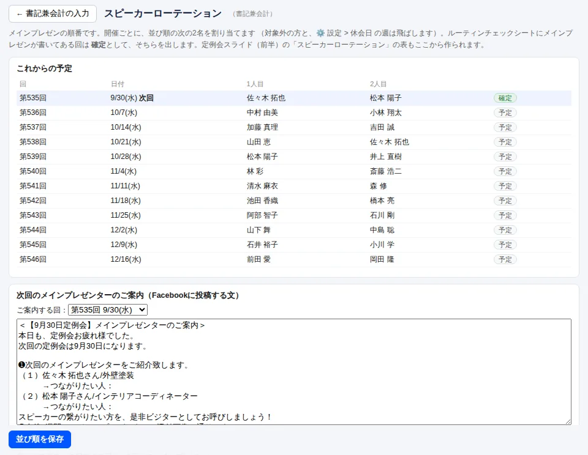

「MP選出・ローテーション管理ツール」でしていた、**メインプレゼンの順番の管理**をここで行います。

メニューやウェブアプリから開くと、**ローテーションを先に読み込みます**。
書記兼会計の入力は、**「← 書記兼会計の入力」** を押したときに読み込みます（初期値の推定に少し時間がかかるため）。

画面の上の **「定例会」** を変えても、**ローテーションの画面のまま**です。**ご案内する回**がその日の回になり、
投稿文と添付する画像2枚（メインプレゼンターの画像・ローテーションの表）をその回で作り直します。
「← 書記兼会計の入力」を押すと、上で選んでいる日の書記兼会計の入力を読み込みます。

- **並び順**の上から順に、開催ごとに **2名ずつ** 割り当てます。最後まで行ったら最初に戻ります
- **「含める」のチェックを外した方（三役など）は飛ばします**
- **休会日**（`⚙️ 設定` > `休会日`）の週は飛ばします
- **ルーティンチェックシートにメインプレゼンが書いてある回は「確定」**として、そちらを出します

| 画面の欄 | できること |
|---|---|
| これからの予定 | 次回から12回分の、第○回・日付・お2人（確定／予定） |
| 次回のメインプレゼンターのご案内 | Facebookに投稿する文（ツールと同じ文面）と、**添付する画像2枚**（メインプレゼンターの画像・ローテーションの表。下の「Facebookに添付する画像」）。文は **「📋 コピーする」** で貼り付けられます |
| 並び順 | 「含める」のチェック、**↑↓**（上下に動かす）、**外す**（退会など）、並びに入っていない方を **入れる**、2人を **入れ替える** |
| 定例会スライド（前半）の表 | 表の見出しと、表の下の注意書き |
| ツールから取り込む | ツールで保存したHTMLファイルを選ぶと、並び順・対象外・次回の位置をそのまま取り込みます |

直したら **「並び順を保存」** を押します。

#### Facebookに添付する画像

「次回のメインプレゼンターのご案内（Facebookに投稿する文）」の欄に、画像が2枚出ます。

1. **メインプレゼンターの画像**（「今週のメインプレゼンテーション」。1920×1080）…
   ご案内する回のお2人の**写真・お名前・ご紹介して欲しいカテゴリー**を、左右に並べた画像です（書記兼会計のデザインと同じ並び・色）
   - 写真は `⚙️ 設定` > `メンバー写真` の写真です。無い方は「写真なし」の枠になります。
     **「写真を選ぶ」** で、パソコンの写真を使うこともできます
   - ご紹介して欲しいカテゴリーは、メンバー名簿の **「協業したい人」** を「・」「、」で分けたものです（3つまで。4つ以上は3つ目にまとめます）。
     カテゴリーの無い方は、「ご紹介して欲しいカテゴリー」の見出しも出しません
   - お名前・カテゴリー・見出し（「今週のメインプレゼンテーション」）は、画像の上の欄で**直せます**（すぐ描き直します。名簿は変わりません）。
     長いカテゴリーは、小さくするか2行にして収めます
   - 下の赤い帯には、標語と「BNI ＋チャプター名」が入ります（BNIのロゴの画像は入れていません）
   - 保存のファイル名は `20261007_メインプレゼンター.png` のような名前です
2. **ローテーションの表の画像**（投稿文の「➋今後4週間のメイン・プレゼンターは添付画像の通りです。」の画像。前半スライドの表と同じ作り）

画像の書体は2枚とも **Meiryo UI** です（前半スライドのスピーカーローテーションの表と同じ）。
Meiryo UI の無いパソコン・スマホ（Macなど）では、似た書体（ヒラギノなど）で描きます。

- **ご案内する回**を選ぶと、その回の投稿文と、メインプレゼンターの画像と、その回から **5回分** の表の画像を作り直します。
  ふだんは次回、**定例会の日は、終わったあとに投稿するので次の回**が選んであります。
  画面の上の **「定例会」** を変えると、その日の回になります。並び順を保存しても、選んだ回はそのままです
- 中身は「これからの予定」と同じです（確定の回はルーティンチェックシートのお2人、予定の回はいまの並び順）。
  お名前は**メンバー名簿の書き方**（姓と名の間の空白など）で出します（ツールから取り込んだ並び順に空白が無くても、名簿のとおりに出ます）。
  カテゴリー・つながりたい人はメンバー名簿から入ります。並び順・見出し・注意書きを直すと、すぐ描き直します
- **「⬇ 画像を保存」** … `20261007_スピーカーローテーション.png`（メインプレゼンターの画像は `20261007_メインプレゼンター.png`）のような名前で保存します
- **「📋 画像をコピー」** … そのままFacebookの投稿に貼り付けられます（2枚とも、それぞれの下のボタンで）
- 保存・コピーができないとき（ダイアログの中など）は、画像を**右クリック（スマホは長押し）**して保存・コピーするか、
  **「Driveに保存」**（`03_生成物` に保存して、そこからダウンロード）を使ってください

- 並び順を直すと、**「○/○ の回から、この並び順どおりに割り当てます」** と出ている回から先が変わります。
  それより前の回と「確定」の回は変わりません（画面を開いたときに、確定した回のあとへ自動で進めます）
- 入れ替えは、2人の順番だけを入れ替えます（ほかの方の順番はそのまま）
- **メンバー名簿にいない方**が並びにいると、お知らせが出ます（退会された方は「外す」で並びから外してください）
- ルーティンチェックシートで開催回が空欄の日（休会の予定）が休会日に無いと、お知らせが出ます。
  お休みなら休会日に登録してください（登録しないと、その週にも割り当てます）
- **まだ一度も保存していないとき**は、メンバー名簿の順に並び（対象外なし）、**最初に見たときの次回の定例会**が並びの先頭から始まります
  （その起点は覚えておくので、見る週によって同じ回の発表者が変わることはありません）。
  画面と前半スライドの画面に「まだ並び順を保存していません（仮の並び）」と出ます。
  「MP選出・ローテーション管理ツール」で管理していた並びは、ツールで保存したHTMLを「ツールから取り込む」で読み込んでください
  （メンバーの氏名はシステムのコードには持たず、スプレッドシートにだけ保存します）

書記兼会計の入力画面の **「メインプレゼン」** には、ローテーションのお2人が初期値として入ります。
**「スピーカーローテーション用スライド画像」** は、前半スライドで表を作るようになったので、初期値が「済」になっています。

### 事前MTG（朝イチMTG）のパワポ

**メニュー**: `名簿システム` > `📝 役職ごとの入力（定例会の準備）` > `入力状況の一覧・事前MTGのパワポ`
（入力状況の一覧の、カードの上にある **「📽 事前MTG（朝イチMTG）のパワポ」** の欄で作ります。
入力と同じ画面なので、足りない項目を入力してから、そのまま作れます。
ウェブアプリでは、トップページの「毎週の作業」にある **役職ごとの入力・事前MTGのパワポ**）

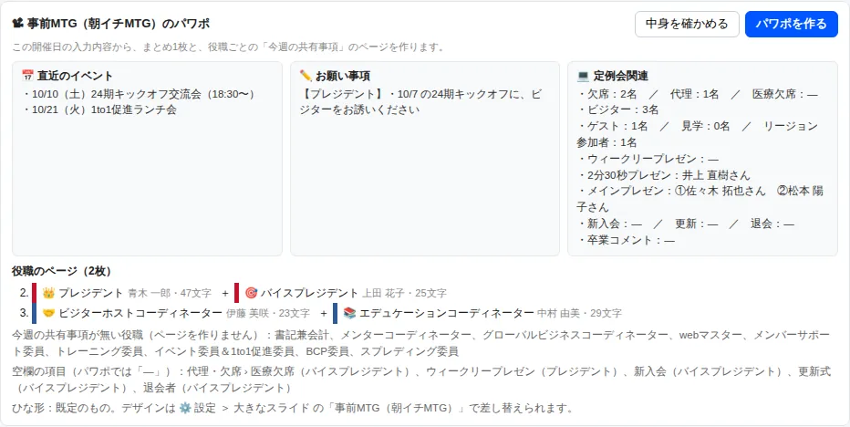

これまで「BNI週次役職情報共有 パワポ自動生成ツール」で、フォームの回答（CSV）から作っていた事前MTGのパワポを、
**役職ごとの入力（ルーティンチェックシート）の内容から**作ります。CSVのダウンロード・読み込みは要りません。
中身・並び・デザインはツールと同じです。

1. 上の **「定例会」** で開催日を選びます（最初は次回の定例会）
2. **「中身を確かめる」** で、まとめのページの文、役職のページの割り付け、空欄の項目を確かめます
3. **「パワポを作る」** を押すと、`03_生成物` に `定例会20260930_（事前MTG）09291015.pptx` のような名前
   （開催日と、作った日時。「7. 定例会スライド（前半）」の「作成」にある、スライドの名前の付け方）で保存されます。
   **「⬇ PowerPointをダウンロード」** から取り出せます

| ページ | 中身 |
|---|---|
| 1枚目 まとめ（`9/30 定例会　朝イチMTG`） | 📅 **直近のイベント**（書記兼会計）<br>✏️ **お願い事項**（三役の「お願い事項」。1行目の頭に【プレジデント】などが付きます）<br>💻 **定例会関連**（下の表） |
| まとめのすぐあと 熱烈歓迎（新入会の方がいる日だけ） | ルーティンチェックシートの **「新入会」** の方ごとに1枚。写真・お名前・会社名・カテゴリー（下の「熱烈歓迎のページ」） |
| 2枚目から 役職のページ | 役職ごとの **今週の共有事項** と、ルーティンチェックシートの **「（役職）より」の行**（`書記兼会計より` `プレジデントより` など）を、担当者の写真・お名前つきで。役職の並び、帯の色（三役＝赤・コーディネーター＝青・委員会＝緑）、アイコンはツールと同じ |

| 定例会関連の行 | どこから |
|---|---|
| 欠席／代理／医療欠席 | 「代理・欠席」の欄のお名前の数 |
| ビジター、ゲスト／見学／リージョン参加者 | バイスプレジデントの「人数：…」（リージョン参加者には「リージョン参加者」の欄のお名前も付きます） |
| ウィークリープレゼン、スタートアッププレゼン、メインプレゼン | ルーティンチェックシートの同じ項目（「2分30秒プレゼン」の行でも読みます） |
| 新入会／更新／退会 | 「新入会」「更新式」「退会者」 |
| 卒業コメント | 書記兼会計の「卒業コメント」 |

- **空欄の項目は「—」**になります（「中身を確かめる」で、空欄の項目と担当の役職が出ます）
- **今週の共有事項と「（役職）より」の行が、どちらも空か「なし」の役職のページは作りません**。
  どちらか片方に書いてあれば作ります（以前は今週の共有事項だけを見ていて、「書記兼会計より」に書いた書記兼会計のページが出ませんでした）。
  両方に書いてあれば、今週の共有事項 → 「○○より」の順に両方入れます（同じ内容なら1回だけ）。
  「中身を確かめる」の役職のページの一覧に、どこから入れたか（`書記兼会計より` など）が出ます
- PowerPoint・Wordから写した文の改行（そのままではパワポに書けない文字）は、改行に直して入れます
- 短いもの（180文字以下）同士が続くときは、**2人で1枚**にします（ツールと同じ）
- 文字が多いときは、枠に収まるまで文字を小さくします。まとめの3つのまとまりは、量に合わせて枠の高さを決め、
  重ならないように上から並べます。いちばん小さく（9pt）しても収まらないときは、作ったときにお知らせが出ます
- 写真は `02_メンバー写真` から担当者のお名前で探します。見つからない方は仮の画像（人の形）のままです
- 担当者は、その開催日の期（半期）の担当者です。入力状況の一覧のいちばん下の **役職・チーム（半期ごと）** で登録します

#### 人数の数え方（「代理・欠席」の欄）

お名前の数を数えます。書き方はこれまでのシートのままで大丈夫です。

| 書き方の例 | 数 |
|---|---|
| `小西さん、長尾さん` ／ `梅田さん　相田さん` | 2名 |
| `村井さん（当欠）`（かっこの中は数えません） | 1名 |
| `辻さん代理：増井 登志さん` ／ `内野さん→小畑大地さん`（代理の方は数えません） | 1名 |
| `なし／遅刻：岩渕さん` ／ `※福元さん遅刻`（遅刻は欠席に数えません） | 0名 |
| `なし` ／ `なし（10/1火曜8時時点）` ／ `24日21時時点でなし` | 0名 |
| `大庭ED`（さん・様などが無いときは、区切りの数） | 1名 |

#### 熱烈歓迎のページ（新入会メンバー）

ルーティンチェックシートの **「新入会」** の欄に書いてある方ごとに、**熱烈歓迎のページを1枚ずつ**作り、
**まとめのページのすぐあと**に並べます（新入会の方がいない日は作りません）。

- お名前・会社名・カテゴリー・よみがな・写真は **メンバー名簿** から入れます（写真は `02_メンバー写真`。丸い枠に合わせて切り抜きます）
- まだ名簿に入っていない方は、チェックシートに書いてあったお名前と、かっこの中のカテゴリー
  （`新井 花子さん（エステサロン）` → 「エステサロン」）で作ります。会社名は空になり、写真は仮の画像（人の形）のままです
- 「中身を確かめる」に、熱烈歓迎のページの方（名簿にない・写真なし も）と、使うひな形が出ます

**ひな形は登録できます。** 何も登録しなければ、同梱の **既定のひな形**（赤い帯に「🎉 熱烈歓迎 🎉」、丸い写真、
お名前・会社名・カテゴリー、「ようこそ、○○チャプターへ！」）で作ります。デザインを変えたいときは：

1. `⚙️ 設定` > `大きなスライド` の **熱烈歓迎（事前MTG・新入会メンバー）** で **「既定のひな形をダウンロード」**
   （自分で作った熱烈歓迎のスライドを使ってもかまいません）
2. PowerPointで、入れたい場所に下の差し込み口を書き、写真の画像の名前を `写真` にします
   （「オブジェクトの選択と表示」で名前を変えられます。名前が無ければ、お名前の文字にいちばん近い画像に入れます）
   - **画像からひな形を作ったとき**などは、差し込み口の代わりに、ふつうの言葉で場所を示せます。
     お名前を入れる文字の箱に **`お名前`** と書き、写真を入れる場所に **`お写真`** とだけ書いた四角を置きます
     （`お名前` の部分がお名前になります。「さん」を付けたいときは `お名前さん` と書きます。
     `お写真` の四角は、同じ位置・大きさ・形の写真になります。写真が無い方は、`お写真` の文字だけ消えて四角が残ります）
3. Driveに置いて、その共有リンクを貼り付けて **「登録する」**（.pptx のまま置きます）。
   登録したときに、お名前・お写真を入れる場所が見つかったかが出ます（見つからないときは「⚠」で出ます。「中身を確かめる」にも出ます）

| 差し込み口 | 入るもの |
|---|---|
| `{{氏名}}` ／ `{{名字}}` ／ `{{よみがな}}` | `新入 花子` ／ `新入` ／ `しんにゅう はなこ`（敬称は付きません。ひな形に「さん」を書きます） |
| `{{会社名}}` ／ `{{カテゴリー}}` | メンバー名簿の会社名・カテゴリー |
| `{{チャプター}}` | `Activeチャプター`（チャプターの設定から） |
| `{{月日}}` ／ `{{開催日}}` ／ `{{開催回}}` | `10/7` ／ `2026年10月7日（水）` ／ `536` |

- ひな形の中で `{{氏名}}` のあるページ（無ければ最初のページ）を、人数ぶん写して使います
- 事前MTGのひな形とデザインの土台（スライドマスター・テーマ）が違うひな形でも、**土台ごと写すので見た目はそのまま**です
- お名前・会社名・カテゴリーが長いときは、1行に収まるまで文字を小さくします
- ページの大きさが事前MTGのひな形と違うとき（画像から作った 1920×1080 のひな形など）は、
  **事前MTGのパワポの大きさに合わせて縮めて**入れます（図形・文字の大きさ・線の太さも同じ割合で）。
  縦横の比（16:9・4:3）が違うときは、ページに収まる大きさにして真ん中に置きます（作ったときにお知らせが出ます）

#### ひな形（デザインを変えたいとき）

何も登録しなければ、同梱の **既定のひな形**（ツールと同じデザイン）で作ります。
色・文字の大きさ・配置・表紙などを変えたいときは、ひな形を登録します。

1. `⚙️ 設定` > `大きなスライド` の **事前MTG（朝イチMTG）** で **「既定のひな形をダウンロード」**
2. PowerPointで開いて直します（`{{ }}` の差し込み口は消さずに残します。ページを足しても構いません）
3. Driveに置いて、その共有リンクを貼り付けて **「登録する」**（Googleスライドに変換せず、.pptx のまま置きます）

| 差し込み口 | 入るもの |
|---|---|
| `{{月日}}` ／ `{{開催日}}` ／ `{{開催回}}` | `9/30` ／ `2026年9月30日（水）` ／ `535` |
| `{{直近のイベント}}` `{{お願い事項}}` `{{定例会関連}}` | まとめの3つのまとまり（1行ずつ段落になります） |
| `{{アイコン1}}` `{{役職1}}` `{{氏名1}}` `{{共有事項1}}` | 役職のページの1人目（2人のページの右の方は `…2`） |

- `{{共有事項2}}` のあるページが **2人のページ**、`{{共有事項1}}` だけのページが **1人のページ** のひな形です。
  役職のページは、この2枚をもとに人数ぶん作ります
- 写真は名前が `写真1` `写真2` の画像、帯は名前が `帯1` `帯2` の図形に入ります
  （PowerPointの「オブジェクトの選択と表示」で見られます）。**帯を赤・青・緑以外の色にすると、塗り替えません**
- **書体はメイリオ**です。作るときに、パワポのテーマの書体（見出し・本文）をメイリオにするので、
  ひな形で書体を指定していない文字はメイリオになります（熱烈歓迎のページも）。
  ほかの書体にしたい文字は、ひな形でその文字に書体を指定してください（指定した書体はそのまま使います）。
  メイリオは1行の高さが大きいので、既定のひな形は本文の行間を少し詰めてあります（まとめ 100%・役職のページ 110%）
- 使うひな形は「中身を確かめる」の下に出ます。ひな形の作りの詳しい決まりは `docs/templates/README.md` にあります

### 役職ごとの入口（ウェブアプリのURL）

ウェブアプリのURL（`…/exec`）の最後に `?p=role_input&role=記号` を付けると、その役職の入力画面が直接開きます。
各役職の方へのご案内やブックマークに使えます（例: `…/exec?p=role_input&role=vice`）。
スピーカーローテーションは `…/exec?p=rotation` で直接開けます。
以前ご案内した事前MTGのパワポの `…/exec?p=premtg` も、これまでどおり開けます（入力状況の一覧が開き、事前MTGの中身の確かめが出ます）。

| 役職 | 記号 | 役職 | 記号 |
|---|---|---|---|
| プレジデント | `president` | webマスター | `web` |
| バイスプレジデント | `vice` | メンバーサポート委員 | `support` |
| 書記兼会計 | `secretary` | トレーニング委員 | `training` |
| ビジターホストコーディネーター | `vhc` | イベント委員＆1to1促進委員 | `event` |
| メンターコーディネーター | `mentor` | BCP委員 | `bcp` |
| エデュケーションコーディネーター | `ec` | スプレディング委員 | `spreading` |
| グローバルビジネスコーディネーター | `gbc` | | |

> ウェブアプリは**開いた方の権限で動きます**。保存するとルーティンチェックシートに書き込むため、
> **役職の方にも、このスプレッドシートの編集権限が必要です。**

---

## スライド・メンバーブックの作成

### 事前の準備（最初に1回だけ）

1. **⚙️ 設定 > BNI 素材フォルダ** … 共有フォルダのURLを登録します。その直下に
   `01_テンプレート` `02_メンバー写真` `03_生成物` が自動作成され、以後の素材と
   生成物はすべてここに保存されます。
2. **⚙️ 設定 > メンバー名簿** … 全ツール共通のメンバー情報です。
   「一括取り込み」から、現行のメンバーブックHTML、または表計算からの貼り付けで登録できます。
   この**並び順が掲載順・発表順**になります。
3. **⚙️ 設定 > メンバー写真** … 写真をアップロードすると、**氏名で自動照合**されます。
   ファイル名は「氏名.jpg」または「氏名__識別子.png」にしてください
   （氏名は**メンバー名簿と同じ字**で。姓と名の間の空白の有無・全角半角は問いません）。
   アップロードすると**写真索引も作り直す**ので、すぐにスライドやメンバーブックで使われます
   （画面の「写真が見つからないメンバー」から消えれば使えます）。
   ドライブの `02_メンバー写真` に直接置いたときは、**「索引を作り直す」** を押してください。
   形式は **JPEG・PNG・GIF・WebP** に対応しています（拡張子の大文字小文字は問いません）。
   同じ人の写真が複数あるときは**更新日時が新しいもの**が使われます。
   iPhoneの **HEIC** は表示できないため、JPEGかPNGに変換してください
   （対応していない形式があると、取り込み時にファイル名を挙げてお知らせします）。
4. **公式ファイルから雛形を作る**（初期設定のときだけ）… **⚙️ 設定 > BNI 素材フォルダ** の画面のいちばん下にある
   小さなリンクから開きます。BNIの公式ファイル（定例会のスライドの .pptx）を共有ドライブに置いてリンクを設定すると、
   ビジター用4種類・メンバープレゼン・定例会スライド（前半・後半）の雛形を作って登録します
   （「初期設定」の章の「公式ファイルから雛形を作る」）。ふだんは使いません。次からは、その雛形を PowerPoint で直して使います。
5. 自分たちで作った雛形を使うときは、**⚙️ 設定 > PowerPointテンプレート**（ビジター用の4種類。登録時にレイアウトが
   自動検証されます）と **⚙️ 設定 > 大きなスライド**（数十MBあるテンプレートは、アップロードではなく
   **Driveに置いて共有リンク**で登録します。登録するものは下の表）から登録します。
   - 登録してあるのに、使っている方のアカウントで開けないテンプレートは「未登録」ではなく
     **「登録済みですが、このアカウントでは開けません」** と理由つきで出ます（ドライブの許可・素材フォルダの共有を確かめてください）。
     登録済みのものを置き換えるときは、みんなが使うテンプレートが替わるので確認が出ます
   - 設定した素材フォルダを開けない方は、テンプレートの登録・写真の追加・写真の索引の作り直しができません
   - ビジター用の4種類は、**お名前などを入れる番号の図形が文字の枠であること**も確かめます（写真や動画の番号が
     合っているだけのもの＝別の種類のテンプレートは、登録しません）
   - ビジター用の4種類で使うのは **1ページ目だけ**です。2ページ目以降があっても、作るファイルには入りません
     （登録のときにお知らせします）。PowerPointで見本の文字を消した枠にも、お名前などが入ります
     （別のフォルダに置いたり、みんなの写真の索引を空にしたりしないため）。素材フォルダを編集者で共有してもらってください


| 大きなスライドの種類 | 公式ファイルから作ったもの（Activeチャプターの雛形） | 中身 |
|---|---|---|
| 定例会スライド（前半） | 21枚・約16MB（79枚・約27MB） | メインプレゼン・メンバーシップ委員会の報告に差し込み口 `{{ }}` 入り |
| 定例会スライド（後半） | 8枚・約9MB（21枚・約23MB） | 推薦のことば（・抽選コーナー）に差し込み口 `{{ }}` 入り。リファーラル発表のひな形・書記兼会計による報告の表は、中身で見分けて書き換えます |
| メンバープレゼン | 2枚・約1MB | 業種区分の扉ページと個人ページのひな形 |
| 事前MTG（朝イチMTG） | 登録しなくても使えます（同梱の既定のひな形） | デザインを変えたいときだけ登録します（「事前MTG（朝イチMTG）のパワポ」の「ひな形」） |
| 熱烈歓迎（事前MTG・新入会メンバー） | 登録しなくても使えます（同梱の既定のひな形） | 新入会の方ごとに事前MTGに入れるページ。デザインを変えたいときだけ登録します（「事前MTG（朝イチMTG）のパワポ」の「熱烈歓迎のページ」） |

メンバープレゼンのテンプレートは、定例会スライド（前半）でウィークリープレゼン（メンバーのページ）を
作るのに使います。前半スライドを作る前に登録しておいてください。

> 大きなファイルを扱う機能は、初回だけメニュー「**🔧 Googleの権限を確認・許可する**」を
> 1回実行してください。権限が未取得だと「サーバーエラー」になります。

### 6. ビジター・代理スライド作成

**メニュー**: `名簿システム` > `📊 スライド・冊子をつくる` > `ビジター・代理スライド作成`

参加者シートから、定例会で使うPowerPointを作ります。Excelのアップロードは不要です。
参加者は **No. の頭文字**でビジター（`V`）・ゲスト（`G`）・代理（`代理`）に振り分けられます。

| ボタン | 作られるもの |
|---|---|
| 📦 紹介スライドをまとめて作成 | **ビジター紹介・ゲスト紹介・代理紹介を1つのファイルに**（3人1枚） |
| 🎤 プレゼンスライド生成 | ビジタープレゼン（1人1枚） |
| 👥 ビジター紹介のみ / 🟢 ゲスト紹介のみ / 🟠 代理紹介のみ | 種類ごとに別ファイル |

#### まとめて作成について

**ふだんはこちらをお使いください。**ビジター → ゲスト → 代理 の順に並んだ
1つのpptxができます。人数に応じて3人ずつのページに分かれ、
節が変わるところで見出しが「歓迎 本日のビジター」「歓迎 本日のゲスト」
「代理出席の方々」に切り替わります。

3種類とも同じレイアウトなので、**「ビジター紹介」のテンプレートが1つ登録されていれば動きます。**
ゲスト用・代理用のテンプレートは、種類ごとに別ファイルで作りたいときだけ登録してください。

#### 開く回・キャンセルの方

- 画面を開いたときは、**次回の定例会**の参加者シートが選ばれています（メールの画面と同じ）。
  翌週の名簿を先に作ってあっても、翌週の分にはなりません。別の回は上の「対象シート」で選んでください
- Spreadingで **キャンセル** になっている方は、**スライドに入れません**（一覧にも出しません）。
  画面の下に「Spreadingでキャンセルの方（スライドに入れません）：○○」とお名前が出ます

#### 長い専門分野・招待者（紹介スライド）

紹介スライド（3人1枚）の専門分野・招待者・お名前が長いと、枠からはみ出して下の行に重なるため、
**文字数に応じて自動で小さくします。**短いものはそのままの大きさです。

#### ビジタープレゼンのカウントダウン

ビジタープレゼンのカウントダウンは、`⚙️ 設定` > `チャプター（名前・期・定例会の回数・プレゼンの秒数）` の
**「ビジタープレゼン」の秒数**（既定20秒）です。テンプレートと同じ秒数ならテンプレートのまま、違うときは
数字を作り直します。始め方（クリックで始まる）と、**最後に鳴るベルの音はそのまま**です。

カウントダウンが終わっても、**次の方のページへは自動で進みません**（クリックで次へ）。
テンプレートに「○秒後に次へ」の画面切り替えが入っていても外します（前半に貼り付けて使うときも同じです）。

#### ビジタープレゼンの会社名・カテゴリーの大きさ

会社名は **44pt**、【カテゴリー】は **32pt** にそろえます（メンバーのウィークリープレゼンのページと同じ）。
以前は1人ずつ1行に入るまで小さくしていたため、人によって大きさがバラバラでした。

- 1行に入らない会社名は、**同じ大きさのまま2行**にします。
  「見本コンサルティング／株式会社」のように社名と種別で分けられればそこで、無ければ語の切れ目（漢字とカタカナの変わり目・空白）で分けます。
  語の途中で切るしかないときは、少し小さくして語の切れ目で分けます
- 文字が大きくなった・行が増えたぶん、**【カテゴリー】を下へずらします**。ずらせるのはカテゴリーの下にある図形
  （カウントダウンなど）の手前までで、足りないときだけ、収まる大きさまで小さくします（**カウントダウンに重なることはありません**）。
  【カテゴリー】の32ptを先に確保し、会社名で詰めます
- 枠の幅は**テンプレートから読み取る**ので、テンプレートのデザインを変えても付いていきます

#### 人数が3の倍数でないとき

余った枠は、**値だけでなく左の見出し（「氏名」「専門分野」「招待者」）も消えます。**
たとえばビジターが1名の週なら、2枠目・3枠目には何も表示されません。
手で消す必要はありません。

#### できあがったファイル

`03_生成物` に `定例会20260930_（ビジタープレゼン）09291015.pptx` のような名前で保存されます
（「ビジター紹介」「ゲスト紹介」「代理紹介」「紹介スライド・まとめて」も同じ形。開催日は参加者シートの名前から。
名前の付け方は「7. 定例会スライド（前半）」の「作成」）。
作成後に出る **「⬇ PowerPointをダウンロード」** を押すと、pptxのまま保存できます。
（「ドライブで見る」から開くとGoogleスライドに変換されて表示されるため、
レイアウトが崩れて見えることがあります。**配布や当日の投影にはダウンロードした方をお使いください。**）

### 7. 定例会スライド（前半）

**メニュー**: `名簿システム` > `📊 スライド・冊子をつくる` > `定例会スライド（前半）`

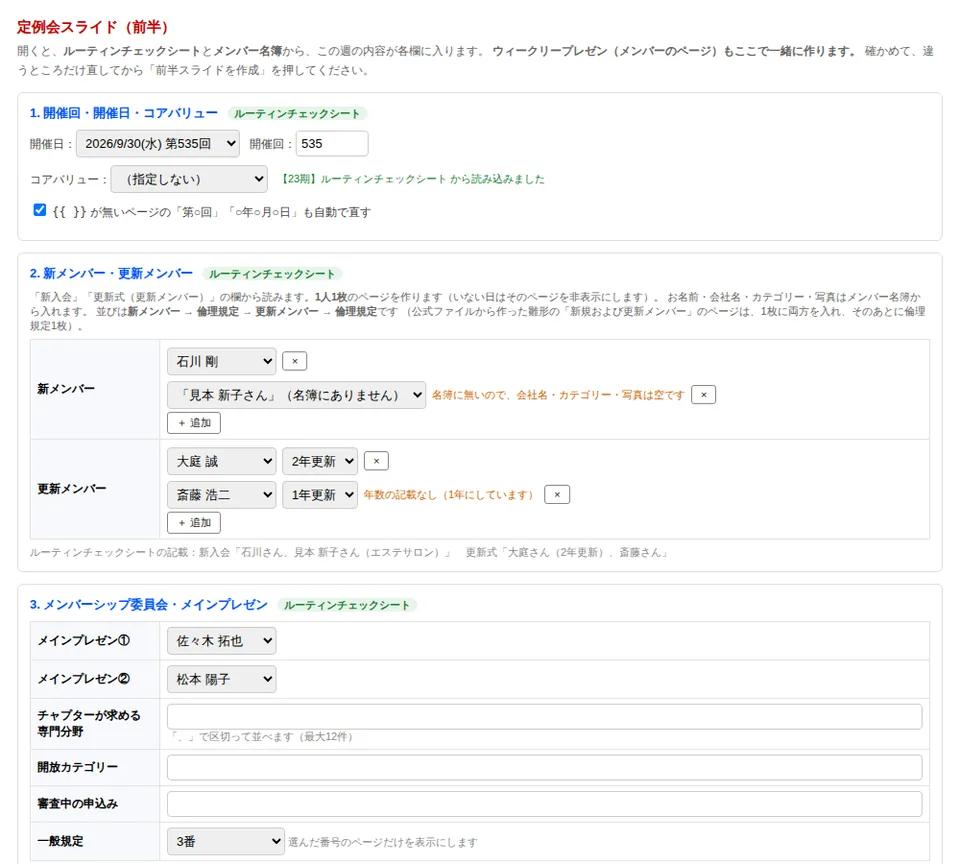

前半のPowerPointを作ります。**ウィークリープレゼン（メンバーのページ）もここで一緒に作ります**
（メンバープレゼンを別に作る画面はありません）。

事前に `⚙️ 設定` > `大きなスライド` に、**定例会スライド（前半）** と **メンバープレゼン** の
テンプレートを登録しておきます。

PowerPointは**Googleスライドに変換せず**、そのまま加工します。テンプレート側で
差し替えたい箇所を `{{開催回}}` のように書いておくと、その部分が置き換わります。
どこに差し込めるかは「⚙️ 設定 > 大きなスライド」の**「差し込み口を調べる」**で確認できます。

#### 開くと読み込むもの

画面を開くと、すぐ次のものを読み込みます。**読み込んでいる間は、画面の上に
「⏳ 読み込み中…」と、何を読んでいるかが出ます。** その間は「前半スライドを作成」を押せません。

- 開催日とルーティンチェックシート
- 前半テンプレート（アンバサダー・ディレクターのページ）… 初回だけ数秒かかります
- メンバーと写真（メンバーのページを作るため）

開催日を選び直したときも、読み直している間は「読み込み中…」が出ます。
選び直した開催日の列が **ルーティンチェックシートに無い**とき（新しい期のシートをまだ作っていない、など）は、
前に選んでいた日のメインプレゼン・コアバリュー・一般規定・カテゴリーを残さず **空にします**
（メインプレゼンは、その日のスピーカーローテーションのお2人が入ります）。手で入れてから作ってください。
後半の推薦のことば・抽選も同じです。

#### 画面の構成

| 番号 | 欄 | 入るもの |
|---|---|---|
| 1 | 開催回・開催日・コアバリュー | ルーティンチェックシートの「定例会回数」「40 BNI目的と概要」 |
| 2 | 新メンバー・更新メンバー（1人1枚のページ。更新は1年・2年） | ルーティンチェックシートの「15 新入会」「16 更新式（更新メンバー）」 |
| 3 | メンバーシップ委員会・メインプレゼン・一般規定・スピーカーローテーション（5回分の表）・役職のメンバー紹介 | ルーティンチェックシート・スピーカーローテーション・役職・チーム（半期ごと） |
| 4 | ウィークリープレゼン（メンバーのページ・欠席の方・アンバサダー・ディレクター・自動送り） | メンバー名簿・写真・ルーティンチェックシート |
| 5 | バイスプレジデントによる報告（月間リファーラル数・累計・サンキュー額・速報の日付） | 「42 バイスプレジデントによる報告」（その日が空欄なら前の回の記載） |
| 6 | ネットワーキングリーダー（月の最初の定例会だけ表示） | 「24 ネットワーキングリーダー」 |
| 7 | 作成 | |

開くとすぐ各欄に内容が入ります。**確かめて、違うところだけ直してから**作成してください。

#### ルーティンチェックシートから読むもの

`【23期】ルーティンチェックシート` のような名前のシートから、
**その開催日の列**を探して読みます。**期の計算はしていません**（開催日そのもので探すので、
期が変わってシートが増えても、そのまま動きます）。

読むのは**最近の期のシートだけ**です。期の新しいシートから順に、ここ4か月ほどの回が載っているシートまで読み、
それより昔の期のシート（ルールを確かめるための控え）は読みません。シートが増えても、読み込みは遅くなりません。
昔の開催日を指定したときだけ、昔の期のシートも読みます。

項目は**行番号ではなく名前で探します**（期によって行がずれるため）。

| ルーティンチェックシートの項目 | 入るところ |
|---|---|
| **定例会回数** | 開催回（前半・後半） |
| **40 BNI目的と概要** | コアバリュー（表示するページを選ぶ） |
| **22 メインプレゼン** | メインプレゼンのお2人（前半）・抽選コーナーのお2人（後半） |
| **43 一般規定** | 一般規定の何番のページを表示するか |
| **募集カテゴリー** | チャプターが求める専門分野 |
| **21 開放カテゴリー** | 開放カテゴリー |
| **14 審査中カテゴリー** | 審査中の申込み |
| **ウィークリープレゼン** | メンバーのページの始まりの業種区分 |
| **代理・欠席** の **欠席**・**医療欠席** | 欠席の方（ウィークリープレゼンのメンバーのページ・後半のリファーラル発表のページを作らない方） |
| **27 スタートアッププレゼン**（「2分30秒プレゼン」でも可） | スタートアッププレゼンの方 |
| **10 リージョン参加者** | アンバサダー・ディレクターのページを入れるか |
| **15 新入会**・**16 更新式（更新メンバー）** | 新メンバー・更新メンバーのページ（1人1枚。更新は「1年」「2年」も読む） |
| **42 バイスプレジデントによる報告** | バイスプレジデントによる報告の数字（読み上げる文から拾う） |
| **24 ネットワーキングリーダー** | ネットワーキングリーダーの発表のページ（部門ごとの数と受賞者） |
| **25 推薦の言葉** | 推薦のことば（後半） |

項目名は**完全一致を先に探します**。「メインプレゼン」を前方一致だけで探すと
「**メインプレゼン用スライド画像**」の行を先に拾ってしまうためです。

これらの項目は、各役職の方が **「📝 役職ごとの入力（定例会の準備）」** で入力できます
（保存先は同じルーティンチェックシートなので、入力すればそのままスライドに使われます）。

コアバリューの書き方はシートによって揺れがありますが
（`Givers Gain®` `ギバーズゲイン` `Lifelong Learnign` など）、
**英語のキーワード → 日本語のキーワードの順に当てます。**
`済` `休会` のようにコアバリューでない記載のときは「（指定しない）」になります。

#### コアバリューのページ

コアバリューを選んで作成すると、**コアバリューのページを1枚だけ表示**にし、
残りを非表示にします。どのページがどのコアバリューかは、**ページに書かれている文字**から
判断します（スライド番号は決め打ちにしていません）。
見分けるのは、**お名前・会社名などを差し込む前の、テンプレートの文字**です
（メンバーの会社名やカテゴリーに「Building」「Positive」のような英語の語があっても、
そのメンバーのページやスピーカーローテーションのページを、コアバリューのページとして隠すことはありません）。

「責任」「伝統」のような語はふつうの文にも出てくるため、
**英語のコアバリュー名で3種類以上のページが見つかったときにだけ**まとめて切り替えます。
見分けられなかったときは何もせず、そのことをお知らせします。

#### メインプレゼンのお2人

`22 メインプレゼン` の欄（`①山内さん　②金井さん` `①北川‗②若松` など）から、
丸数字で区切って**お2人**を読み取り、メンバー名簿の氏名に合わせます。

スライドには **氏名・会社名・【カテゴリー】** が入り、**写真も差し替わります**
（写真は氏名で自動照合。**①は左の枠、②は右の枠**です）。
長い会社名などは、下の段に重ならないよう、収まる大きさまで文字を小さくします。
名簿の氏名と一致しなかったときはお知らせするので、画面で選び直してください。
選ばないまま作ると、その側は**写真の枠ごと空**になります（元の写真は残しません）。
ルーティンチェックシートにメインプレゼンがまだ書いていない日は、**スピーカーローテーションのお2人**が入ります。

#### スピーカーローテーションの表（78枚目）

書記兼会計が作っていた **「スピーカーローテーション」のページの画像を、スライドの表に置き換えます**
（画面の「書記兼会計の画像の代わりに、5回分の表を作る」。最初からチェックが入っています）。

- その開催日から **5回分**（休会日の週は飛ばす）の、第○回・日付・お2人の【カテゴリー】・氏名（赤）・つながりたい人
- **1回目は画面のメインプレゼン①②のお2人**、2回目からは **スピーカーローテーション**（ルーティンチェックシートにメインプレゼンが書いてある回はそちら）
- つながりたい人は、メンバー名簿の「協業」の欄です
- 見出し（`メインプレゼンテーション（各４分45秒）`）と、表の下の注意書き（※ …）は、
  スピーカーローテーションの管理画面で直せます
- 長い文字は、1行に収まるまで小さくします

並び順は **役職ごとの入力 ＞ 書記兼会計 ＞ 🔁 スピーカーローテーションの管理** で直します（下の「スピーカーローテーション」）。

#### 役職のメンバー紹介（リーダーシップチーム・コーディネーター・チームのページ）

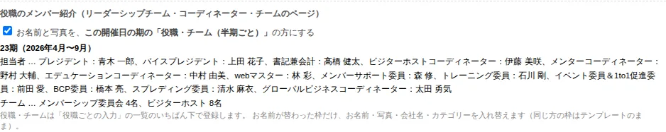

前半の **リーダーシップチーム・プレジデントなど1人ずつのページ・メンバーシップ委員会・ビジターホストチーム・
各サポートチーム** のページに、**その開催日の期の「役職・チーム（半期ごと）」の方**を入れます
（画面の「お名前と写真を、この開催日の期の役職・チームの方にする」。最初からチェックが入っています）。
期が替わっても、役職・チームを登録すれば、スライドを手で直さなくて済みます。

- 入るもの：**お名前・写真・会社名・（カテゴリー）・ローマ字**（ローマ字はメンバー名簿の「ふりがな」から。
  名・姓の順、長い音は書かない書き方。ふりがなが空の方は空欄）
- **お名前が替わった枠だけ**入れ替えます。同じ方のままの枠は、写真の切り抜きやローマ字も含めてテンプレートのまま
- 担当者の居ない役職の枠は空にして写真の枠を外します。**プレジデントなど1人のページは非表示**にします
- 写真が見つからない方は、写真の枠を外してお知らせします（前の方の写真は残しません）
- 長いお名前・カテゴリーは、枠に収まるまで文字を小さくします
- チームのページの枠より人数が多いときは、入りきらなかったことをお知らせします
- 画面には、入れる方（その期の担当者・チームの人数・未登録の役職）が出ます。
  **役職・チームがまだ登録されていない期は、テンプレートのまま**にします（チームのメンバーだけ未登録なら、チームのページだけそのまま）
- どのページのどこに入れるかは、ページに書いてある役職の名前と、写真・文字の並び方で見分けます。
  自分たちで作った雛形でうまく入らないときは、差し込み口（`{{プレジデント氏名}}` など）を書いておくと確実です
  （書き方は `docs/templates/README.md` の「役職のメンバー紹介」）

#### ネットワーキング学習コーナー

担当は、**その開催日の期のエデュケーションコーディネーター**（「役職・チーム（半期ごと）」）です。
ページの「担当：」の枠は、**1行目にカテゴリー（20pt）、2行目に「担当：お名前」**に入れ直します。
「担当：」は20pt、**お名前は40ptの太字**です（以前はお名前も32ptで、枠の幅に合わせて行ごと小さくしていたため、小さく出ていました）。
雛形の斜体や自動縮小（Googleスライドなどで文字がとても小さくなる）はやめて、この大きさにそろえます。
枠の幅に入らないときだけお名前を小さくし、枠の高さが2行ぶんに足りなければ枠を下へ伸ばします。
写真も、その方の写真にします（写真の無い方のときは写真の枠を外し、「スピーカーの写真を挿入」のような見本の文字も消します）。

#### 新メンバー・更新メンバー

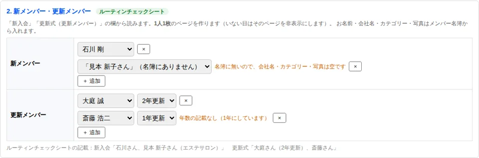

ルーティンチェックシートの **「15 新入会」「16 更新式（更新メンバー）」** の欄から、1人ずつ読み取ります。

- `山田さん、川上さん` `森本さん（1年更新）、高橋さん（2年）` `内装業　店舗オフィス小川さん（1年）` のような書き方から、
  **1人ずつに分けてメンバー名簿の氏名に合わせます**（前に業種・カテゴリーが付いていても、うしろの名字で探します）
- 括弧の中のお名前（`山田さん（川上さんは10/7）`）や、`川上さんのあと、31番に入ります` のような文の中のお名前は数えません
- 更新は **`（1年更新）` `（2年）`** から1年・2年を読みます。書いていない方は1年にして、画面に「年数の記載なし」と出ます（選び直せます）
- 同じ名字の方が2人いるときは決めません。画面で選んでください
- `なし` `ー` `－` のように書いてあれば、その日はいないものとして扱います（「ー」というお名前のページは作りません）

作成すると、テンプレートの **「新メンバー」「更新メンバー」のページを人数ぶん**（1人1枚）にし、
お名前・会社名・【カテゴリー】・写真（メンバー名簿から）、更新は **「1年更新」「2年更新」** の文字も入れます。
**いない日は、そのページを非表示**にします。

並びは **新メンバー → 倫理規定 → 更新メンバー → 倫理規定** です（ルーティンチェックシートの「新入会 → 更新式」と同じ順）。
テンプレートが「更新メンバー → 新メンバー」の並びでも、新メンバーのページ（「新メンバー紹介」のような見出しのページがあれば、それも一緒に）を先にします。
PowerPointのセクションを使ったテンプレートなら、セクションも並びに合わせます。

- 名簿に無い方（まだ名簿に入っていない新メンバー）は、書いてあったとおりのお名前で作り、会社名・カテゴリー・写真は空です。
  名簿に入れてから作り直すと入ります（お名前の一部が同じ方・1字違いの方がいても、その方にはしません）
- ルーティンチェックシートに **名字だけ**（「見本さん」）で書いてあり、**同じ名字の方が名簿に2人以上いる**ときは、
  どちらかに決めずに「名簿にありません」と出します。画面でその方を選んでください
  （以前は名簿で先に並んでいる方を黙って選んでいたため、別の方のお名前・写真になることがありました。
  メインプレゼン・スタートアップ・推薦のことば・抽選なども同じです）
- 写真が見つからない方は写真の枠を隠し、「写真のサイズを枠に合わせてトリミング」のような見本の文字も消します
- 公式ファイルから作った雛形の「新規および更新メンバー」のページ（1枚に両方の欄）は、それぞれの欄に上から入れます。
  氏名の枠より人数が多いときは、**最後の枠に残りの方をまとめて入れ**（文字を小さくします）、作成後のお知らせでそのことを伝えます

**倫理規定のページ**は、**新メンバーのページのあと**と**更新メンバーのページのあと**に、同じものを出します
（テンプレートにある「倫理規定」のページを写して使います。手で並べ替える必要はありません）。

- 新メンバー（更新メンバー）がいない日は、そのあとの倫理規定のページも非表示にします。どちらもいない日は、倫理規定のページは出ません
- 1枚に両方の欄がある「新規および更新メンバー」のページのときは、そのあとに1枚です
- テンプレートのほかの場所にある同じ倫理規定のページ（まとまりの前にある・2枚目の写しなど）は非表示にします（余分に出ないように）

#### ネットワーキングリーダー

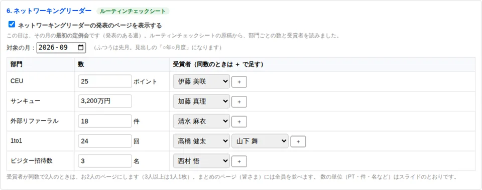

ネットワーキングリーダーの発表は **月の最初の定例会だけ**です。

- その日（休会日の週は飛ばして、その月で最初に開催する回）は **「発表のページを表示する」にチェックが入り**、
  ほかの週はチェックが外れて、**ページはすべて非表示**になります。月の最初でなくても、ルーティンチェックシートに原稿が書いてあればチェックが入ります
- 対象者と数は、バイスプレジデントがルーティンチェックシートの **「24 ネットワーキングリーダー」** に書く発表の原稿から拾います。
  `先月のCEU部門は25ポイントで、税理士：山田さんです` `21回で、鍼灸師：川上さんと、Web制作：森本さんです` のように、
  部門ごとの**数**と**受賞者**（同数で2人以上のときも）を読み、メンバー名簿の氏名に合わせます。
  `わたくし、ダンス教室：中野です` の「わたくし」はバイスプレジデント本人です
- 見出しの **「2026年／○月度」「○月のネットワーキングリーダーの皆さま」** は、原稿の「2026年8月のネットワーキングリーダー」の年月（無ければ開催日の前の月）
- 部門のページ（CEU・サンキュー・外部リファーラル・1to1・ビジター招待数）には、数・お名前・会社名・【カテゴリー】・写真が入ります。
  数の単位（PT・件・名など）はスライドのとおりです
- **受賞者が2人（同数）** の部門は、テンプレートにある**お2人並びのページ**（外部リファーラルなど）を写し、その部門の見出しと数にして作ります。
  その部門の1人のページは非表示にします。3人以上は1人1枚です
- 部門の見出し（月桂樹の中の「サンキュー」など）や数の枠に、お名前・会社名を入れることはありません
  （以前は、カタカナだけの見出し「サンキュー」をお名前の枠と取り違え、お2人のときに見出しへ1人目のお名前、
  数の枠へ1人目の会社名が入り、写真の側には2人目だけが入っていました）
- 受賞者のいない部門のページは非表示にします
- まとめのページ（皆さま）には全員が並びます。2人以上の部門があるときは、列を増やして並べ直します
- 原稿がまだ空欄のときは、画面にそう出ます。書かれたら開き直すと入ります（画面で数と受賞者を入れても作れます）

#### 一般規定のページ

`43 一般規定` の欄（`2番` など）の番号のページだけを表示にし、残り11枚を非表示にします。
どのページが何番かは、**BNI公式スライドがノートに持っている通し番号**（`J-04164`〜`J-04175`）で
見分けます。ページを入れ替えても、この番号は付いて回ります。

#### バイスプレジデントによる報告

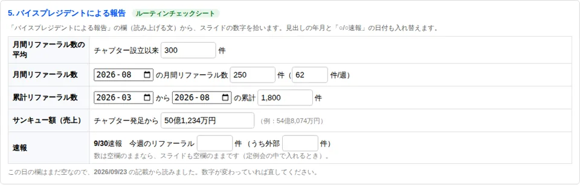

ルーティンチェックシートの **「42 バイスプレジデントによる報告」**（読み上げる文をそのまま書く欄）から、スライドの数字を拾います。

| スライド | 画面の欄 | 読み上げる文の例（数は例） |
|---|---|---|
| チャプター設立以来の月間リファーラル数の平均 | 月間リファーラル数の平均 | `月間リファーラル数の平均は300件` |
| ○年○月の月間リファーラル数（○件/週） | 月間リファーラル数 | `2026年8月の月間リファーラル数は250件(62件/週）` |
| ○年○月から○年○月の累計リファーラル数 | 累計リファーラル数 | `2026年3月から2026年8月の半年間のリファーラル数の合計は1,800件` |
| ビジネスのサンキュー額（売上） | サンキュー額 | `サンキュー額つまり売上は、50億1,234万円` |
| ○/○速報　今週のリファーラル　件（うち外部　件） | 速報 | 日付は開催日。数は画面に入れたときだけ（空欄なら空欄のまま） |

- **その日の欄がまだ空なら、いちばん近い前の回の記載**を使います（「できれば前週をコピペ」の運用に合わせて）。
  どの回の記載かが画面に出るので、数字が変わっていれば直してください
- スライドの見出しの年月（`2026年8月の月間リファーラル数` など）も入れ替えます
- `50億0,234万円` のような書き方は `50億234万円` にそろえます
- 以前の版の「実績数値（総リファーラル数・サンキューカード・1to1…）」の欄は、どのスライドにも使われていなかったので外しました

#### メンバーシップ委員会による報告

| 欄 | 入るところ |
|---|---|
| `募集カテゴリー` | チャプターが求める専門分野（表のマスに左上から順に、最大12件） |
| `21 開放カテゴリー` | 開放カテゴリー |
| `14 審査中カテゴリー` | 審査中の申込み |

募集カテゴリーの欄は `赤文字` `黒文字` の見出しや `（…から更新します）` の但し書きが
混ざっていても、**項目だけを取り出します**（`・` `、` で区切られたもの）。

#### ウィークリープレゼン：メンバーのページ

**「メンバーのページ（業種区分の扉ページ＋個人ページ）を作って…入れる」** は、最初からチェックが
入っています。作成すると、前半スライドの **「ウィークリープレゼンテーション」の見出しの直後**に
次のページが並びます（スタートアッププレゼンの下書きのページ（非表示）は、そのまま残ります）。

| ページ | 内容 |
|---|---|
| 扉ページ | 業種区分名・先頭の方の写真・**専門分野とメンバーの一覧**（7名ごとに1枚） |
| 個人ページ | 写真・氏名・会社名・【カテゴリー】・**NEXT➡ 次の方のお名前**（1人1枚） |

**発表の順番は「メンバー名簿」の行順**です。順番を変えたいときは名簿の行を並べ替えてください。
画面の **「この日の順番」** に、業種区分の並び・人数・先頭の方と、全部で何枚になるかが出ます。

#### 欠席の方（ページを作りません）

**ルーティンチェックシートの「代理・欠席」の「欠席」「医療欠席」の欄に書かれた方は、個人ページを作りません。**
扉ページの一覧・先頭の写真・前の方のページの **NEXT➡** にも出しません（次の出席の方が出ます）。
画面の **「欠席の方」** にチェックつきで並ぶので、確かめてから作成してください。

- 違うときは **チェックを外す** と、その方のページを作ります。欄に無い方は **「欠席の方を足す」** で選びます
- **代理を立てた方（「代理」の欄）は外しません**（代理の方が、その方の順番で発表するため）
- 欄の読み方は、事前MTGのパワポの人数と同じです。かっこの中（`（当欠）` など）は読まず、
  `遅刻：○○さん`・`○○さん遅刻`・`○○さん代理：△△さん` の △△さん・`○○さん復帰` は欠席にしません。
  `なし`・`○時時点でなし` は誰もいません
- 姓だけで書かれていても、メンバー名簿の氏名に合わせます。同じ名字の方が2人いるときなど、
  **名簿の方と結びつかなかった書き方は画面に出す**ので、メンバーの方なら「欠席の方を足す」で選んでください
- その日の列がルーティンチェックシートに無いときは、欠席の方はいないものとして作ります
- 欠席の方は、**後半のリファーラル発表**でも同じように飛ばします（「8. 定例会スライド（後半）」の「リファーラル発表」）

#### 業種区分の順番

**並び順はいつも同じで、始まりの区分だけが開催ごとにずれます。**
開催日を選ぶと、始まりの区分が次の順で自動で決まります。

1. **ルーティンチェックシートの「ウィークリープレゼン」の欄**（`建築　住まい　22番　熊田さん` など）に
   書いてある区分
2. その日の欄がまだ空なら、**前回の記載から、開催した回数ぶん進めた区分**
   （休会日の週は数えません。**名簿に誰もいない区分は飛ばします**）
3. どちらも無いときは、開催日から計算した区分
   （2026年8月19日がプロモーション始まり、以降1週ごとに1つずつ順繰り）

どれで決めたかは「始まりの業種区分」の下に表示されます。**違うときだけ選び直してください。**
名簿に誰もいない区分は、扉ページごと飛ばされます。

> チャプターの運用は「開催した回ごとに1つ進み、誰もいない区分は飛ばす」です。
> 3.の計算は元の生成ツールと同じ決まりで、休会日の週も1つ進めてしまうため、
> 1.・2.を優先しています。

区分の名前と並びは `業種区分マスタ` シート（非表示）の
**ブロック表示名**・**巡回順**から読んでいます。扉ページの見出しもこの名前です。

> 昔の区分が残っていると、**同じ名前が2つ並んだり、人数0の区分が混ざったり**します。
> その場合はウィークリープレゼンの欄に名前を挙げてお知らせするので、
> **「使われていない業種区分を消す」** を押してください（消す前に一覧で確認できます）。
>
> 2026年9月より前の版で作られた `業種区分マスタ` には、以前の既定の行（`建築住まい`・`美容健康`・
> 巡回順4番の `プロモーション` など）がそのまま残っていて、**「建築＆住まいの次が不動産関連」のように順番がずれていました。**
> いまは、シートを読むときに自動で今の既定（企業サポート → 研修・教育 → 不動産関連 → 建築＆住まい →
> プロモーション → 暮らし・生活 → 美容・健康 → 飲食・エンタメ）に直します。手で色や巡回順を変えた行は触りません。

#### スタートアッププレゼンの方（1人まで）

**「スタートアッププレゼン」** で選ぶと、その方の個人ページだけ
**スタートアッププレゼンの秒数のカウントダウン**になります（既定は2分30秒。60秒以上は `2:30` のような分:秒の表示）。
残り10秒から赤くなるのはほかの方と同じです。

いない日は **「（なし）」** のままにしてください。選べるのは1人までです。

**初期値は `【NN期】ルーティンチェックシート` の「27 スタートアッププレゼン」から読み込みます**
（前の呼び名の「2分30秒プレゼン」の行でも読みます）。
「谷口さん」のように姓だけで書かれていても、メンバー名簿の氏名に合わせます
（`３５番船越さん` `内装業　岩渕さん` のように前置きが付いていても探します）。
`なし` `無し` `休会` `ー` と書かれていれば「（なし）」になります。
**名簿の氏名と一致しなかったときは、その旨をお知らせするので手で選んでください。**

#### 会社名とカテゴリーの大きさ

会社名は **44pt**、【カテゴリー】は **32pt** にそろえます。
以前は1行に入るまで1人ずつ小さくしていたため、人によって大きさがバラバラでした。
長い会社名は、上から順に試して収めます。

1. `㈱` のような略記が含まれていたときは展開し、
   **「プルデンシャル生命保険／株式会社」のように社名と種別で改行**します（44pt）
2. 1行に入れば、そのまま（44pt）… ほとんどの方はここです
3. 入らなければ **同じ大きさのまま2行** にします。「社名／株式会社」「株式会社／社名」で分けられればそこで、無ければ語の切れ目で
4. 2行にも入らないほど長いときだけ、**文字を小さくします**（2行で28ptまで、それでも入らなければ3行で20ptまで）。
   3行になる場合は、**枠と【カテゴリー】の位置を行数に合わせて下げます**

【カテゴリー】も同じく、1行に入らなければ **32ptのまま2行**（行間を少し詰めます）にし、2行にも入らないときだけ小さくします。

**カタカナ語や熟語の途中では改行しません**（「建設業許可・外国人ビザ」のような「・」のあとでは改行します。
「・」「）」が行の頭に来ることはありません）。2行目が1〜2文字だけになるときは、切れ目を前にずらします。
**【カテゴリー】が会社名と重なることはありません**（行数に合わせて自動で下がります）。
リファーラル発表（後半）の会社名・カテゴリーも、同じ大きさ・同じ処理で収めます。
公式ファイルから作った雛形でも、雛形の字の大きさには合わせず、この大きさにします
（会社名の枠が44ptの1行より低いときは、枠を伸ばしてカテゴリーを下げます）。

#### 写真・業種区分が足りないとき

メンバーと写真を読み込んだ時点で、ウィークリープレゼンの欄にお知らせします。

- **写真が見つからない方** … その方だけ**写真なし**で作られます（枠は空になります）
- **写真の索引にあるのに、写真のファイルを開けない方**（ドライブで消した・入れ替えた、その写真を見る権限が無い）…
  その方だけ**写真なし**で作り、作ったあとのお知らせに名前を出します。`⚙️ 設定 > メンバー写真` で「索引を作り直す」を押してください。
  1枚も開けないとき（写真のフォルダを見る権限が無いなど）は、写真の無いスライドで置き換えないよう、作らずに止めます
- **業種区分が空の方** … その方は**ページに出ません**
- **業種区分マスタに無い区分** … その名前のまま扉ページを作ります

いずれも氏名を挙げて表示するので、`⚙️ 設定 > メンバー写真` や
`メンバー名簿` の「業種区分」列を直してから、画面を開き直してください。

#### アンバサダー・ディレクターのページ

前半スライドのテンプレートに非表示で入っている、**アンバサダー（坂上さん）・
エグゼクティブディレクター（大庭さん）の紹介のページとウィークリープレゼン**のページは、
**チェックを入れた方だけ表示**になります（チェックしなかった方のページは非表示）。

- 紹介のページは、「ウィークリープレゼンテーション」の見出しより前にある、その方の氏名と
  「アンバサダー」「ディレクター」「リージョン」の文字があるページです
- ウィークリープレゼンのページの並びは**メンバーの後、「全員終わりましたか？」の前**です
- メンバーのページを入れたときは、最後の方のページの **NEXT➡** にその方のお名前が入ります
- チェックを入れなかった方のページは**非表示のまま残ります**（当日急に来られたときは、PowerPointで表示に戻せます）
- **初期値は、ルーティンチェックシートの「10 リージョン参加者」から入ります。**
  `大庭ED・坂上アンバサダー` `坂上アンバサダー` のように**名字**が書いてあればチェックが入り、
  `なし` ならチェックが外れます（空欄の日はテンプレートのまま）。記載の内容は画面にも出ます
- 画面に並ぶお名前・肩書きは、**テンプレートのページから読んでいます**。
  担当の方が替わったときは、テンプレートのページ（氏名・肩書き・写真）を直して登録し直してください

#### カウントダウンと自動送り

カウントダウンの秒数は、`⚙️ 設定` > `チャプター（名前・期・定例会の回数・プレゼンの秒数）` の
**「ウィークリープレゼンテーション」**（既定30秒）と **「スタートアッププレゼン」**（既定2分30秒）です。
アンバサダー・ディレクターのページもウィークリープレゼンテーションの秒数になります。
テンプレートの秒数と違うときは、作るときに数字を作り直します（**ベルや卵時計の動画の音はそのまま鳴ります**）。
画面の「この日の順番」の下に、使う秒数が出ます。

**「カウントダウンが終わったら自動で次へ進む」**（最初からチェックあり）は、
メンバーの個人ページ・アンバサダー・ディレクターのページに効きます。

- スライドが表示された時点で**カウントダウンが自動で始まり**
- 0になった1秒後に**自動で次のスライドへ進みます**
  （卵時計の動画のあとでカウントダウンが始まるテンプレートでも、0になってから1秒後です）

チェックを外すとクリックで進む形になります。扉ページと「全員終わりましたか？」は、いつもクリックで進みます。

自動送りのページを作るときは、ファイル全体を **「保存済みのタイミングを使用」** にします。
そのとき、**ほかのページに残っていた自動送りの設定（0.4秒など）は外します。**
元のファイルでは効いていなかった設定なので、ほかのページはこれまでどおりクリックで進みます。

> **元のテンプレートでは自動で進みませんでした。** 自動送りには3つの設定が必要で、
> （1）カウントダウンがスライド表示と同時に始まること
> （2）スライドに「何秒で次へ」が入っていること
> （3）**スライドショーが「保存済みのタイミングを使用」になっていること**
> ——元のファイルは3つとも噛み合っておらず、とくに（3）が無効だと
> （1）（2）を直しても絶対に進みません。**作成時に3つとも設定します。**

#### `{{ }}` が無いページの「第○回」「○年○月○日」

表紙などは、差し込み口を置かずに `第526回 2026年07月22日` と直接書いてあることがあります。
**チェックを入れておくと、この形の文字を見つけて開催回・開催日に書き換えます**（後半も同じ）。

- `第526回` `第 526 回` → `第535回`
- `2026年07月22日` `2026年7月22日` → 0埋めの有無はそのまま引き継ぎます
- `2026/07/22` `2026-7-22` も同じように直します
- それ以外の文字は触りません

**PowerPointが1つの文字列を複数に分けて持っていても、つながった状態で探します。**

#### 作成

**「前半スライドを作成」** を押すと、Driveの `03_生成物` に
`定例会20260930_（前半）09291015.pptx` のような名前で保存され、**「⬇ PowerPointをダウンロード」** から
pptxのまま保存できます。何を差し込んだか（メンバーのページの枚数・写真・非表示にしたページなど）が
画面に一覧で出るので、確かめてください。

**スライドの名前の付け方**：`定例会` ＋ **開催日**（20260930）＋ `_（前半）` ＋ **作った日時**（月日時分：09291015 は 9/29 10:15）。
後半は `（後半）`、事前MTGは `（事前MTG）`、ビジター用は `（ビジタープレゼン）` `（ビジター紹介）` などです。
同じ開催日のファイルがドライブで並び、**作るたびに別のファイルになります**（前に作ったものは上書きせずに残ります。
要らなくなったものはドライブで消してください）。

> 前半はテンプレートだけで約27MBあり、メンバーのページを入れるとさらに大きくなるため、
> **1〜2分かかることがあります。**
> 作成中は画面を閉じないでください。
> 「ドライブで見る」はGoogleスライドの表示になり、カウントダウンや自動送りは動きません。
> **当日はダウンロードしたpptxをPowerPointで**お使いください。

### 8. 定例会スライド（後半）

**メニュー**: `名簿システム` > `📊 スライド・冊子をつくる` > `定例会スライド（後半）`

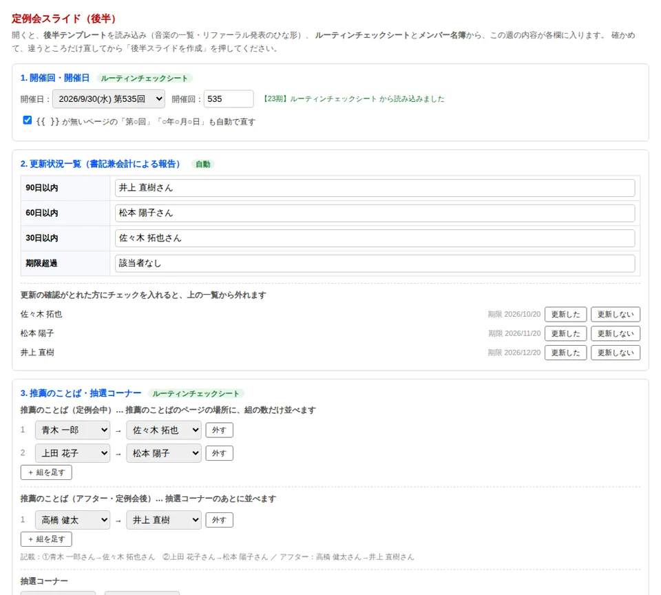

後半のPowerPointを作ります。事前に `⚙️ 設定` > `大きなスライド` に
**定例会スライド（後半）** のテンプレートを登録しておきます。

#### 開くと読み込むもの

画面を開くと、**まず後半テンプレートを読み込みます**（入っている音楽の一覧と、
リファーラル発表のひな形ページの枠を調べるため）。**読み込んでいる間は、画面の上に
「⏳ 読み込み中…」が出て、「後半スライドを作成」は押せません。**

- 後半テンプレートは**初回だけ1分ほど**かかります。2回目からは、テンプレートを
  差し替えるまで前回調べた結果を使うので、すぐ終わります
- 開催日とルーティンチェックシート、登録した差し替え用の音楽も、同時に読み込みます

#### 画面の構成

| 番号 | 欄 | 入るもの |
|---|---|---|
| 1 | 開催回・開催日 | ルーティンチェックシートの「定例会回数」 |
| 2 | 更新状況一覧（書記兼会計による報告） | メンバー名簿の更新期限日（90日／60日／30日以内・期限超過）。**書記兼会計による報告のページの4つの表**に入ります |
| 3 | 推薦のことば・抽選コーナー | ルーティンチェックシートの「25 推薦の言葉」（**何組でも**）「22 メインプレゼン」 |
| 4 | リファーラル発表（欠席の方を除く） | メンバー名簿（No.順）・写真・ルーティンチェックシートの「欠席」「医療欠席」 |
| 5 | 音楽の差し替え・音量 | 後半テンプレートに入っている音楽 |
| 6 | 作成 | |

#### 更新の確認がとれた方を一覧から外す

更新状況一覧の下に、対象の方が並びます。それぞれ **「更新した」「更新しない」** を
押すと、上の一覧から外れます。押し間違えたら「戻す」で元に戻ります。

**「更新した」の印は、そのときの更新期限日に対するものです。**
あとで会費レポートを取り込んで期限が伸びると、印は自動的に外れます。
そのため、次の更新時期が来たときはまたちゃんと一覧に出ます。印の消し忘れは起きません。

押しても、画面で手直しした **推薦のことば・抽選などはそのまま**です（読み直すのは更新状況の一覧だけです）。

**「更新しない」**（退会される方）は、期限に関係なく一覧から外れます。
名簿からの削除は行わないので、退会が確定したら「メンバー名簿」から手で消してください。

#### 書記兼会計による報告のページ（更新状況）

更新状況一覧の4つの欄は、後半スライドの **「書記兼会計による報告」のページの表**に、
**欄の文字がそのまま**入ります（テンプレートに書いてあった先週までのお名前は残りません）。

| 画面の欄 | 入る表（見出し） |
|---|---|
| 90日以内 | 90日以内に更新を迎えるメンバー |
| 60日以内 | 60日以内に更新を迎えるメンバー |
| 30日以内 | 30日以内に更新を迎えるメンバー |
| 期限超過 | メンバーシップ期限切れメンバー |

- 欄が空なら **「該当者なし」** と入ります
- 画面では `山田 太郎さん、…` のようにフルネームで出ます。名字だけにしたいときは、欄を直してから作成してください
- お名前は **「、」の区切りで改行**します（お名前の途中では折り返しません）
- お名前が多いときは、**下の表に重ならないよう文字を小さく**します（元の大きさで2行ぶんの高さに収まるまで）。
  それでも収まらないほど多いときは画面でお知らせするので、欄を短くしてください

表は見出しの文字（「90日以内」「期限切れ」など）で見分けるので、テンプレートに差し込み口は要りません。

#### 推薦のことば（何組でも）

ルーティンチェックシートの `25 推薦の言葉` の欄から、**推薦する人 → 推薦される人**の組を読み取ります。
欄には次のように、発表する時間ごとに何組も書かれます。

    定例会中
     ①藤本さん⇒金井さん、
     ②山岸さん⇒山内さん
    アフター
     ①船越さん→金井さん

- 見出しの **「定例会中」** の下の組は画面の **「推薦のことば（定例会中）」** に、
  **「アフター」「定例会後」** の下の組は **「推薦のことば（アフター・定例会後）」** に入ります
  （見出しが無ければ定例会中として扱います）
- **「翌週以降」** の下の組は予定のメモなので入れません（画面でお知らせします）
- ①②… の丸数字で区切るので、1行に何組続けて書いてあっても分けて読みます
- お名前はメンバー名簿の氏名に合わせます。「川辺さん」と名簿の「川邉」のような**字の違いも合わせます**
  （名字が1人に決まるときだけ）。名簿と一致しなかった方はお知らせするので、画面で選んでください

画面では、組ごとに **推薦する人 → 推薦される人** を選びます。
**「＋ 組を足す」** で組を増やし、**「外す」** でその組を消せます。2人とも「（なし）」の組は作りません。

スライドには**1組につき1ページ**、推薦のことばのページができます。

| 組 | ページの場所 |
|---|---|
| 定例会中 | テンプレートの推薦のことばのページの場所に、組の順に続けて並びます |
| アフター・定例会後 | **抽選コーナーのページのすぐあと**に、組の順に並びます |

定例会中の組が無い日は、推薦のことばのページを**非表示**にします（元のお名前と写真は消します）。

#### 推薦のことば：受け取ったスライド（pptx・pdf・画像）

推薦する方から**スライドを1枚**受け取ったときは、その組の **「📎 受け取ったスライド」** を押してファイルを選びます。
作成すると、**その組の推薦のことばのページのすぐあと**に、受け取ったスライドが1枚のページとして入ります
（定例会中の組も、アフター・定例会後の組も）。

| 受け取ったファイル | 入るもの |
|---|---|
| 画像（png・jpg・gif・webp・bmp） | その画像（長い辺を2400pxまでに縮めます） |
| PDF | **1ページ目**を画像にしたもの（2ページ以上あるときはお知らせします） |
| PowerPoint（pptx） | **1枚目**を画像にしたもの（Googleスライドに変換してから画像にするので、少し時間がかかります。書体が少し変わることがあります） |

- 受け取ったスライドは**画像として**入ります（パワポで中の文字は直せません）。縦横比はそのままで、ページいっぱいに真ん中に置き、
  余ったところ（4:3 のスライドの左右など）は黒にします。テンプレートのロゴなどの飾りは出しません
- 選ぶ前に、その組の **推薦する方・推薦される方** を選んでください（組ごとに覚えるため）
- 選んだファイルは画像にして、素材フォルダの **「03_生成物／推薦のことばのスライド」** に置きます。
  開催日と組（推薦する方 → 推薦される方）ごとに覚えるので、**画面を閉じて開き直しても、同じ組に付いています**
- 選び直すと置き換わります（前のものはゴミ箱へ）。**「スライドを外す」** で外せます
- 1つのファイルは15MBまでです。pptx が大きいとき・うまく画像にならないときは、PowerPointで「PDFとして保存」したものか、画像を選んでください
- PDF・pptx を画像にするのに、画面で pdf.js（jsDelivr から）を読み込みます。インターネットにつながっている必要があります

#### 抽選コーナー

`22 メインプレゼン` のお2人が初期値です（通常はメインプレゼンのお2人と同じ）。画面で選び直せます。

#### 推薦のことば・抽選コーナーのページに入るもの

どちらのページも、**氏名・会社名・【カテゴリー】と写真**が入ります。
写真は **1人目（推薦のことばは推薦する人）が左の枠、2人目（推薦される人）が右の枠**です。
どの枠かは**氏名の差し込み口の真上にある枠**で決めるので、抽選コーナーの中央下にある
飾りの画像（プレゼントの絵）には入りません。
お名前を選ばなかった側・写真が見つからない方の側は、**写真の枠ごと空**になります
（テンプレートの元の写真は残しません）。

氏名・会社名は**1行**、【カテゴリー】は**2行**に収まるよう、長いときだけ文字を小さくします
（会社名が2行に折り返して、下のカテゴリーに重なるのを防ぐため）。
前半のメインプレゼンのページも同じです。

#### リファーラル発表

**「リファーラル発表のページを名簿のNo.順で全員ぶん（欠席の方を除いて）作る」** は、最初からチェックが入っています。
テンプレートに入っている `REFERRAL PRESENTATION` のページをひな形に、**人数ぶんのページを作ります。**

- 順番は**名簿のNo.順（1番から）**です（ウィークリープレゼンのような業種区分の巡回ではありません）
- **欠席の方（ルーティンチェックシートの「代理・欠席」の「欠席」「医療欠席」の欄に書かれた方）のページは作りません。**
  前の方のページの NEXT➡ も、次の出席の方になります。画面の **「欠席の方」** で、チェックを外す・方を足すことができます
  （読み方・代理を立てた方の扱いは、前半の「欠席の方（ページを作りません）」と同じです）
- カウントダウンは、チャプターの設定の **「リファーラル発表」の秒数**（既定7秒）です。画面でその回だけ変えられます。
  **クリックで始まり、次のページへもクリックで進みます**
  （自動では進みません。後半スライドの「保存済みのタイミングを使用」の設定も触りません）
- 写真・氏名・会社名・【カテゴリー】・**NEXT➡ 次の方**が入ります
- **最後の方のページからは NEXT➡ が消えます**
- 会社名の収め方（折り返し・文字の縮小）はメンバーのページと同じ処理です

写真が見つからない方は、人数と一緒に画面でお知らせします（その方は写真なしになります）。

#### 音楽の差し替えと音量

後半テンプレートを読み込むと、入っている音楽・動画が
**ページ番号・曲名・いまの音量**つきで一覧に出ます。

- **差し替え** … 差し替えたい曲をDriveに置き、共有リンクを **「差し替え用の音楽」** に貼って
  **「登録」** を押すと、一覧の「差し替え」で選べるようになります（mp3・m4a・wav・wma・aac）。
  登録した曲は次回からも選べます。「外す」で登録から外せます
- **音量** … 0〜100％で指定します（元の値が初期表示されます）
- **動画**（一覧に「（動画）」と出る行）は差し替えできません。音量だけ変えられます

差し替えても**鳴らし方（再生のタイミング）は元のまま**です。曲だけが入れ替わります。

#### 作成

**「後半スライドを作成」** を押すと、前半と同じく `03_生成物` に
`定例会20260930_（後半）09291015.pptx` のような名前（開催日と、作った日時）で保存され、ダウンロードできます。
「`{{ }}` が無いページの第○回・日付」のチェックは前半と同じ働きです。

### 9. トークスクリプト（台本）

**メニュー**: `名簿システム` > `📊 スライド・冊子をつくる` > `トークスクリプト（台本）`

これまで「【NN期】トークスクリプト生成用」シートでしていたことを、画面でできるようにしたものです。
ひな形の文にある **`{プレジデント}` `{ビジターの一覧}` のような差し込み**に、その回の役職の担当者・参加者・
ルーティンチェックシートの内容を入れて、**`20260930トークスクリプト` のようなシート**を作ります。

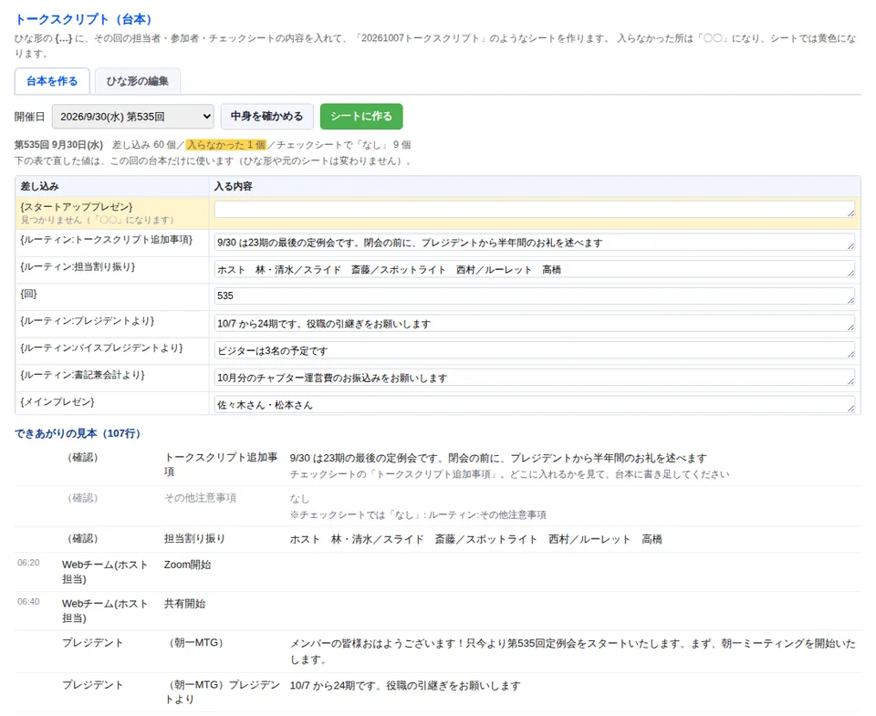

#### 台本を作る

1. 開催日を選びます（次の4回と、前の2回から選べます）
2. **「中身を確かめる」** を押すと、差し込みに入る内容の表と、できあがりの見本が出ます
3. 違っているところは、表の右の欄で直します。直した値は**この回の台本だけ**に使います
   （ひな形やルーティンチェックシートは変わりません）
4. **「シートに作る」** を押すと、シートができます。同じ日をもう一度作ると上書きします

ルーティンチェックシートが埋まってから（前日〜当日の朝に）作るのがおすすめです。

| 見本・シートでの見え方 | 意味 |
|---|---|
| 「〇〇」・黄色の行 | 入る内容が見つからなかった差し込みです（チェックシートが空欄・参加者シートがまだ無い など）。表で入れるか、できたシートで直してください |
| 灰色の行・メモに「※チェックシートでは「なし」」 | チェックシートが「なし」の項目です。読み飛ばす行の目安にしてください |
| 赤字の「書き方の違う差し込み」 | ひな形の `{…}` が、使える名前と違います（`{…}` のまま残ります）。ひな形を直してください |

#### 差し込みに入るもの

| 種類 | 例 | 入るもの |
|---|---|---|
| チャプター・開催回 | `{チャプター}` `{回}` `{開催日}` `{期}` `{リージョン}` | チャプターの設定から（「Activeチャプター」「535」「9月30日(水)」など） |
| プレゼンの秒数 | `{ウィークリープレゼンの秒数}` `{スタートアッププレゼンの秒数}` `{ビジタープレゼンの秒数}` `{リファーラル発表の秒数}` | チャプターの設定の秒数（「30秒」「2分30秒」など） |
| 役職 | `{プレジデント}` `{プレジデントのカテゴリー}` | その回の期の担当者の名字（同じ名字の方がいればフルネーム）と、メンバー名簿のカテゴリー |
| チーム | `{チーム:ビジターホスト}` `{チームのメンバー:メンバーシップ委員会}` | 「役職・チーム（半期ごと）」のメンバーを「カテゴリーの名字さん」にして「、」でつないだもの（「チームのメンバー」はリーダーを除く） |
| 参加者 | `{ビジターの一覧}` `{ビジターの人数}` `{ゲストの一覧}` `{代理の一覧}` | その日の参加者シート（CSVから作った名簿）から。キャンセルの方は入りません |
| チェックシートから | `{メインプレゼン1}` `{スタートアッププレゼン}` `{ウィークリープレゼンの起点}` `{推薦のことば}` `{真正度確認の紹介者}` `{コアバリュー}` | ルーティンチェックシートのその回の列から、お名前などを取り出したもの（`{スタートアッププレゼン}` は前の呼び名の `{2分30秒プレゼン}` でも同じ） |
| チェックシートの項目 | `{ルーティン:体験談}` `{ルーティン:エデュケーション}` | その項目の欄に書いてあるとおり |
| その他 | `{スピーカーローテーション}` `{更新対象者（60日以内）}` `{名簿の先頭}` | 今後4回のメインプレゼン／メンバー名簿の更新期限日から数えた方／名簿のいちばん上の方 |

使える差し込みは、「ひな形の編集」の右側にボタンで全部並んでいます（ボタンの下に、何が入るかの説明があります）。

- **ビジネスブレイクアウトルームの起点**は、ウィークリープレゼンの起点と同じ `{ウィークリープレゼンの起点}` です
- **敬称**：役職などのお名前は名字だけが入るので、「さん」はひな形の方に書きます（`{プレジデント}さん`）。
  チェックシートに「〇〇さん」と書いてあって、ひな形にも「さん」が続くときは、1つにします。
  チェックシートが「なし」のときは「さん」を付けません
- **チーム・参加者の一覧**には敬称まで入ります（後ろに「さん」「様」は書きません）
- チェックシートの項目名を変えたときは、ひな形の `{ルーティン:…}` も同じ名前に直してください
- `{ルーティン:本日の招待者}`（アフターMTGの前の「本日ご招待いただきました…」）は、**チェックシートの欄が空なら、
  その日の参加者シートのビジター・ゲストを招待したメンバー**が入ります（代理の方・キャンセルの方は入れません）。
  欄に書いてあれば、書いてあるとおりです

#### ひな形の編集

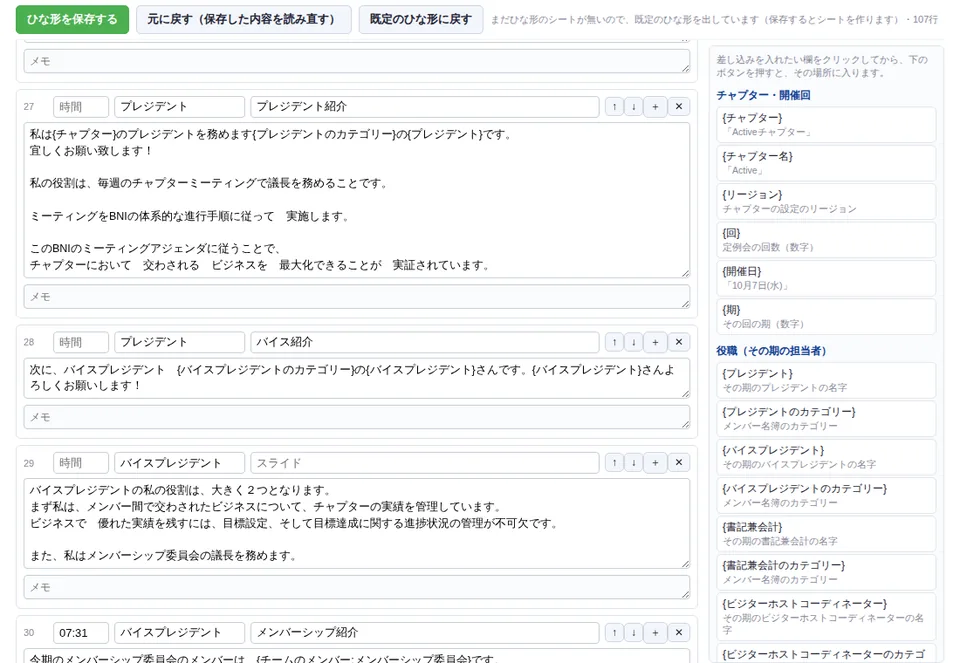

「ひな形の編集」のタブで、台本の行（時間・発言者・スライド・トーク・メモ）を直せます。

- 差し込みを入れたい欄をクリックしてから右のボタンを押すと、カーソルの場所に `{…}` が入ります
- 各行の右の **↑ ↓** で並べ替え、**＋** で下に行を足し、**×** で消します
- **「ひな形を保存する」** で `トークスクリプト（ひな形）` シートに保存します。以後は、このシートのひな形で作ります
- シートを直接直してもかまいません（1行目は見出し。時間・発言者・スライド・トーク・メモの5列）
- **「既定のひな形に戻す」** で、最初から入っている内容に戻せます

最初から入っているひな形では、チャプター名は `{チャプター}` になっています（チャプターの設定の名前が入ります）。

### 10. メンバーブックの編集・PDF出力

**メニュー**: `名簿システム` > `📊 スライド・冊子をつくる` > `メンバーブックの編集・PDF出力`

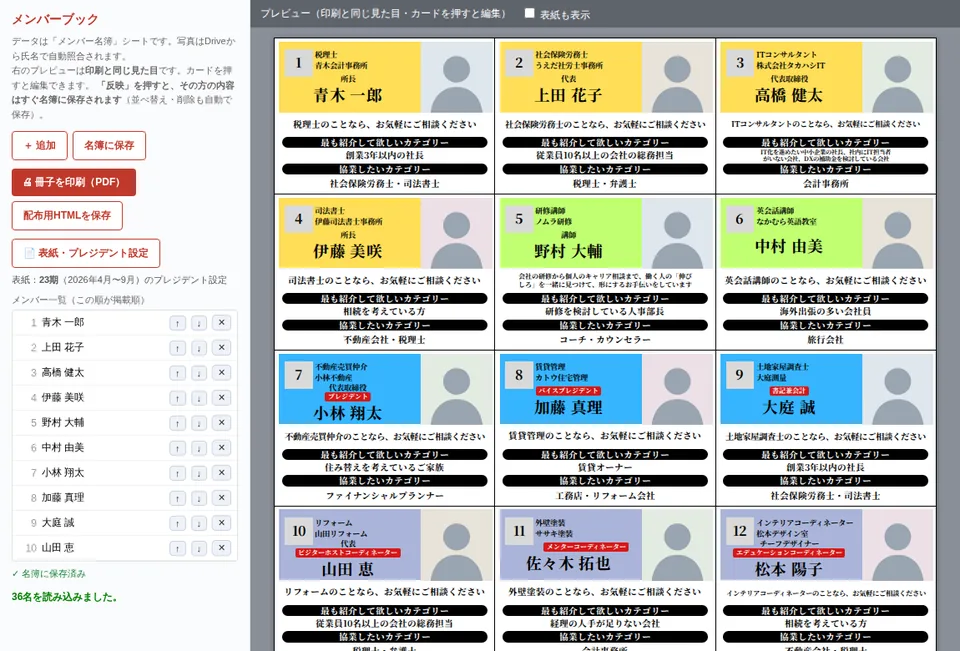

「メンバー名簿」シートの内容から、**配布版（Member Book）と同じ体裁の冊子**を作ります。
右のプレビューは**印刷と同じ組版**（文字の大きさ・位置・長い文字の収め方も同じ）です。

| ページ | 内容 |
|---|---|
| 1ページ目 | 理念・チャプター紹介・参加するメリット・タイムスケジュール・用語の説明・プレジデント挨拶・業種区分の説明（名簿で使っている業種区分だけ） |
| 2ページ目以降 | メンバーカードを3列×6行（1ページ18名・1枚 70mm×49.5mm） |

カードの帯の色は**業種区分**で決まります。名簿の「業種区分」列が、
`業種区分マスタ`シートの「キー」と一致したときに色が付きます。
Spreadingから取り込むと自動で一致するので、ふだんは意識しなくて構いません。

#### カードに出るもの

| 場所 | 名簿の列 | 文字の大きさ（いつも） |
|---|---|---|
| 左上の四角 | No | 12pt |
| 番号の右の1行目 | カテゴリー | 7pt |
| 番号の右の2行目 | 会社名 | 7pt |
| お名前の上 | **会社での役職**（代表取締役・支店長など） | 7pt |
| お名前の上の赤い帯 | **役職**（BNIの役職。プレジデント・ビジターホストなど） | 6pt |
| 真ん中 | 氏名 | 14pt |
| 写真の下 | 一言コメント | 8pt |
| 黒い帯「最も紹介して欲しいカテゴリー」の下 | 紹介してほしい人 | 8pt |
| 黒い帯「協業したいカテゴリー」の下 | 協業したい人 | 8pt |

- 会社での役職・BNIの役職は、入っている方だけに出ます（無い方は、お名前が真ん中に来ます）
- 書体は配布版と同じ**明朝体の太字**（Googleフォントの Noto Serif JP。源ノ明朝と同じ字形）です。
  プレビュー・印刷のたびにインターネットから読み込みます。つながらないときは、パソコンの明朝体で作ります

#### 長い文字

枠に入りきらない文字は、**ほかの欄に重ならないよう**、次の順に収めます。改行の位置を手で調整する必要はありません。

1. 1行のまま、入る大きさまで小さくします（一言コメントは6pt、紹介・協業は5.5pt、カテゴリー・会社名は4.5ptまで）
2. それでも入らなければ**2行**にして、入る大きさまで小さくします
3. それでも入らない（とても長い）ときは、はみ出た分が切れます。
   左の一覧の下に **「⚠ 文字が多くて、いちばん小さくしても入りきらない欄があります」** と、どなたのどの欄かが出るので、文を短くしてください

- 会社での役職・BNIの役職が長くて左上の番号の四角にかかるときは、四角の右に寄せて収めます
  （BNIの役職だけの方で、それでも入らないときは、お名前ごと四角の下に下げます）
- 一言コメント・紹介・協業の**改行はそのまま**出ます（改行したところで行が分かれます）
- 表紙の各欄（挨拶文・プレジデントの肩書き・タイムスケジュール・用語の説明など）も、長いときは枠に入る大きさまで全体を小さくします
- 業種区分の説明は2行に収めます（11区分以上のときは1行に並べる数を増やし、文字を小さくします）

#### 編集と保存

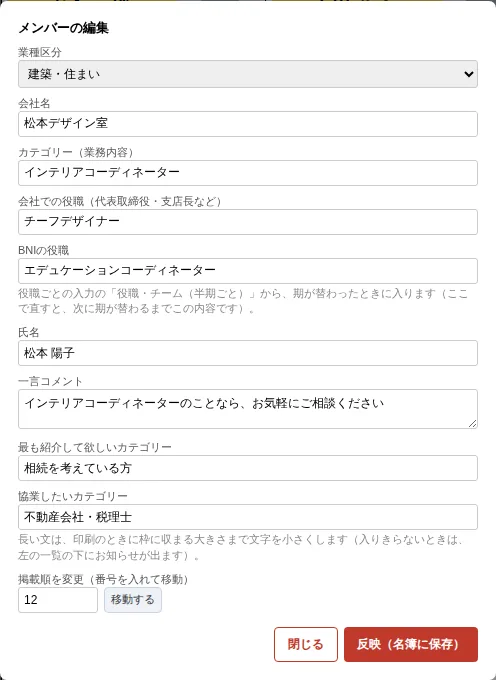

1. プレビューの**カードを押す**（または左の一覧のお名前を押す）と、その方の編集が開きます
2. 直して **「反映（名簿に保存）」** を押すと、**その方の内容をすぐメンバー名簿に保存します**。ページを閉じても消えません

- 反映しないまま「閉じる」を押すと、**「反映していない変更があります」** と聞かれます。
  ［OK］で保存して閉じ、［キャンセル］で保存しないで閉じます
- 並べ替え（↑↓・番号で移動）・削除・追加も、自動で名簿に保存します
- 左の一覧の下に **「✓ 名簿に保存済み」** と出ていれば、保存は済んでいます。
  保存中や、反映していない変更があるときにページを閉じようとすると、ブラウザが確認します
- 保存できなかったときは、赤いお知らせが出ます（あとでほかの方の保存が通っても消えません）。
  **「名簿に保存」** を押すと、いまの一覧（並び順も）をまとめて保存し直し、お知らせが消えます
- 開いたときに名簿を読み込めなかったときは、追加・並べ替え・削除・保存はできません（名簿が空で上書きされるのを防ぐため）。画面を開き直してください
- この画面で直せるのは、業種区分・会社名・カテゴリー・会社での役職・BNIの役職・氏名・一言コメント・紹介・協業です。
  ふりがな・メモ・写真・日付は、`⚙️ 設定` > `メンバー名簿` で直します
- BNIの役職は、期が替わったときに、役職ごとの入力の「役職・チーム（半期ごと）」の内容で書き換わります
  （「役職ごとの入力」の「メンバー名簿の「役職」への反映」）。会社での役職は書き換わりません

#### 表紙・プレジデント設定

左の **「📄 表紙・プレジデント設定」** から、1ページ目の内容を変えられます（「表紙も表示」にチェックを入れると、プレビューにも出ます）。

- **プレジデント** … 氏名・肩書・挨拶文。**期ごとに保存します**（すぐ下の「プレジデントの設定は期ごと」）。
  **写真は氏名から自動で照合されます**
- **定型文** … 理念・チャプター紹介・メリット・タイムスケジュール・用語の説明（期によらず1つです）

**プレジデントの設定は期ごと**

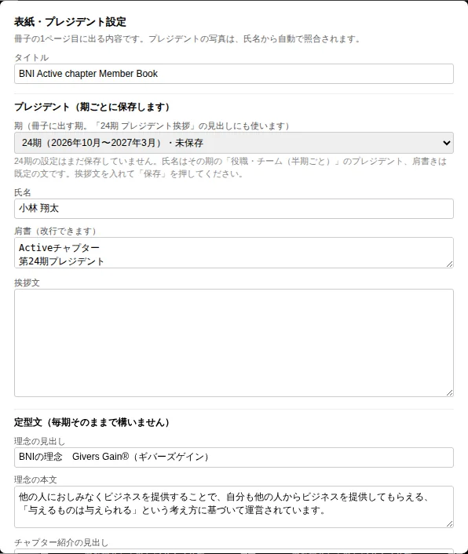

プレジデントは期ごとに替わるので、氏名・肩書・挨拶文は**期ごとに保存**します。前の期の挨拶文も消えずに残ります。

- 開いたときは**いまの期**です。「期」を選び直すと、その期の設定が出て、**冊子（プレビュー・印刷・配布用HTML）もその期**になります。
  「24期 プレジデント挨拶」の見出しも、選んだ期になります
- 次の期の挨拶文を前もって入れておけます（次の期を選んで入れ、「保存」）。期が替わると、開いたときにその期の挨拶文が出ます
- まだ保存していない期は、**氏名**がその期の「役職・チーム（半期ごと）」のプレジデント（その期の担当者を登録してあるとき）、
  **肩書**が「○○チャプター 第N期プレジデント」、**挨拶文は空**です。
  左の「表紙」の欄に **「⚠ 24期のプレジデント挨拶がまだありません」** と出るので、挨拶文を入れて保存してください
- 氏名・肩書を既定のままにしておくと、あとで担当者やチャプター名・期の番号を直したときも、それに合わせて変わります
- 保存していない変更があるまま期を切り替えたり閉じたりすると、確認が出ます
- 期ごとにする前に保存してあった1件は、その期（例: 23期）の設定として引き継ぎます

タイムスケジュールと用語の説明の **①②③… は自動で付きます。**
入力欄には番号を書かず、項目だけを1行ずつ入れてください。
用語の説明は、**「用語」の行と「説明」の行を交互に**並べます。

定型文を戻したいときは **「定型文を初期値に戻す」** を押してください。
**プレジデントの設定（期ごと）は消えません。**

#### 出力

- **📄 PDFを作ってドライブを更新** … 冊子のPDFを作り、**ドライブのメンバーブック（メールで送るPDF）をその内容に差し替えます。
  アップロードは要りません**（「メンバーブック(PDF)の更新」でPDFを選ぶ手間がなくなります）。
  - **URLは変わりません**。案内メールの `{{memberbook}}` のリンク・メニュー画面の「📄 メンバーブック」も、そのまま新しい版になり、
    **前に送ったメールのリンクからも新しい版が見られます**
  - 見た目はプレビュー・印刷と同じです（書体・写真・長い文字の収め方も同じ）。ページは画像になりますが、
    **PDFの中で文字の検索・コピーもできます**（お名前・会社名・カテゴリーなど）
  - 終わると「差し替えました」と、**ページ数と写真の数**（「写真 64/65名」など。写真を登録していない方の名前も）が出て、
    **「📄 ドライブで開く」「⬇ ダウンロード」** のリンクが出ます（パソコンにも残したいときはダウンロード）
  - ボタンの下に、いまのメンバーブックへのリンクと、**最後に差し替えた日時**が出ます
  - 写真は、**全員分の元の写真をそろえてから**作ります（一覧の写真の表示が終わるのを待たずに押して構いません）。
    読めなかった写真があるときは、**ドライブのメンバーブックは変えずに止めます**（写真の欠けたPDFを送らないため）。もう一度押してください
    - ブラウザーで開けない写真（HEIC を名前だけ .jpg にしたもの・壊れたファイル）があるときも止め、その方の名前が出ます。
      JPEG か PNG にして、`⚙️ 設定` > `メンバー写真` で入れ直してください
    - 写真の一覧にあるのにファイルが無くなっている方は、写真なしで作り、「写真のファイルが見つからなかった方」として名前が出ます（入れ直してください）。
      全員の写真を開けないときは、写真のフォルダ（02_メンバー写真）を見る権限が無いので止めます
  - 作っているあいだは画面が覆われ、操作はできません（途中で直した内容はPDFに入らないため）。数秒〜数十秒かかります
  - まだ登録していないときは、素材フォルダの「03_生成物」に新しく作って登録します（リンクを知っている全員が見られるようにします）
  - **自分に編集の権限が無い**ときは、差し替えずに「ファイルの持ち主（○○さん）に、このファイルの「編集者」にしてもらってください」と出ます。
    持ち主に頼んでから、もう一度押してください（作り直すとURLが変わるので、作り直しのボタンは出ません）
  - 登録してあるファイルを**削除した**（見つからない）ときは、**新しくは作らずに止め**、
    **「新しく作り直す（URLが変わります）」** のボタンが出ます。確かめてから押すと、**そのときの内容で**PDFを作り直して登録します
    （送ったメールのリンクは古いままになります）
  - 持ち主がファイルをゴミ箱に入れたときは、持ち主にゴミ箱から戻してもらうよう出ます。
    このアプリへのGoogleドライブの許可が足りないときは、`🔧 動作確認` > `Googleの権限を確認・許可する` の案内が出ます
  - 前の版は、ドライブのファイルの「版を管理」に**30日間**残ります（戻したいときはそこから。30日を過ぎると消えます）
  - **Google Chrome** でお使いください。PDFを作れなかったときは（ドライブのメンバーブックは変わりません）、
    もう一度押すか、「冊子を印刷」でPDFを保存して `⚙️ 設定` > `メンバーブック(PDF)の更新` からアップロードしてください
- **冊子を印刷** … 冊子が別のタブで開き、書体を読み込んで文字を収めてから、印刷画面が開きます（数秒かかります）。
  紙に印刷するときや、送信先で「PDFに保存」を選んでパソコンに保存するときに使います（用紙はA4です）。
  **ドライブのメンバーブックは変わりません**
- **配布用HTMLを保存** … Googleドライブに保存します。
  **写真は画像そのものを埋め込む**ので、受け取った方にドライブの閲覧権限がなくても表示されます。
  開いた方のブラウザでも、同じように書体を読み込んで文字を収めます

画面のプレビューは**小さいサムネイル**を使うので、15名ずつ順に表示されていきます。
一度読み込んだ写真はしばらく覚えているので、2回目からはすぐ出ます。

冊子と配布用HTMLには**元の大きさの写真**を埋め込みます。そのため、
どのボタンも押したあとに写真の読み込みが入り、人数分だけ時間がかかります
（「PDFを作ってドライブを更新」は、読み込んだ写真をPDFに要る大きさまで縮めてから使います）。

### 11. Zoom入室案内の作成

**メニュー**: `名簿システム` > `📊 スライド・冊子をつくる` > `Zoom入室案内の作成`

メンバー名簿の氏名を6列・縦読みで並べたA4横の案内を作ります。
Zoomの表示名を **「番号（半角）名前（カテゴリー）」** にそろえてもらうための案内です。

例に出す番号と人数表記を変えられます。
**番号は名簿のNoをそのまま使います。**並び順から振り直すと、Noが飛んでいるときに
実際の番号とずれてしまい、案内の紙自体が間違うことになるためです。

#### カテゴリーの表示

既定では、全員の欄に **「（カテゴリー）」** とひな形が入ります。
名前の付け方を示すための案内なので、実際のカテゴリーは出しません。

各メンバーの実際のカテゴリーを載せたい場合は、画面のチェックを入れてください。
ただし**カテゴリーが長い方は途中で切れます**（1行に収める作りのため）。
ふだんは既定のままで問題ありません。

---

## 抽選ルーレット用のビジター招待数

**メニュー**: `名簿システム` > `🎯 抽選ルーレット` > `ビジター招待数をH列に入れる`

「抽選ルーレット作成用」シートの **H列（ビ）** に、その日のビジター招待数を入れます。

当日の「〇〇参加者」シートを見て、**No. が `V` で始まる行だけ**を招待者ごとに数えます。
ゲスト（`G`）と代理は数えません。招待していない方には `0` が入ります。
Spreadingで **キャンセル** になっているビジターも数えません（実行後のメッセージにお名前が出ます）。

参加者シートは、**開催日が今日以降でいちばん近いもの**（無ければ直近の回）を使います（メールの画面の既定と同じ）。
翌週の名簿を先に作ってあっても、定例会の当日はその日の分を数えます。
どのシートを使ったかは、実行後のメッセージに出ます。

氏名は**メンバー名簿の表記にそろえてから**照合します。
参加者シート側が「川辺」、ルーレット側が「川邉」のように字が違っていても同じ人とみなします。
シート名が「抽選ルーレット作成用」で始まるものは、①②と分かれていてもまとめて入ります。

### シートにボタンを置く

`名簿システム` > `🎯 抽選ルーレット` > `シートにボタンを置く` を1回実行すると、
シートの **P1セルにチェックボックス**が置かれます。
**チェックを入れると実行され、終わると自動でチェックが外れます。**結果は隣のQ1に出ます。

> スプレッドシートの図形ボタンはスクリプトからは作れないため、チェックボックスで代用しています。
> 図形のボタンにしたい場合は、`挿入` ＞ `図形` で図形を作り、図形右上のメニューから
> **「スクリプトを割り当て」** に `fillRouletteVisitorCounts` と入力してください。

### うまく入らないとき

- **全員0になる** … 参加者シートのNo.が `V01` のような形式か確認してください。
- **特定の人だけ0** … ルーレット側のA列（姓）B列（名）と、参加者シートの「招待者」が
  別人と判定されています。メンバー名簿の氏名と見比べてください。
- **「招待者が空のビジター」と出る** … そのビジターには招待者が登録されていません。
  参加者シートの「招待者」列を埋めてから、もう一度実行してください。

---

## シートの整理（アーカイブ）

**メニュー**: `名簿システム` > `🗂 シートの整理` > `アーカイブして整理する`

開催日ごとに「参加者」「参加者_印刷用」「割り振り表」「オリエン」「オープンネット」
（台本を作ったときは「トークスクリプト」も）のシートが作られるため、何週も続けるとタブが増えていきます。
この画面でまとめて片付けられます。

アーカイブは**開催日単位**です。同じ日付のシートがまとめて非表示になり、まとめて戻ります。

### シート名について

シート名は **`20260930参加者` のように年から始まります**（yyyyMMdd）。

以前は `0930参加者` のように月日だけでしたが、**年が分からないため
「3/25」が翌年と判定されて次回の候補に出てしまう**などの誤りが起きていました。

既存のシートは**すべて8桁に変更済み**で、新しく作られるシートも8桁になります。
移行用のメニューは役目を終えたので外しました。

4桁のシートが残っていた場合（古いコピーを戻したときなど）でも、
アーカイブ・PDFの再作成・割り振り表の作成はこれまでどおり動きますが、
**タブが日付順に並ばず、「次回の開催日」の判定にも使えません。**
タブ名を手で直してください（例: `0930参加者` → `20260930参加者`）。
このときPDFは、上書きではなく新しいファイルとして作り直されます。

**アーカイブ＝シートを非表示にするだけです。データは消えません。**
非表示のままでも、再編集・PDFのみ再作成・割り振り表の作成はこれまでどおり使えます。
アーカイブした開催日で名簿・PDF・割り振り表を作り直すと、**その開催日のシートは自動で表示に戻ります**
（作り直した開催日が隠れたままになることはありません）。

### できること

| 操作 | 内容 |
|---|---|
| 自動アーカイブ（既定ON） | 新しい開催日の名簿や割り振り表を作ると、**過ぎた開催日**を自動で非表示にします（作った開催日と、今日以降の開催日は表示されたままです。翌週分を先に作っても、次回のシートは隠れません） |
| 最近N件を残して一括アーカイブ | 溜まったタブを一気に整理します（1〜10件から選択） |
| 選択をアーカイブ / 表示に戻す | 開催日ごとに個別に切り替えます |
| 全て表示に戻す | アーカイブ済みをすべて元に戻します |

### 元に戻したいとき

- メニュー `名簿システム` > `🗂 シートの整理` > `アーカイブを全て表示に戻す` … ワンクリックで全部戻します
- または上記の画面で、戻したい開催日にチェックを入れて「選択を表示に戻す」

### 安全のための仕組み

- 「メンバーリスト」「休会日」など、開催日以外のシートはアーカイブされません
- すべてのシートが非表示になる操作はできません（1枚以上は必ず表示されます）
- 自動アーカイブは `🗂 シートの整理` > `アーカイブして整理する` の画面でいつでもOFFにできます

---

## 初期設定（初回・メンバー変更時のみ）

ふだんの毎週の作業では触りませんが、初回セットアップやメンバーの変更があったときに必要な設定です。

### チャプターの設定（名前・期・定例会の回数・プレゼンの秒数）

`名簿システム` > `⚙️ 設定` > `チャプター（名前・期・定例会の回数・プレゼンの秒数）`

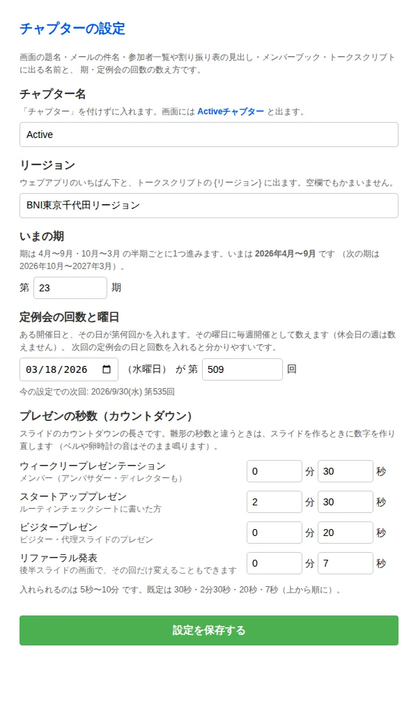

ほかのチャプターでも使えるように、チャプターごとに違うものをここで決めます。
何も保存していなければ、Activeチャプターの値（Active・東京千代田リージョン・2026年4月〜9月が23期・2026/3/18(水)が第509回）で動きます。

| 項目 | 使われるところ |
|---|---|
| チャプター名 | ウェブアプリ・メニュー画面の題名、案内メールの件名と送り主の初期値、参加者一覧（PDF）と割り振り表の見出し、メンバーブックの表紙の初期値、トークスクリプトの {チャプター} |
| リージョン | ウェブアプリのいちばん下、トークスクリプトの {リージョン}（空欄でもかまいません） |
| いまの期 | 役職・チーム（半期ごと）の期の番号、メンバーブックの表紙の初期値（「第24期プレジデント」など） |
| 定例会の回数と曜日 | 開催日の候補（CSVの取り込み・メール・役職ごとの入力など）と「第○回」の数え方。入れた日の曜日に毎週開催として数え、休会日の週は数えません |
| プレゼンの秒数 | スライドのカウントダウンの長さ（分・秒で入れます。5秒〜10分）。下の表 |

| プレゼンの秒数 | 既定 | 使われるところ |
|---|---|---|
| ウィークリープレゼンテーション | 30秒 | 前半スライドのメンバーの個人ページ、アンバサダー・ディレクターのページ、トークスクリプトの {ウィークリープレゼンの秒数} |
| スタートアッププレゼン | 2分30秒 | 前半スライドの、スタートアッププレゼンの方の個人ページ、トークスクリプトの {スタートアッププレゼンの秒数} |
| ビジタープレゼン | 20秒 | ビジター・代理スライドの「ビジタープレゼン」、トークスクリプトの {ビジタープレゼンの秒数} |
| リファーラル発表 | 7秒 | 後半スライドのリファーラル発表のページ（画面でその回だけ変えられます）、トークスクリプトの {リファーラル発表の秒数} |

- チャプター名は「チャプター」を付けずに入れます（「Active」→ 画面では「Activeチャプター」）。
- 定例会の回数は、**次回の定例会の日と、その回数**を入れると分かりやすいです。
- プレゼンの秒数は、テンプレートのカウントダウンと同じ秒数ならテンプレートのまま使い、違うときは作るときに数字を作り直します。
  **最後に鳴るベル・最初に流れる卵時計の動画などの音は、そのまま残ります。**
- **いまの期を変えると**、「役職・チーム（半期ごと）」に登録してある期の番号と、メンバーブックの期ごとのプレジデント設定も
  同じだけずらします（同じ半期の担当者・挨拶文がそのまま出ます）。
  ずらすのは、**画面を開いたときの期から変えた分だけ**です。9/30 に開いた画面を 10/1 に保存しても（期の欄を触らなければ）、
  期の番号はずれません。
- 案内メールの件名は、メールテンプレートを保存していないときの初期値です。保存してある件名は変わらないので、
  必要ならメールテンプレート設定で直してください。

### 足りないシートを作る

`名簿システム` > `⚙️ 設定` > `足りないシートを作る（ルーティンチェックシートなど）`

システムが使うシート（メンバー名簿・業種区分マスタ・休会日）と、次の4回の定例会の列がある
ルーティンチェックシートのうち、**無いものだけを作ります。あるシートには触りません。**

- **期が替わる前に、次の期のルーティンチェックシートを作りたいとき**に使えます。
  前の期のシートを写して、開催日の列（1行目の開催日・2行目の回数）だけを新しくします
  （休会日の週は回数を空けます）。項目・担当・期日・曜日目安・備考と書式は、前の期のまま引き継ぎます。
- メニュー画面の「準備の状況」に、次回の定例会の列があるルーティンチェックシートが出ます。
  無いときは「作る」から同じことができます。

空のスプレッドシートから新しく始めるときの手順は、このマニュアルとは別に、
リポジトリの `docs/SETUP.md`（初期導入の手順）にまとめています。

### 公式ファイルから雛形を作る

`名簿システム` > `⚙️ 設定` > `BNI 素材フォルダ` の画面のいちばん下にある、小さなリンク「公式ファイルから雛形を作る」

**初期設定のときに使う画面です（ふだんは使いません）。** そのため、メニューやホーム画面には出さず、
BNI 素材フォルダの画面から開くようにしています（ウェブアプリでも、BNI 素材フォルダの画面のリンクから開きます）。

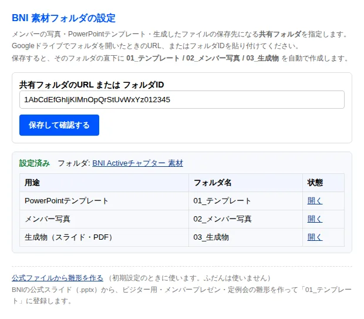

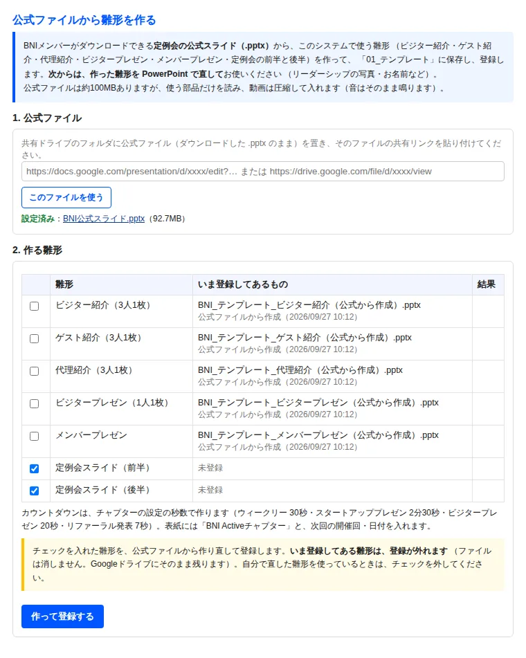

BNIメンバーがダウンロードできる**定例会の公式スライド（.pptx）**から、このシステムで使う雛形を作って登録します。

1. Google ドライブ（共有ドライブのフォルダなど）に、ダウンロードした公式ファイルを **.pptx のまま**置きます
   （Googleスライドに変換しない）。そのファイルの共有リンクをコピーします
2. 「1. 公式ファイル」にリンクを貼り付けて「**このファイルを使う**」
3. 「2. 作る雛形」でチェックを入れたものを、「**作って登録する**」で順に作ります（1つ30秒ほど）。
   まだ登録していない雛形にだけ、最初からチェックが入っています

| 雛形 | 公式ファイルのどのページから | 作るときに直すこと |
|---|---|---|
| ビジター紹介・ゲスト紹介・代理紹介 | 歓迎 本日のビジター | 題名（ゲスト・代理出席の方々）。「専門分野：」「招待者：」の見出しは残して、後ろにお名前などが入ります |
| ビジタープレゼン | ビジターの紹介 | お名前・会社名・【カテゴリー】の枠。卵時計つきのカウントダウン（ビジタープレゼンの秒数） |
| メンバープレゼン | 業種区分の表・ウィークリープレゼンテーション | 扉に先頭の方の写真と「次のプレゼンター」。カウントダウン（ウィークリーの秒数） |
| 定例会スライド（前半） | 表紙〜メインプレゼンテーション | 表紙のチャプター名と第○回・日付、メンバーシップ委員会の表・メインプレゼン（お2人）の差し込み口 |
| 定例会スライド（後半） | リファーラルと推薦のことば〜締めの言葉 | リファーラル発表のひな形（カウントダウンつき）、推薦のことば（お2人）、書記兼会計の更新状況の表 |

- 作った雛形は「01_テンプレート」に `BNI_テンプレート_○○（公式から作成）.pptx` の名前で保存され、登録されます。
  **次からは、その雛形を PowerPoint で直して**使います。リーダーシップチーム・サポートチームのお名前と写真は、
  「役職・チーム（半期ごと）」の登録から作るたびに入ります（下の「定例会スライド（前半）」の「役職のメンバー紹介」）。
  もう一度作ると、同じファイルを作り直します（リンクは変わりません。直した内容は消えます）
- いま登録してある雛形の代わりに作るときは、確かめてから登録を替えます（前の雛形のファイルは消しません）
- **音は消しません。** 右上のコアバリューの動画・卵時計は、公式ファイルのまま鳴ります。
  公式ファイルでは動画が圧縮されずに入っていて大きい（約100MB）ので、雛形に入れるときに圧縮します
- カウントダウンの秒数は「チャプターの設定」のプレゼンの秒数です。あとから秒数を変えても、作るときに作り直すので、
  雛形を作り直す必要はありません
- 公式ファイルに無いページ（コアバリューを1つずつ出すページ・一般規定のページ・アンバサダー／ディレクターのページ・
  抽選コーナー）の機能は、そのページを雛形に足すと使えます

### メンバー名簿（すべての機能の正本）

`名簿システム` > `⚙️ 設定` > `メンバー名簿`

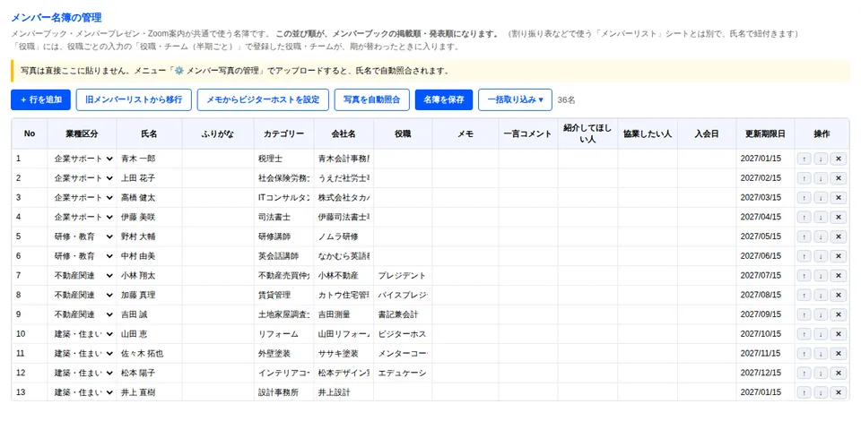

メンバーの情報は、この**「メンバー名簿」シート1枚**にまとまっています。
割り振り表もメンバーブックもスライドも、すべてここを見ています。
（以前あった「メンバーリスト」シートは不要になりました。
「旧メンバーリストから移行」ボタンで中身を移し、シートは非表示にできます。
**移行は1回だけ**です。移したあとの旧シートは古いままなので、もう一度押しても移しません
（退会した方が名簿に戻ったり、番号が古いものに戻ったりするため）。旧シートを直して移し直すときは、シートを表示に戻してから押します）

**ほかの方と同時に直したとき：** この画面（とメンバーブックの編集画面）は、開いたときの名簿を覚えています。
開いたあとで、ほかの方が名簿を変えていたら（Spreading・メンバーリスト(OCR)の取り込み、期の替わり目の役職の反映、
別の画面での保存、シートへの直接の書き込みなど）、**「名簿を保存」しても保存しません**
（開いたときの古い一覧で、ほかの方の変更を消してしまうため）。「ほかの方…が名簿を変えました」と出たら、
直した内容を控えてから画面を開き直し、もう一度直してください。

**シートに列を足さないでください。** 列は下の表の並びで決まっています。見出しの名前で読むので、
列を足したり動かしたりしても、ほかの列をずれて読むことはありませんが、決まっていない列（「メール」など）があると、
名簿全体の保存（「名簿を保存」・並べ替え・取り込み）で消えてしまうため、**保存を止めて知らせます**。
その列は別のシートに移してください。

列は次のとおりです。

| 列 | 内容 | どこから埋まるか |
|---|---|---|
| No | メンバー番号 | Spreading / メンバーリスト(OCR) |
| 業種区分 | 企業サポート、不動産関連など | Spreading / メンバーリスト(OCR)の見出し |
| 氏名 / ふりがな | | Spreading / メンバーリスト(OCR) |
| カテゴリー | 生命保険(法人) など | Spreading / メンバーリスト(OCR) |
| 会社名 | | Spreading / メンバーリスト(OCR) |
| 役職 | **BNIの役職**（「プレジデント」「ビジターホスト」など）。メンバーブックではお名前の上に赤い帯で出ます | Spreading / メンバーリスト(OCR)。期が替わったときに、役職ごとの入力の「役職・チーム（半期ごと）」の内容が入ります |
| メモ | 役職と同じく「ビジターホスト」等が入ることがあります | メンバーリスト(OCR) |
| 写真ファイル名 | | メンバー写真の自動照合 |
| 一言コメント / 紹介してほしい人 / 協業したい人 | メンバーブックに載る内容 | 手入力、またはメンバーブックHTMLの取り込み |
| 入会日 | | Spreading / メンバーシップ期間レポート |
| 更新日 | | 手入力 |
| 更新期限日 | | 会費レポート |
| 会社での役職 | 代表取締役・支店長などの肩書き。メンバーブックではお名前の上に出ます | 手入力（メンバーブックの編集画面、またはこの画面）。以前の名簿には無い列なので、保存したときにいちばん右に足します |

#### 一括取り込み（4つの方法）

画面上部の「一括取り込み」から、次の方法でまとめて埋められます。
**Spreadingが使える場合は、次項の「Spreadingから名簿を更新」がいちばん確実です。**
下の4つは、それを補う形で使ってください。

1. **メンバーブックHTML** … 現行のメンバーブック管理ツールで保存したHTMLから、
   業種区分・カテゴリー・会社名・一言コメント・紹介/協業を取り込みます。
   **HTMLに無い項目（No・ふりがな・役職・メモ・写真ファイル名・入会日・更新日・更新期限日・会社での役職）は
   そのまま残ります。**名簿にしか居ない方も消えません。
2. **BNI公式レポート(.xls)** … 2つのレポートを選ぶと、氏名で照合して日付を埋めます。
   - メンバーシップ期間レポート → **入会日**（Recent Start date＝最新の入会日）
   - 会費レポート → **更新期限日**（会費がいつまでか）
   - 日付以外の項目には触れません。
3. **表計算から貼り付け** … タブ区切りのデータを貼り付けます。
   **空欄だった列は元の内容を残します。**セルの中に改行がある一言コメント（2行の一言など）も、そのまま1人ぶんとして読みます。
   「既存の名簿を全て置き換える」にチェックを入れたときだけ、
   貼り付けた内容だけの名簿になります（写真・日付なども消えます）。
4. **メンバーリスト(OCR)** … 次項のとおり、PDFから大半の項目が埋まります。

#### 取り込む前に戻す

メンバーリスト(OCR)・Spreading・メンバーブックHTML・表計算からの貼り付け・BNI公式レポートで**名簿をまとめて書き換える前に、
いまの名簿を控えておきます**（隠しシート「メンバー名簿_取り込み前」）。
控えがあると、この画面の上に「名簿の控えがあります：（日時）（何の取り込みの前か）」と出ます。

取り込みで名簿がおかしくなったときは **「↩ 取り込む前に戻す」** を押します。いまの名簿と控えを入れ替えるので、
間違えて押したときは、もう一度押すと戻す前の名簿（取り込んだあと）に戻ります。控えは、いちばん新しい取り込みの前の1つだけです。
戻したあと、BNIの役職は、いま反映してある期の「役職・チーム（半期ごと）」に合わせ直します。

#### メモからビジターホストを設定

Spreadingから取り込むと**役職**欄に、メンバーリスト(OCR)で読み込むと**メモ**欄に、
「ビジターホスト」等が入ります。
**「メモからビジターホストを設定」**ボタンを押すと、
役職欄・メモ欄のどちらかにその記載があるメンバーを、ビジターホスト設定に一括反映できます。
「ビジホス」のような略称も拾います。

### Spreadingから名簿を更新

`名簿システム` > `⚙️ 設定` > `Spreadingから名簿を更新`

SpreadingのAI連携（MCP）で取得したメンバー情報を、メンバー名簿に反映します。
**PDFの読み取りと違って文字化けや誤読が起きないため、こちらが使えるときはこちらが確実です。**
（名簿に「役職・チーム（半期ごと）」を反映してあれば、取り込んだあと、役職を登録した内容に合わせ直します。
ただし、期が替わったのに新しい期の「役職・チーム」がまだ登録されていないときは、**取り込んだ役職のまま**にします
（新しい期の役員を、前の期の内容に戻さないように）。「取り込む前に戻す」のあとも同じです）

「番号を振り直す」にチェックを入れずに取り込むと、新しく入った方には番号（No）が付きません。
番号の無い方は、割り振り表・ビジターホストの一覧に出ないので、取り込んだあとのお知らせに名前が出ます。
（招待者・代理・ルーティンチェックシートの名前の照合では、番号が無くても名簿の方として扱います。
その方の代理は、ビジターリストで「代理」と出ます）

#### 最初に1回だけ：SpreadingのAI連携を許可する

この機能を使うには、先にClaude側でSpreadingとの連携を許可しておく必要があります。
一度許可すれば、次回からこの作業は不要です。

1. [claude.ai](https://claude.ai/) を開き、**設定 → コネクタ** を選びます。
2. **「カスタムコネクタを追加」** を押します。
3. URLに、お使いのチャプターのSpreadingのMCPサーバーのアドレスを入力します（Activeチャプターは次のとおり）。

   ```
   https://active.spreading.tokyo/mcp_server*rpc
   ```

   > **`*`（アスタリスク）は誤字ではありません。** `/`（スラッシュ）に直すと動きません。
   > Spreadingが公開している設定にも、この形で書かれています。そのままコピーしてください。

4. Spreadingのアカウントでログインし、アクセスを許可します。
   マスター・メンバー・DNAチームのいずれの有効なアカウントでもかまいません。

**読み取り専用の連携です。**Spreading側のデータが書き換わることはありません。
パスワードなどの認証情報も連携の対象外です。

ただし、**メンバーと参加者の連絡先（メールアドレス・電話番号）も取得できる範囲に含まれます。**
チャプターの個人情報を扱うことになるので、運用上問題ないかご確認のうえで連携してください。

> **うまく登録できないとき**: SpreadingのMCPサーバーは「動的クライアント登録」に対応しておらず、
> 新しい方式（CIMD）を使っています。登録時にエラーになる場合はこれが原因である可能性が高く、
> こちら側では対処できません。Spreadingの提供元にお問い合わせください。

#### 使い方

1. Claudeなど、SpreadingのMCP連携を許可したAIに **`member_list` を実行して結果を見せて** と頼みます。
2. 返ってきた内容をコピーします。前後に説明文が混ざっていてもかまいません。
3. この画面の入力欄に貼り付けます。
4. まず **「変更内容を確認」** を押します。ここではまだ名簿は変わりません。
   誰のどの項目が、何から何に変わるかが一覧で出ます。
5. 問題なければ **「名簿に取り込む」** を押します。

#### 反映される項目

ふりがな・カテゴリー・会社名・役職・業種区分・入会日 の6つです。

**写真ファイル名・一言コメント・紹介してほしい人・協業したい人・メモ・更新日・更新期限日・会社での役職は
上書きしません。**取り込む前の名簿は控えておくので、メンバー名簿の画面の「取り込む前に戻す」で戻せます。すでに入っている内容はそのまま残ります。
Spreading側が空欄の項目も、上書きせずに元の内容を残します。

氏名で同じ人かどうかを判断します（スペースや全角半角の違いは無視します）。

#### Noの振り直しについて

**「Noを業種区分の並び順で振り直す」**にチェックを入れると、
業種区分の並び（企業サポート → 不動産関連 → …）とその中の並び順にしたがって、
1番から順に番号を振り直します。紙のメンバーリストと同じ並びになります。

ただし**番号が変わると、過去に作った割り振り表との対応が取れなくなります。**
必ず先に「変更内容を確認」を押して、いまの番号と変わらないかを見てから実行してください。
ふだんはチェックを外したままで問題ありません。

#### 退会された方について

名簿にはいるのにSpreadingの有効メンバーに見つからない方は、確認画面に一覧で出ます。
**自動では消しません。**退会された方かどうか、氏名の書き方が違うだけかを
ご自身で判断して、必要なら手で削除してください。
（自動で消すと、その方の写真や一言コメントも一緒に失われるためです）

### メンバーリスト(OCR)の更新

`名簿システム` > `⚙️ 設定` > `メンバーリスト(OCR)の更新`

メンバーリストのPDFを読み取って、**メンバー名簿の大半の項目を一度に埋めます**。
読み取るのは No・氏名・ふりがな・カテゴリー・会社名・役職・メモ、および
表の途中にある業種区分の見出し（企業サポート、不動産関連など）です。

**PDFの出し方（Spreading）**：Spreadingのメニューの **「メンバー」** を開き、右上の **「メンバーリスト印刷」** を押します。
開いたPDF（`members-pdf.pdf`）を、右上の **↓（ダウンロード）** でパソコンに保存し、下の「方式A」で選びます。

- Spreadingで新しいメンバーを登録したときは、**コンタクトサークル設定**でカテゴリーのまとまりに移してから出してください
  （「カテゴリの設定がないメンバー」のままだと、メンバーリストに載りません）
- 読み取った一覧では、新しい方は **「新しく足す方」** に、その方より後ろの方は番号が1つずつずれて **「変わる方」** に出ます。
  名簿は氏名で照らし合わせるので、写真・一言コメントなどが別の方に入れ替わることはありません
- 反映したあと、新しい方の写真は `⚙️ 設定` > `メンバー写真` でアップロードします
  （ファイル名はメンバー名簿と同じ氏名で、`新井 花子.jpg` のように。JPEG か PNG。iPhoneの HEIC はそのままでは使えません）

**写真・一言コメント・日付など、PDFに載っていない項目は消えません。**
すでに入っている内容はそのまま残り、PDFにある項目だけが更新されます。
読み取りは **Gemini（AI）** が行うため、先に `⚙️ Gemini API・モデル設定` でAPIキーを設定しておいてください。

**名簿の行は氏名で探します（番号では探しません）。** 番号はPDFの番号に直すだけで、行の氏名は書き換えません。
メンバーが増えて番号がずれても、写真・一言・日付などが別の方の行に入ることはありません。

- 氏名が1文字だけ違う方（読み取りの誤りや「髙／高」「𠮷／吉」のような字の違い）は、**ふりがなも同じ**で、
  名簿に当てはまる方が1人だけのとき、その方として扱います（氏名は名簿のまま）。
  ふりがなが違う・無いとき（「山川 健」と「山川 誠」など）、2文字の氏名、当てはまる方が2人以上のときは、別の方として足します
- PDFに同じ氏名が2回出てくる（読み取りで同じ行を2回読んだ）ときは、2回目を飛ばします
- 名簿に同じ氏名の方がいなければ、新しい方として足します
- **PDFに無い方**（退会された方）は、確認の一覧で **「名簿から消す」にチェックした方だけ** 名簿から消します。
  PDFの番号に抜けが無く、新しく足す方もいないときは、**はじめからチェックが入っています**。
  番号に抜けがあるとき（読み取れなかった方かもしれない）と、新しく足す方がいるとき（氏名の書き方が違うだけの同じ方かもしれない）は、
  チェックを外してあるので、退会された方だけチェックしてください。消したあとも「取り込む前に戻す」で戻せます

**読み取ったら、すぐには反映しません。** 画面に次の一覧が出るので、確かめてから **「名簿に反映」** を押します
（やめるときは「やめる」。名簿は変わりません）。

| 一覧 | 中身 |
|---|---|
| 変わる方 | 名簿の氏名で突き合わせた方と、変わる項目（No 3 → 4、ふりがな など） |
| 新しく足す方 | 名簿に同じ氏名が無い方 |
| 氏名が1文字違う方 | PDFの氏名と、当てはめる名簿の方（ふりがなが同じ方だけ）。別の方なら「やめる」を押して、名簿の氏名を直してから読み直します |
| PDFに同じ氏名が2回ある方 | 2回目は飛ばします |
| PDFに無い方 | 退会された方か、読み取れなかった方。**「名簿から消す」にチェックした方を、名簿から消します**（チェックしない方は残します） |
| 番号が重なる方 | 反映すると、同じ番号の方が2人になる（PDFに無い方を残すと、前の番号のまま、など）。名簿から消す方は除いて数えます（チェックを替えると、すぐ出し直します）。反映したあと、メンバー名簿で直します |

反映する前の名簿は控えておきます。おかしくなったときは、メンバー名簿の画面の **「取り込む前に戻す」** で戻せます。
名簿に変わるところが無いときは、名簿も控えもそのままです。

読み込み方法は2つあります。どちらでも結果は同じです。

- **方式A：ファイルを選んで解析** … パソコン内のPDFを選ぶだけ。ふだんはこちらでOKです。
- **方式B：ドライブのPDFを指定** … PDFをGoogleドライブに置き、その共有リンクかファイルIDを貼り付けます。
  ファイルが大きいときや、方式Aがうまくいかないときに使ってください。

> メニューの「メンバーリスト(OCR)の更新（ダイアログなし）」でも、読み取った内容を小窓で見せてから、OKで反映します。
> PDFに無い方がいるときは、続けて「名簿から消しますか？」と聞きます（「はい」で消す・「いいえ」で残す・「キャンセル」でやめる）。

### メンバーブック(PDF)の更新

`名簿システム` > `⚙️ 設定` > `メンバーブック(PDF)の更新`

ビジターに配るメンバーブックのPDFをアップロードします。

- **メンバーブックの編集画面の「📄 PDFを作ってドライブを更新」を使えば、アップロードは要りません**（同じファイルを差し替えます）。
  ほかで作ったPDFを使うときや、編集画面でPDFを作れなかったときに、ここからアップロードしてください
- 差し替えても**URLは変わりません**（送ったメールのリンクからも最新版が見られます）
- 自分に編集の権限が無い・一時的なエラーのときは、差し替えずに知らせます（勝手に新しいファイルにはしません）。
  登録してあったファイルが見つからない（削除した）ときだけ新しく作り、**URLが変わった**ことを知らせます
- メールテンプレートの `{{memberbook}}` で自動的にこのPDFのURLが挿入されます。
- AI割り振りは、このPDFではなく**メンバー名簿の内容**を使います。名簿に一言・紹介してほしい人・協業したい人が
  まったく入っていないときだけ、このPDFを読ませます（「AI自動割り振り（Gemini AI）」）。

### AI参考資料の管理

`名簿システム` > `⚙️ 設定` > `AI参考資料`

AI自動割り振りのときに、メンバー名簿の内容と一緒にGeminiへ渡す参考資料を登録できます。
コンタクトサークルのアンケート結果や、メンバーのつながりたい相手リストなどを入れておくと、
割り振りの精度が上がります。

- PDF・画像・テキストなどに対応しています。複数登録できます。
- 一覧から不要になった資料を削除できます。

### 休会日の管理

`名簿システム` > `⚙️ 設定` > `休会日`

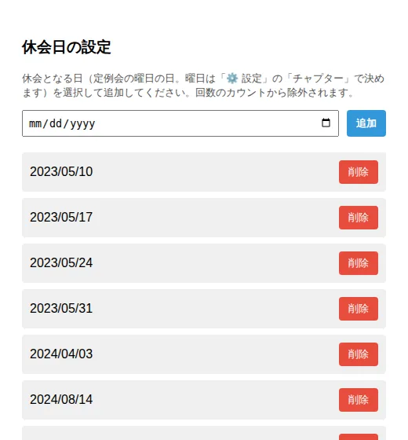

お盆・年末年始など、定例会がお休みの日を登録します。登録した日は定例会の候補日に表示されなくなります。

### メールテンプレート設定

`名簿システム` > `⚙️ 設定` > `メールテンプレート`

Visitor・Guest・Substituteの3種別ごとに、メールの件名と本文のひな形を設定します。CC/BCCも設定できます。

**代理送信 Web App URL** に、管理者のアカウントでデプロイした Web App のURLを入れると、メールをその Web App（管理者のGmail）から送ります。
空欄なら、送る画面を開いている方のGmailから送ります。「/dev」で終わるURLなど、使えない形のURLを保存したときは知らせます。

URL・合言葉の下の **「メールが送れるかのテスト」** で、画面に入っている値のまま確かめられます（保存する前でも確かめられます）。

- **① 代理送信を確かめる（メールは送りません）** … 代理送信の Web App に、送らずに返事だけをもらいます。
  届くか（ログインの画面・見つからないページが返らないか）、合言葉が合っているか、その Web App の持ち主の Gmail の許可があるか、
  送信元のアドレスと Web App の版が出ます。古い版の Web App は、届くことまでしか確かめられません（②で確かめてください）
- **② テストメールを送る** … 決まった件名（「【チャプター名】メール送信のテスト（日時）」）と本文のメールを、本当に1通送ります。
  送り先が空欄なら自分あて。届けば、案内メールも同じように送れます

本文の中で以下の変数を使うと、送信時に自動で置き換わります。

| 書き方 | 置き換わる内容 |
|--------|--------------|
| `{{name}}` | 参加者の氏名 |
| `{{inviter}}` | 招待者の氏名 |
| `{{date}}` | 開催日 |
| `{{visitorlist}}` | 選んだ開催日のビジターリストPDFのURL |
| `{{memberbook}}` | メンバーブックPDFのURL |

### 割り振り表の特記事項設定

`名簿システム` > `⚙️ 設定` > `割り振り表の特記事項`

割り振り表PDFの下部に載せる注意書き（「当日の動き」など）を編集できます。

### ビジターホストの設定

`名簿システム` > `⚙️ 設定` > `ビジターホスト・優先順位`

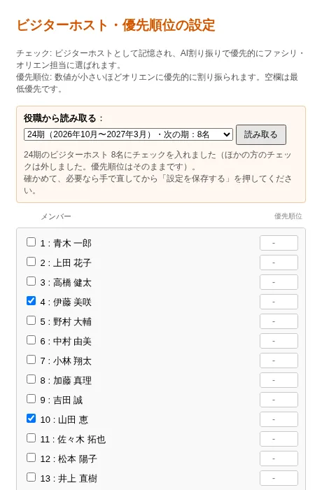

ビジターホストを務めるメンバーにチェックを入れます。AI割り振り時に、ファシリテーターやオリエン担当として優先的に配置されます。

**役職から読み取る**：役職ごとの入力の「役職・チーム（半期ごと）」で登録したビジターホスト
（ビジターホストのチームのメンバーと、リーダーのビジターホストコーディネーター）を読み取れます。

1. 上の **「役職から読み取る」** で期を選びます（今の期・次の期）。
   引継ぎの時期（期の最後の月＝9月・3月）は次の期の方がビジターホストをするので、次の期を登録してあれば次の期が選ばれています。
2. **「読み取る」** を押すと、その期のビジターホストにチェックが入ります（ほかの方のチェックは外れます。優先順位はそのままです）。
3. 必要なら手で直して、**「設定を保存する」** を押します。保存するまでは設定は変わりません。

期が替わっても、この設定は自動では替わりません。引継ぎの時期に読み取って、手で直して使ってください。

この設定は **番号と氏名の組** で覚えています。メンバーリスト(OCR)やSpreadingの取り込みで **名簿の番号がずれても、同じ方のまま** です
（以前は番号だけで覚えていたため、新メンバーが途中の番号に入ると、別の方がビジターホストになっていました。
その前に保存した設定は、この版で最初に割り振り表などを開いたときの名簿で氏名を控えます。
すでに番号がずれて別の方になっていたときは、この画面で直して保存し直してください）。

**名簿の記載から設定することもできます。**
「メンバー名簿」画面の **「メモからビジターホストを設定」** を押すと、
役職欄またはメモ欄に「ビジターホスト」「ビジホス」等の記載があるメンバーを、
まとめてビジターホストに設定します。
（Spreadingから取り込むと役職欄に、メンバーリスト(OCR)で読み込むとメモ欄に入ります）

あわせて、メンバーごとに **優先順位（数値）** を設定できます。

- 数値が **小さいほど優先** され、ファシリテーター・オリエン担当に先に割り当てられます。
- **空欄のメンバーは最も優先度が低い**扱いになります。
- 割り振り表の待機リストでは、名前のうしろに `[1]` のように優先順位が表示されます。

### Gemini API・モデル設定

`名簿システム` > `⚙️ 設定` > `Gemini API・モデル`

AI自動割り振りとメンバーリスト(OCR)の読み取りに使うAPIキーを設定します。
Google AI Studio からキーを取得して入力してください。

### メール送信のテスト

`名簿システム` > `🔧 動作確認` > `メール送信のテスト（代理送信の Web App）`

案内メールが送れる状態かを、その場で確かめます。

1. どこから送るか（代理送信の Web App か、自分のGmailか）と、送れる状態かを確かめます（メールは送りません）。
   代理送信の Web App なら、届くか・合言葉・持ち主の Gmail の許可・送信元・版まで確かめます
2. 送れる状態なら「自分あてにテストメールを1通送りますか？」と聞くので、「はい」で送ります。届いたら確かめ終わりです
3. 送れない状態なら **❌** と、理由・直し方が出ます（メールは送りません）

定例会の前日など、案内メールを送る前に一度やっておくと安心です。

### Gemini接続テスト

`名簿システム` > `🔧 動作確認` > `Gemini接続テスト`

APIキーが正しく設定され、Geminiと通信できるかをその場で確認できます。
AI割り振りやメンバーリスト(OCR)がうまく動かないときは、まずこれを実行してください。

- **✅ 成功** と出れば、APIキーと通信は正常です。
- **❌ 失敗** と出た場合は、表示されたエラー内容（HTTPコードなど）を確認してください。

---

## よくある質問

### Q: ダイアログ（小窓）が真っ白で何も出ません

枠と題名だけが出て中身が表示されない場合、まず
`名簿システム` > `🔧 動作確認` > **`ダイアログが真っ白なときの確認`** を実行してください。

**「サーバー側は正常です」と出た場合** … 原因はブラウザ側です。
ダイアログの中身は `googleusercontent.com` という**別のドメイン**から読み込まれるため、
ブラウザが「サードパーティ Cookie」を止めていると、枠だけ出て中身が真っ白になります。

- アドレスバーの右にある**目のアイコン**（Cookieがブロックされた印）を押して許可する
- または Chromeの `設定` > `プライバシーとセキュリティ` > `サードパーティ Cookie` で、
  `googleusercontent.com` を許可するサイトに追加する
- シークレットウィンドウや別のブラウザでも試してみる

**「中身がありません」と出た場合** … `clasp push` が反映されていません。
もう一度 `clasp push` を実行してから、確認をやり直してください。

#### いちばん多い原因：複数のGoogleアカウントにログインしている

**まずブラウザのURLを見てください。** `/u/1/` や `/u/2/` が入っていたらこれが原因です。

```
https://docs.google.com/spreadsheets/u/1/d/xxxxx/edit
                                      ~~~~ ← ここ
```

複数のGoogleアカウントにログインしていると、スプレッドシート本体は2番目の
アカウント（`/u/1/`）で開かれます。ところが**ダイアログの中身だけは
アカウントの番号が付かないURLで読み込まれる**ため、1番目のアカウント（`/u/0/`）
として扱われます。そのアカウントにはこのスクリプトを動かす権限がないので、
中身が読み込めず真っ白になります。

**次のような症状ならほぼ確実にこれです。**

| 環境 | 結果 | 理由 |
|---|---|---|
| Chrome（ふだんの画面） | 真っ白 | 複数アカウントにログインしている |
| Chromeのシークレット | 出る | ログインが1つだけ |
| Edgeなど別のブラウザ | 出る | ログインが1つだけ |

**サードパーティ Cookie は関係ありません。**シークレットウィンドウは
Cookieを止めているのに正常に出るので、それで切り分けられます。

**直し方（おすすめ順）**

1. **このスプレッドシート用にChromeのプロファイルを分ける**
   右上のアイコン →「追加」で新しいプロファイルを作り、そこでは
   **このアカウントだけ**にログインします。以後 `/u/0/` で開けます。
2. 他のGoogleアカウントからログアウトして、このアカウントだけにする
3. このアカウントを**最初にログインしたアカウント**にする
   （いったん全部ログアウトし、このアカウントから順にログインし直す）
4. 直すまでの間は **Edgeなど別のブラウザ**を使う

#### そのほかの原因

- **拡張機能や社内のネットワーク制限**
  広告ブロック系の拡張機能や、`googleusercontent.com` を遮断する設定があると
  中身が読み込めません。拡張機能を切って試してください。

#### いちばん確実な回避策：ウェブアプリで開く

ウェブアプリのURL（`…/exec` で終わるもの。ブックマークしておくと便利です）から、**すべての機能を
普通のタブで**使えます。ダイアログ（iframe）を使わないので、この問題が起きません。
設定方法とURLの確かめ方は「ウェブアプリとして開く」の章をご覧ください。

#### そのほか（ダイアログを使わない方法）

**`⚙️ 設定` > `メンバーリスト(OCR)の更新（ダイアログなし）`** をお使いください。
スプレッドシート本体が描く入力欄（ダイアログの中身を読み込まない形式）で動くため、
ブラウザの影響を受けません。

1. PDFをGoogleドライブに置きます（BNI素材フォルダに置くのが簡単です）
2. このメニューを実行します
3. 共有リンクかファイルIDを貼り付けてOK。
   **空のままOKを押すと、素材フォルダの一番新しいPDFを読み取ります**
4. 結果がそのまま表示されます

### Q: メニューに「名簿システム」が表示されません

→ スプレッドシートを **一度閉じて、開き直して** ください。開いたときにメニューが作られるので、それで表示されます。

### Q: CSVをドラッグ＆ドロップしても反応しません

→ Spreadingからダウンロードした **そのままのファイル** を使ってください。Excelなどで開いて保存し直すと、文字コードが変わってしまうことがあります。

### Q: スプレッドシートを「コピーを作成」して試したい・別のチャプターで使いたい

→ コピーで初めてメニューを使ったときに、**コピー元で作ったファイル（共有したビジターリスト・割り振り表のPDF、メンバーブック）の控えを外します**。
コピーで名簿や割り振り表を作っても、コピー元のチャプターが共有したPDFを書き換えることはありません（コピーでは新しいPDFを作ります）。
素材フォルダ（テンプレート・写真）やチャプターの設定は引き継ぐので、別のチャプターで使うときは docs/SETUP.md の手順で設定し直してください。

### Q: 名簿を作ったあとに修正したくなりました

→ もう一度「1. CSVから名簿・PDF作成」を開いてください。画面の下に **「作成済みデータを再編集」** が表示されています。ここからシートを選べば、前回のデータを読み込んで修正・再作成できます。PDFのURLは変わりません。

### Q: メンバーリストの読み取り結果がおかしいです

→ PDFの画質によっては正しく読めないことがあります。
**「メンバー名簿」シート**を開いて、間違っている箇所を直接修正してください。
（以前の「メンバーリスト」シートは「メンバー名簿」に一本化されました）

→ **`⚙️ 設定` > `Spreadingから名簿を更新` が使えるなら、そちらをお使いください。**
データをそのまま受け取るので、読み間違いが起きません。

### Q: 取り込んだら、名簿の情報（写真・一言・日付など）が別の方の行に入ってしまいました

→ 以前のメンバーリスト(OCR)の取り込みは、**番号で名簿の行を探して、その行の氏名をPDFの氏名に書き換えて**いました。
そのため、メンバーが増えて番号がずれると（Spreadingで新しい方を足したあとなど）、ある方の行が次々と別の方の名前に
書き換わっていました。版 `2026-09-28b` からは**氏名で探す**ので、このずれは起きません。

**版 `2026-09-28b` より後の取り込み**なら、メンバー名簿の画面の **「↩ 取り込む前に戻す」** で戻せます。

**それより前の取り込みで崩れた名簿**は、スプレッドシートの変更履歴から戻します。

1. スプレッドシートの **「ファイル」→「変更履歴」→「変更履歴を表示」** を開きます
2. 右の一覧から、**取り込む前の時刻の版**を選びます（「メンバー名簿」シートを開いて、中身が正しいか確かめます）
3. その版の右にある **「︙」→「コピーを作成」** で、その版をコピーしたスプレッドシートを作ります
   （「この版を復元」は、ほかのシート（参加者・割り振り表など）もその時点に戻るので、ふだんは使いません）
4. コピーしたスプレッドシートの「メンバー名簿」シートで、表全体（A1から）をコピーし、
   元のスプレッドシートの「メンバー名簿」シートのA1に貼り付けます
5. 戻したら、もう一度 **メンバーリスト(OCR)の更新** で読み取り、一覧を確かめてから「名簿に反映」を押します
   （Spreadingで足した新しい方にも、PDFの番号が入ります）

### Q: Spreadingから名簿を更新したら、番号が変わってしまいました

→ 「Noを業種区分の並び順で振り直す」にチェックが入っていた可能性があります。
このチェックを入れると、業種区分の並び順にしたがって1番から番号を振り直します。

番号が変わると、**過去に作った割り振り表との対応が取れなくなります。**
ふだんはチェックを外したままにして、押す前に必ず **「変更内容を確認」** で
番号が変わらないかご確認ください。

### Q: 退会したメンバーが名簿に残ったままです

→ **自動では消しません。**Spreadingの有効メンバーに見つからない方は、
確認画面に一覧で表示されるだけです。

自動で消してしまうと、その方の写真・一言コメント・紹介してほしい人なども
一緒に失われてしまうためです。退会された方かどうかをご自身で確認のうえ、
「メンバー名簿」シートの行を手で削除してください。

なお、**氏名の書き方がSpreadingと違うだけ**という場合もあります
（旧字体・スペースの有無など）。その場合は削除せず、氏名を合わせてください。

### Q: AI割り振りでエラーが出ます

→ 以下を確認してください。
1. `Gemini API・モデル設定` でAPIキーが正しく入っているか
2. メンバー名簿に一言・紹介してほしい人・協業したい人が入っているか（無くても動きますが精度が下がります。
   メンバーブックの編集画面で入れられます）
3. APIの利用制限に達していないか

### Q: メール送信でエラーが出ます

→ 画面上部の **「対象の開催日」** で、正しい開催日が選ばれているか確かめてください。
その開催日の「〇〇参加者」シート（例: `20260930参加者`）が無いと読み込めません。
先に「1. CSVから名簿・PDF作成」で名簿を作ってください。
（以前は「開いているシート」を使っていましたが、今は開催日で選ぶ方式です。どのタブを開いていても構いません）

### Q: 「PDFを「リンクを知っている全員が閲覧可」にできませんでした」と出ます

→ PDFはできたものの、ビジターの方がリンクから開けるようにする設定（リンクを知っている全員が閲覧可）を、Googleに断られたときに出ます。
開けないリンクをビジターの方に送らないよう、そのPDFは登録せずに止めています。知らせに出る **「動かしたGoogleアカウント」** をまず見てください。

考えられる原因と直し方:

1. **会社などの組織のアカウント（Google Workspace）で動かしている**
   会社のGoogleアカウントは、組織の設定で「リンクを知っている全員」への共有が禁止されていることがあります
   （その会社の管理者の設定なので、このシートからは変えられません）。
   → ふだんチャプターで使っているアカウント（Gmailのアカウントなど）や、スプレッドシートの持ち主のアカウントで作り直してください。
2. **知らせのアカウントが、ふだん使っているものと違う**
   ブラウザで複数のGoogleアカウント（会社のアカウントと個人のアカウントなど）にログインしていると、別のアカウントで動くことがあります。
   → このシステム用にChromeのプロファイルを分けて、そのアカウントだけでログインしてください（「ダイアログ（小窓）が真っ白で何も出ません」と同じ直し方です）。
   すぐに試すときは、シークレットウィンドウでそのアカウントだけにログインして開いてください。
3. **Googleドライブの一時的な不調**
   作った直後は、Google側でまだ共有を変えられずに断られることがあります。システムが少し待って3回まで試していますが、
   それでも断られたときは、数分おいてからもう一度お試しください。

名簿のシートはできているので、編集し直す必要はありません。エラーのあと、`1. CSVから名簿・PDF作成` の **「作成済みデータを再編集」** の一覧で
その開催日のシート（例: `20261007参加者`）が選ばれているので、**「PDFのみ再作成」** を押すとPDFだけを作り直せます。

### Q: スプレッドシートから直接PDFにすると「ファイルは暗号化されているか破損しているようです」と出ます

→ Chromeに入っている拡張機能 **Adobe Acrobat** が、スプレッドシートの「ファイル ＞ ダウンロード ＞ PDF」や「印刷」で作ったPDFを
横から開こうとして、うまく受け取れなかったときに出ます（画面の左上にAcrobatの赤いマークが出ている画面です）。
スプレッドシートやPDFが壊れているわけではありません。このシステムが作るPDF（ビジターリスト・割り振り表など）は
Google側で作るので、この拡張機能の影響は受けません。

次のどれかで直ります。

1. Chromeの右上の「︙」＞「拡張機能」＞「拡張機能を管理」で、**Adobe Acrobat** をオフにする（使うときだけオンにする）
2. 同じ画面で Adobe Acrobat の「詳細」＞「拡張機能のオプション」を開き、**「PDF を Acrobat で開く」をオフ** にして「環境設定を保存」を押す
3. 急ぐときは、シークレットウィンドウ（拡張機能が動かない）でスプレッドシートを開いてPDFにする

### Q: メール送信で「送られていません（○名）」と出たのに、実際は1人多く送られていました

→ 代理送信の Web App は、メールを送ったあとに「送れました」の返事を返します。この返事を受け取るところがGoogle側でまれに失敗すると、
版 `2026-10-06b` より前は、送れていたのに「送られていません…（doPost）がありません」と出て止まっていました（止まったときの1人目の方は、送られています）。
今の版は、返事だけを読み直し、読めなければ送れたものとして進み、確かめるようお名前を出します。
送れたかどうか分からないときは、その方を「自分のGmailから送る」に入れず、開き直してもチェックを外しておきます
（「メールの確認・一括送信」の「代理送信の『送れました』の返事を受け取れなかったとき」をご覧ください）。

### Q: PDFのURLを関係者に共有しても見られないと言われます

→ PDFは自動的に「リンクを知っている人は誰でも閲覧可」に設定されています。それでも見られない場合は、相手のブラウザでGoogleアカウントにログインした状態で開いてもらうか、シークレットモードで開いてみてください。

### Q: タブ（シート）が増えすぎて見づらいです

→ `🗂 シートの整理` > `アーカイブして整理する` を開いて「最近3開催日だけ残して一括アーカイブ」を実行してください。
データは消えず、タブの表示だけが減ります。元に戻したいときは `🗂 シートの整理` > `アーカイブを全て表示に戻す` から復元できます。

### Q: 「サーバーエラー」と表示されて処理が進みません

→ 次の順に確認してください。
1. `🔧 動作確認` > `Gemini接続テスト` を実行して、Geminiとの通信が正常か確認する
2. `🔧 動作確認` > `Googleの権限を確認・許可する` を1回実行する（スライドなど大きなファイルを扱う機能は、ここで許可が要ります）
3. メニューに `🔧 動作確認` が表示されない場合は、スクリプトが最新版に更新されていません。更新後にスプレッドシートを再読み込みしてください
4. それでも直らない場合は、Apps Scriptエディタの左メニュー「実行数」で、該当する処理の赤いエラー内容を確認してください

### Q: 「DriveApp.getFileById を呼び出す権限がありません」「必要な権限: …auth/drive…」と出ます

→ その方のGoogleアカウントで、このシステムに **Googleドライブを使う許可が出ていない** ときに出ます。
はじめの許可の画面（「…がアクセスできる情報を選択してください」）で、ドライブの項目にチェックを入れずに「続行」を押した場合などです。
ほかの方のアカウントでは動いていても、許可は **1人ずつ** なので、その方だけ止まります。次のどれかで許可し直してもらってください。

1. **ウェブアプリで使っているとき**：トップページや各画面の上に、赤い **「Googleの許可をやり直す」** ボタンが出ます。
   押して開いた画面で **「すべて選択」にチェック** を入れてから「続行」を押し、ページを再読み込みします
2. **スプレッドシートのメニューから使っているとき**：`名簿システム` > `🔧 動作確認` > `Googleの権限を確認・許可する` を実行し、
   表示される画面で **「すべて選択」にチェック** を入れてから「続行」を押します
3. 上のボタンが出ない・うまくいかないとき：その方のGoogleアカウントの
   [サードパーティ製のアプリとサービスとの接続](https://myaccount.google.com/connections) を開き、
   このシステム（「無題のプロジェクト」など、許可の画面に出ていた名前）を選んで **接続を削除** します。
   そのあとウェブアプリを開き直すと、はじめと同じ許可の画面が出るので、最後の画面で **「すべて選択」にチェック** を入れて「続行」を押します

許可し直したあとも「フォルダを開けません」などと出るときは、その方に **BNI 素材フォルダ** の編集の権限が無い可能性があります。
スプレッドシートの持ち主に、素材フォルダを編集者で共有してもらってください（テンプレートの登録は、持ち主が行っても構いません）。

### Q: 設定の画面で「このスプレッドシートの編集者だけが使えます」と出ます

→ GeminiのAPIキー・メールのテンプレート（CC・BCC）・送信の設定・チャプターの設定・素材フォルダなどは、
**このスプレッドシートを開ける方（編集者）だけ** が読み書きできるようにしてあります。
ウェブアプリは Google アカウントがあれば開けるため、URLを知っているだけの方（抜けたメンバーなど）に、
APIキーを読まれたり、メールのBCCを書き換えられたりしないためです。
使う方には、スプレッドシートを編集者で共有してください。

### Q: 消えてしまったシートを元に戻したいです

→ 削除ではなく**アーカイブ（非表示）**されている可能性が高いです。
`名簿システム` > `🗂 シートの整理` > `アーカイブを全て表示に戻す` で復元できます。

### Q: ビジターリストのPDFが真っ白です／作ったはずのシートが見当たりません

→ 版 `2026-09-24`〜`2026-09-28d` には、名簿を作った直後に**その開催日のシートまで自動アーカイブで隠れてしまう**誤りがありました。
隠れたシートから作り直したPDFは真っ白になります。版 `2026-09-29a` で直しました。

1. 最新版に更新します（`clasp push`・`clasp version`・`clasp deploy`）
2. `1. CSVから名簿・PDF作成` の **「作成済みデータを再編集」** の一覧でその開催日のシート（例: `20260930参加者`）を選び、
   **「PDFのみ再作成」** を押します。その開催日のシートが表示に戻り、PDFも中身の入ったものに差し替わります
   （URLは変わりません。開催日が過ぎた回でも使えます）
3. その開催日の割り振り表も作っていた場合は、`4. 作成済みPDFの確認` で **ルーム割り振り表 PDF** も開いてみてください。
   真っ白なら、`3. ルーム・オリエン割り振り表` でその開催日を選んで「データを読み込む」（前に作った割り振りがそのまま読み込まれます）→
   「この内容でシートとPDFを作成する」を押します。割り振り表のPDFも同じURLのまま差し替わります（開催日が過ぎた回は選べません）

更新する前にすぐ直したいときは、`🗂 シートの整理` > `アーカイブを全て表示に戻す` でシートを表示に戻してから
「PDFのみ再作成」を押してください（前の開催日も表示に戻るので、あとで「アーカイブして整理する」で片付けてください）。
割り振り表のPDFも真っ白なら、表示に戻したあとで割り振り表も作り直してください。

PDFを作るときにGoogle側が混み合っていると「PDFを作れませんでした」と出ます。
そのときはドライブの前のPDFはそのままなので、1〜2分おいてから、もう一度押してください。

### Q: スライドショーでカウントダウンが終わっても次へ進みません

→ 次の順に確かめてください。

1. 作成するときに **「カウントダウンが終わったら自動で次へ進む」** にチェックが入っていたか
   （リファーラル発表は、もともとクリックで進む作りです）
2. **PowerPointで開いているか**。「ドライブで見る」（Googleスライドの表示）やプレビューでは、
   カウントダウンも自動送りも動きません。ダウンロードしたpptxをPowerPointで開いてください
3. PowerPointの `スライドショー` > `スライドショーの設定` で **「保存済みのタイミングを使用」** が
   選ばれているか（作成時に入れていますが、手で変えると効かなくなります）

### Q: 新しい機能が画面に出てきません

→ 画面の **「版」**（ウェブアプリのトップページの下、定例会スライドの画面の右上）を見てください。
お伝えした版と違う場合は、更新がまだ反映されていません。
`clasp push`・`clasp version`・`clasp deploy` を順に行ったか確かめ、スプレッドシートを再読み込みしてから開き直してください
（手順は「ウェブアプリとして開く」の「機能を追加・変更したあと」）。

### Q: 後半の画面が「読み込み中…」のまま進みません

→ 後半テンプレートは20MB以上あり、**初回は開くのに1分ほど**かかります。そのままお待ちください。
2回目からは、テンプレートを差し替えるまで前回調べた結果を使うので、すぐ終わります。
赤字でエラーが出た場合は、`⚙️ 設定` > `大きなスライド` の登録と、
`🔧 動作確認` > `Googleの権限を確認・許可する` を確かめてください。

### Q: 役職ごとの入力で「保存する」を押しても保存できません

→ ウェブアプリは開いた方の権限で動くため、**スプレッドシートの編集権限**が必要です。
権限が無い方は、スプレッドシートの共有に「編集者」として追加してください。
「ルーティンチェックシートに ○○ の列が見つかりません」と出るときは、
「【NN期】ルーティンチェックシート」の1行目にその開催日があるか確かめてください。

### Q: 入力したのに、入力状況の一覧で「未入力あり」のままです

→ 次のどれかです。
- **「保存する」を押していない**（入力欄に入っているだけでは、シートには入りません。「未保存」の印が目印です）
- 一覧の上の **「定例会」** が、入力した開催日と違う
- 「未入力あり」の項目が、ほかの役職の担当になっている（カードに足りない項目の名前が出ます）

### Q: 役職の画面の項目を増やしたい・担当を変えたい・必須でなくしたい

→ **ルーティンチェックシートを直すだけ**で変わります。行を足して「担当」に役職（プレジ・バイス・書記兼会計・
VH・EC・WEB など）を書けば、その役職の画面に出ます。「期日」を入れると必須、消すと必須でなくなります。

### Q: 期が替わって、役職の担当者が変わりました

→ 入力状況の一覧のいちばん下の **「役職・チーム（半期ごと）」** で、新しい期を選んで、役職の担当者（チームのリーダー）と
チームのサポートメンバー（ビジターホスト・メンバーシップ委員会など）を登録してください（「この期の役職・チームを保存」）。
新しい期のチームのメンバーは空から登録します（前の期のメンバーは引き継ぎません）。
前の期の内容はそのまま残るので、前の期の開催日を選べば前の担当者が出ます。
新しい期が始まる前に、前もって登録しておくこともできます。
メンバー名簿の「役職」には、期が替わったあと自動で入ります。すぐに入れたいときは **「名簿の役職に反映」** を押してください。
割り振りのビジターホストは自動では替わりません。「ビジターホストの設定」の **「役職から読み取る」** で読み取ってください。

### Q: 事前MTGのパワポに、ある役職のページがありません

→ その役職の **今週の共有事項が空か「なし」** です（ページを作りません）。
ルーティンチェックシートに「書記兼会計より」のような **「（役職）より」の行** があれば、そちらに書いてあるだけでもページを作ります
（2026年10月3日の版から。それより前の版では、「書記兼会計より」に書いた書記兼会計のページが出ませんでした）。
「中身を確かめる」の「今週の共有事項が無い役職」に出ます。その役職の画面で入力して保存してから、作り直してください。
開催日（上の「定例会」）が違っていないかも確かめてください。

### Q: 事前MTGのパワポの人数や担当が「—」になっています

→ ルーティンチェックシートのその欄が **空欄** です。「中身を確かめる」の「空欄の項目」に、項目と担当の役職が出ます。
その役職の画面で入力して保存してから、作り直してください（人数はバイスプレジデント、欠席・代理はバイスプレジデントの「代理・欠席」の欄です）。

### Q: 推薦のことばのページが非表示になっています

→ 画面の **「推薦のことば（定例会中）」に組が1つも無い**と、推薦のことばのページは非表示になります。
ルーティンチェックシートの `25 推薦の言葉` に書かれていない週や、組を全部「外す」にしたときです。
定例会中に推薦のことばがあるときは、「＋ 組を足す」で組を入れてから作り直してください。
アフター・定例会後の組は、**抽選コーナーのページのあと**に入っています。

### Q: 書記兼会計による報告のお名前が、画面の更新状況一覧と違います

→ スライドには、作成したときの**画面の欄の文字がそのまま**入ります。
更新の確認をチェックしたあとなどは、一覧が新しくなっているか確かめてから作成してください。
「書記兼会計による報告（更新状況）を書き換えました」と出ないときは、テンプレートの表の
見出し（「90日以内に更新を迎えるメンバー」など）の文字が変わっていないか確かめてください。

### Q: 投稿文の「入金済み／未入金」が実際と違います

→ 入金の状態は、**SpreadingのCSVを取り込んだときのもの**です。
「5. ビジター情報の投稿文」の一覧でその方を切り替えるか、
SpreadingからCSVをダウンロードし直して「1. CSVから名簿・PDF作成」で作り直してください。

### Q: トークスクリプトに「〇〇」が残ります

→ 「〇〇」は、入る内容が見つからなかった差し込みです。画面の「中身を確かめる」の表で、
上の方（黄色の行）に何が見つからなかったかが出ます。よくある原因は次のとおりです。

- ルーティンチェックシートのその回の欄が、まだ空欄（埋まってから作り直してください）
- その日の参加者シートがまだ無い（「1. CSVから名簿・PDF作成」のあとで作り直してください）
- 役職の担当者・チームが未登録（「📝 役職ごとの入力」の「役職・チーム（半期ごと）」で登録します）

その回だけのことなら、表の右の欄に入れてから「シートに作る」を押しても直せます。
